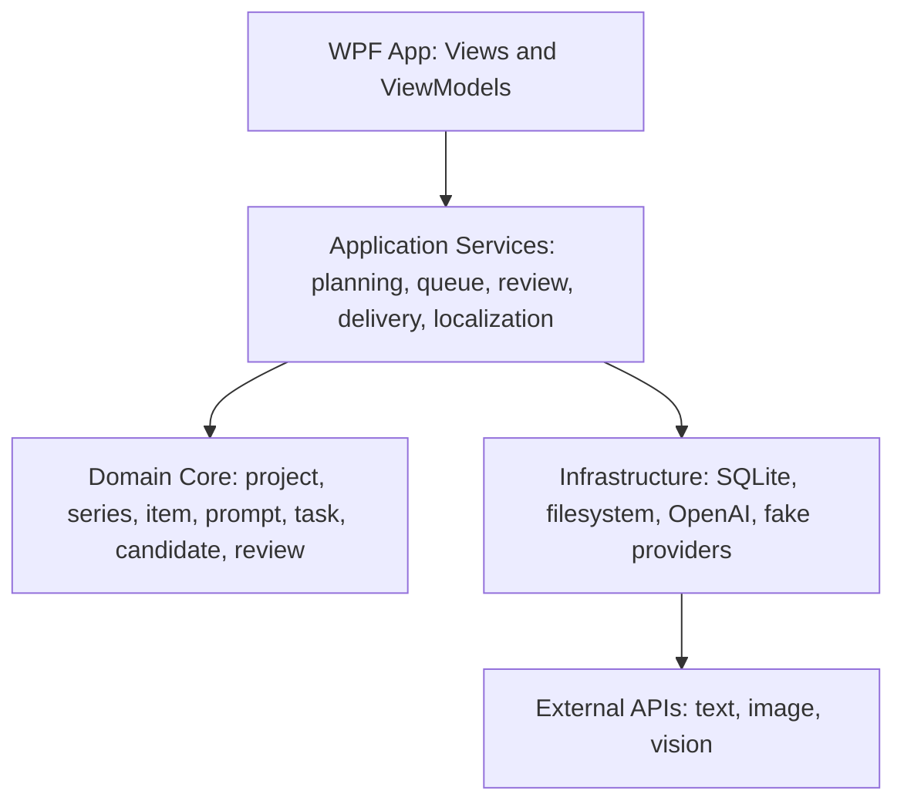

# Architecture

## Recommendation

Build an independent Windows-first desktop app using WPF on .NET 10 for the MVP, with strict separation between UI, domain core, provider infrastructure, and local storage.

Microsoft recommends WinUI for new modern Windows apps. For this product, WPF is still the better MVP choice because it is mature, actively maintained, strong for local data-heavy workbenches, supports XAML/MVVM well, and can use .NET Generic Host for DI, logging, configuration, and background services. The architecture must keep UI-specific code outside the domain core so a later WinUI shell remains possible.

## Target Solution Layout

```text
ai-image-series-studio/
  src/
    ImageSeriesStudio.App/              WPF shell, views, view models
    ImageSeriesStudio.Application/      use cases, localization, workflow orchestration
    ImageSeriesStudio.Core/             domain model and provider-neutral contracts
    ImageSeriesStudio.Infrastructure/   EF Core, filesystem, provider adapters
  tests/
    ImageSeriesStudio.Tests/            unit and integration tests with fake providers
  docs/
    adr/
    research/
    superpowers/
  workspace/                            ignored local user data
  outputs/                              ignored generated outputs
```

## Logical Layers



## Localization

The app supports two first-class languages:

- Chinese: `zh-CN`
- English: `en-US`

Language preference is `System`, `Chinese`, or `English`. The application layer resolves the effective culture, exposes localized UI/report/prompt strings by stable keys, and keeps domain model identifiers, protocol fields, and provider error codes in English.

User-visible WPF labels, validation messages, review summaries, delivery reports, prompt templates, and export descriptions must not be hard-coded in view models or infrastructure. New strings should be added through the localization catalog and covered by tests for both supported languages.

## Provider Boundaries

The app must not let one AI API shape the whole architecture. Use separate contracts:

- `ITextPlanningProvider`: conversation, requirement clarification, plan/list/prompt generation, prompt revision.
- `IImageGenerationProvider`: text-to-image, image edit, reference images, batch settings, streaming partials.
- `IVisionReviewProvider`: candidate review, rubric scoring, visual issue detection, suggested fixes.
- `IProviderCapabilities`: model sizes, quality levels, formats, streaming support, edit support, moderation modes, and cost hints.

OpenAI is the first implementation. Fake providers are required for tests and UI development.

## Data Model

Core entities:

- `Workspace`
- `Project`
- `Series`
- `SeriesItem`
- `PromptVersion`
- `GenerationTask`
- `CandidateImage`
- `ReviewRubric`
- `ReviewResult`
- `DeliveryPackage`
- `ProviderProfile`

State machines:

- Item: `Draft -> Ready -> Generating -> NeedsReview -> Approved -> Delivered`
- Candidate: `Generated -> ReviewPending -> Rejected | Alternate | Final`
- Task: `Queued -> Running -> Succeeded | Failed | Cancelled`

## Storage

- SQLite stores structured project state, prompt versions, queue state, review records, and manifest history.
- Filesystem stores large assets: images, masks, reference files, thumbnails, exports, and logs.
- Every generated image has a sidecar JSON metadata file.
- Delivery packages are immutable once exported unless explicitly rebuilt as a new delivery version.

## Background Work

Generation and review run through a bounded local queue:

- Per-provider concurrency.
- Per-model timeout.
- Retry with backoff.
- Cancellation.
- Cost and quota budget.
- Run log and request ID capture.
- Dry-run mode.

## Review And Text Composition

For image series with important text, especially educational posters and infographics, the preferred path is:

1. Generate visual scene or background.
2. Compose required text, formulas, legends, and labels deterministically in-app.
3. Review the combined image.

This avoids over-reliance on image model text rendering.

## Security

- Store API keys in Windows Credential Manager or DPAPI-backed local secrets.
- Keep `.env`, SQLite databases, workspaces, and outputs ignored by git.
- Redact secrets from logs and exported manifests.
- Record provider profile and model settings without exposing credentials.

## Quality Gates

Before real provider integration:

```powershell
dotnet build
dotnet test
dotnet format --verify-no-changes
```

Provider integration adds:

- Fake provider contract tests.
- OpenAI dry-run capability validation.
- Opt-in smoke tests with real API calls.
- Snapshot tests for delivery manifest format.
- Localization tests for `zh-CN`, `en-US`, and system fallback.

## Best Engineering End State

The best end state is a modular local desktop product:

- Application use cases can be tested without WPF, SQLite, or network access.
- WPF shell can be replaced without rewriting core logic.
- Provider adapters can be swapped or added.
- Chinese and English are selectable across UI, prompts, review reports, and delivery output.
- Workflows are reproducible through stored prompt versions and metadata.
- Every generated output is traceable to prompt, model, settings, references, review, and delivery version.
- Review is a structured loop, not an informal comment.
- The app can import the current physics poster project as a sample while staying domain-neutral.
