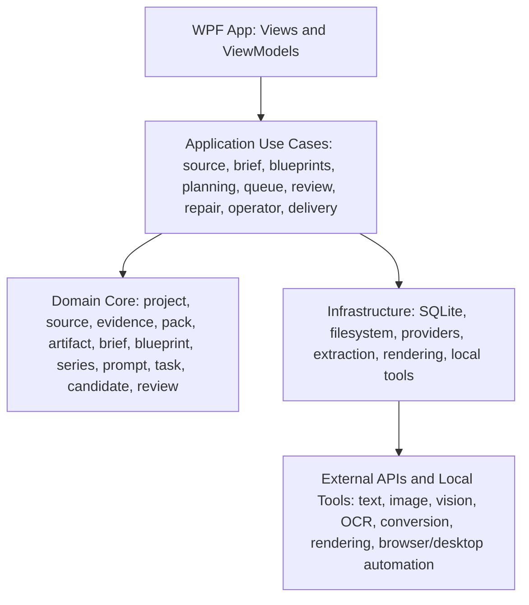
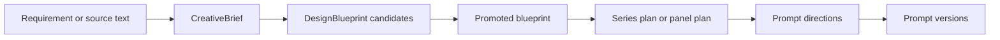
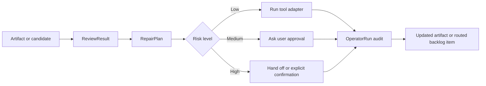

# Architecture

## Recommendation

Build an independent Windows-first desktop app using WPF on .NET 10 for the MVP, with strict separation between UI, application use cases, domain core, provider infrastructure, deterministic local tools, and local storage.

Microsoft recommends WinUI for new modern Windows apps. For this product, WPF is still the better MVP choice because it is mature, actively maintained, strong for local data-heavy workbenches, supports XAML/MVVM well, and can use .NET Generic Host for DI, logging, configuration, and background services. The architecture must keep UI-specific code outside the domain core so a later WinUI shell remains possible.

The target product is now AI Content Delivery Studio: a multimodal content delivery studio with image-series production as the core capability. AI providers, model families, workflow packs, and artifact types must be swappable. Core domain records and application use cases should not need a major rewrite for every provider release or new industry pack.

## Target Solution Layout

```text
ai-image-series-studio/              active checkout, pending medium-term rename to ai-content-delivery-studio
  src/
    ImageSeriesStudio.App/              WPF shell, views, view models
    ImageSeriesStudio.Application/      use cases, localization, workflow orchestration
    ImageSeriesStudio.Core/             domain model and provider-neutral contracts
    ImageSeriesStudio.Infrastructure/   EF Core, filesystem, provider adapters
      Extraction/                       file ingestion, OCR, document conversion adapters
      Rendering/                        deterministic image, PDF, DOCX, slide, and report rendering
      Tools/                            CLI/SDK/browser/desktop automation adapters
  tests/
    ImageSeriesStudio.Tests/            unit and integration tests with fake providers
  docs/
    adr/
    research/
    superpowers/
  workspace/                            ignored local user data
  outputs/                              ignored generated outputs
```

`ImageSeriesStudio` remains the internal solution and namespace root until the dedicated migration in ADR 0008 renames the local root, solution, project folders, assemblies, namespaces, scripts, and tests in a gated slice.

## Logical Layers



## Localization

The app supports two first-class languages:

- Chinese: `zh-CN`
- English: `en-US`

Language preference is `System`, `Chinese`, or `English`. The application layer resolves the effective culture, exposes localized UI/report/prompt strings by stable keys, and keeps domain model identifiers, protocol fields, and provider error codes in English.

User-visible WPF labels, validation messages, review summaries, delivery reports, prompt templates, and export descriptions must not be hard-coded in view models or infrastructure. New strings should be added through the localization catalog and covered by tests for both supported languages.

## Pack-Driven UI Composition

The UI shell should be stable even as task types grow. New scenarios should not add permanent top-level tabs by default.

Recommended composition model:

- `WorkflowStageDefinition`: stable stage ID, display key, required domain objects, visible panels, command groups, and completion criteria.
- `WorkflowViewSlot`: reusable shell slot such as `SourceList`, `StageWorkspace`, `Inspector`, `ActivityPanel`, `ApprovalPanel`, or `ArtifactPreview`.
- `FeatureViewModule`: WPF view, view model, localization keys, commands, and tests for one stage or artifact family.
- `InspectorSection`: context-sensitive metadata and actions for selected source, plan, prompt, artifact, review, repair, operator run, or delivery package.

The WPF shell owns layout slots and navigation state. Workflow packs select stages and modules. Feature modules own their own views and view models. Application use cases own behavior. Provider and tool adapters remain outside the UI layer.

UI complexity rules:

- Keep the canonical stage vocabulary small: `Source`, `Brief`, `Plan`, `Produce`, `Review`, `Repair`, `Deliver`.
- Hide irrelevant stages for the active workflow instead of showing disabled global tabs.
- Put advanced provider settings, pack metadata, manifest details, and operator logs behind inspector sections or advanced views.
- Prefer task-first commands such as `Generate directions`, `Run extraction`, `Approve repair`, or `Export package` over raw tool names.
- Each new task pack must declare which stage modules it needs before any UI is added.
- A new UI module must be testable with fake application services and must not depend on a real provider.

## Provider Boundaries

The app must not let one AI API shape the whole architecture. Use separate contracts:

- `ITextPlanningProvider`: conversation, requirement clarification, plan/list/prompt generation, prompt revision.
- `IImageGenerationProvider`: text-to-image, image edit, reference images, batch settings, streaming partials.
- `IVisionReviewProvider`: candidate review, rubric scoring, visual issue detection, suggested fixes.
- `IDocumentAnalysisProvider`: source-file understanding, semantic extraction, summarization, translation, formula or citation suggestions.
- `IContentTransformProvider`: rewrite, polish, translate, de-AI-style editing, paper review, LaTeX conversion, and other text-heavy transformations.
- `IArtifactPlanningProvider`: plan output artifacts from source evidence and workflow packs.
- `IProviderCapabilities`: model sizes, quality levels, formats, streaming support, edit support, moderation modes, and cost hints.

OpenAI is the first implementation. Fake providers are required for tests and UI development.

The generalized design workflow should treat provider adapters as execution and planning engines, not as product-shaping objects. Topic-specific or provider-specific concepts should not leak into the core project model.

Provider contracts should return structured provenance: model, provider profile, capability warnings, request ID where available, input references, output references, token/cost hints, latency, and redacted errors.

The detailed routing policy for choosing between the Images API and the Responses API, plus `store` and `previous_response_id` defaults, lives in [PROVIDER_ROUTING_POLICY.md](./PROVIDER_ROUTING_POLICY.md).

## Multimodal Source And Artifact Model

The core model needs stable records for user files and generated deliverables:

- `SourceAsset`: local file, folder, URL snapshot, screenshot, image reference, note, or generated intermediate.
- `ExtractedContent`: extracted text, images, tables, equations, OCR spans, page ranges, metadata, thumbnails, or layout hints.
- `EvidenceAnchor`: stable pointer from a brief, plan, review, or artifact back to a source asset and extracted range.
- `ContentTask`: a user-facing task such as article illustration, paper polishing, document translation, poster production, courseware visual pack, or PDF delivery report.
- `OutputArtifact`: generated image, PDF, DOCX, markdown, slide asset, manifest, review report, or archive.
- `ArtifactPackage`: delivery bundle with manifest, provenance, review, repair, approval, and source-evidence traceability.

These records should live in `Core` and be persisted through provider-neutral repositories. Extraction and rendering tools translate files into and out of this model; they do not define the model.

The launch-capable combinations of source inputs and output artifacts are intentionally narrower than the long-term model boundary and are tracked in [SOURCE_ARTIFACT_SUPPORT_MATRIX.md](./SOURCE_ARTIFACT_SUPPORT_MATRIX.md).

## Versioned Workflow And Blueprint Packs

Generalization should come from versioned packs rather than new hard-coded product modes.

Recommended pack families:

- `WorkflowPack`: stages, required inputs, tool permissions, review gates, repair routes, and delivery outputs.
- `BlueprintPack`: reusable visual/content strategies and artifact patterns.
- `IndustryPack`: domain vocabulary, source conventions, output conventions, compliance hints, and default rubrics.
- `RendererPack`: deterministic recipes for image composition, PDF, DOCX, slide, markdown, or web-ready exports.
- `ReviewRubricPack`: structured quality gates and AI/human review criteria.

Pack metadata must include stable ID, semantic version, compatibility range, provider/tool requirements, migration notes, and deprecation state. Packs can evolve quickly; `Core` and `Application` contracts should evolve slowly.

## Local Deterministic Toolchain

Use local deterministic tools for repeatable file and artifact work before asking AI to do the same job by prose:

- extraction and conversion: PDF/DOCX/PPTX/HTML/Markdown parsing, OCR, table extraction, formula extraction, metadata inspection
- rendering and composition: text overlays, labels, callouts, formula placement, PDF/DOCX/slide output, image conversion, compression
- validation: file dimensions, page counts, manifest shape, broken links, missing assets, naming, checksums
- browser and desktop automation: only through controlled harnesses with allow lists, dry-run where possible, screenshots, and audit logs

Tool preference order:

1. Stable SDK or library API.
2. Official CLI with structured output or machine-readable logs.
3. Local adapter around proven open-source tools.
4. Browser automation for web workflows.
5. Desktop or computer-use automation only when a better API/CLI path does not exist.

AI should understand, plan, choose, review, orchestrate, and repair. Deterministic tools should execute repeatable extraction, rendering, packaging, and validation.

## Blueprint-First Design Layer

The product should add a reusable design layer between requirement capture and prompt generation.

Recommended durable records:

- `CreativeBrief`
- `DesignBlueprint`
- `PromptDirection`
- `Series`
- `SeriesItem`
- `PromptVersion`

Recommended logical flow:



This allows posters, diagrams, article illustrations, storyboards, and comic-like panel sequences to share one architecture.

## Data Model

Core entities:

- `Workspace`
- `Project`
- `SourceAsset`
- `ExtractedContent`
- `EvidenceAnchor`
- `CreativeBrief`
- `DesignBlueprint`
- `WorkflowPack`
- `BlueprintPack`
- `ContentTask`
- `Series`
- `SeriesItem`
- `PromptVersion`
- `GenerationTask`
- `CandidateImage`
- `ReviewRubric`
- `ReviewResult`
- `RepairPlan`
- `OperatorAction`
- `OutputArtifact`
- `ArtifactPackage`
- `DeliveryPackage`
- `ProviderProfile`

Recommended extensions:

- `SeriesItemKind` such as `Standard`, `Panel`, `Diagram`, `Keyframe`, `Cover`
- review repair routing that distinguishes brief, blueprint, prompt, reference, settings, source extraction, renderer, and operator problems

State machines:

- Item: `Draft -> Ready -> Generating -> NeedsReview -> Approved -> Delivered`
- Candidate: `Generated -> ReviewPending -> Rejected | Alternate | Final`
- Task: `Queued -> Running -> Succeeded | Failed | Cancelled`

## Storage

- SQLite stores structured project state, prompt versions, queue state, review records, and manifest history.
- Filesystem stores large assets: images, masks, reference files, thumbnails, exports, and logs.
- Every generated image has a sidecar JSON metadata file.
- Delivery packages are immutable once exported unless explicitly rebuilt as a new delivery version.

## Background Work

Generation and review run through a bounded local queue:

- Per-provider concurrency.
- Per-model timeout.
- Retry with backoff.
- Cancellation.
- Cost and quota budget.
- Run log and request ID capture.
- Dry-run mode.

Extraction, rendering, repair, and operator tasks use the same queue discipline. Long-running local tools must support cancellation where possible and must write progress, command provenance, stdout/stderr summaries, output paths, and exit codes into structured audit records.

## Review And Text Composition

For image series with important text, especially educational posters and infographics, the preferred path is:

1. Generate visual scene or background.
2. Compose required text, formulas, legends, and labels deterministically in-app.
3. Review the combined image.

This avoids over-reliance on image model text rendering.

For generalized series workflows, review should identify the right repair layer:

- return to brief when the goal is underspecified
- return to blueprint when the chosen visual route is wrong
- return to prompt when the route is correct but wording drifted
- return to settings or references when execution drifted
- return to source extraction when the evidence or document parse is wrong
- return to renderer/composer when text, formula, layout, or export quality is wrong

## Review, Repair, And Operator

Review must produce structured findings, not only comments. Repair turns findings into explicit actions. Operator executes safe repeatable steps.



Operator surfaces must be small and auditable:

- `IToolAdapter` for SDK/CLI/local tool operations.
- `IBrowserAutomationAdapter` for web workflows.
- `IDesktopAutomationAdapter` for Windows UI automation.
- `IComputerUseProvider` for model-guided UI action planning.

Every operator action should declare risk level, dry-run support, input files, output files, side effects, required approvals, timeout, and rollback or cleanup path.

The execution boundary and first real low-risk operator slice are defined in [OPERATOR_RISK_POLICY.md](./OPERATOR_RISK_POLICY.md).

## Physics Project Migration Limits

The physics poster importer is a sample migration path, not a second implementation root. It reads the source project as an external artifact and maps selected prompt metadata, finalized delivery manifest rows, final images, alternate images, and metadata sidecars into generic project, candidate, and review structures.

Migration limits:

- The importer is read-only against `D:\CODE\physicist_chinese_poster_batch_tool`.
- The importer blocks source-relative paths that escape the selected source root.
- It does not copy generated image binaries into this repository by default.
- It does not migrate API keys, workspace state, local SQLite databases, logs, or transient batch runtime state.
- It preserves the generic app model as the target contract; physics-specific naming remains import metadata, not domain vocabulary.
- Human final approval remains explicit in the generic workflow, even when imported final images are mapped as approved review records.

## Security

- Store API keys in Windows Credential Manager or DPAPI-backed local secrets.
- Keep `.env`, SQLite databases, workspaces, and outputs ignored by git.
- Redact secrets from logs and exported manifests.
- Record provider profile and model settings without exposing credentials.
- Treat provider credentials as role-scoped. `TEXT_PROVIDER_API_KEY` is for text/vision only, while `IMAGE_PROVIDER_API_KEY*` is for image generation only; see `docs/PROVIDER_CONFIGURATION.md`.

## Diagnostics Export

Diagnostics packages are local support artifacts for troubleshooting. They may include application version, OS and .NET runtime details, selected project counts, provider capability summaries, and whether required secrets are configured. They must not include secret values, local SQLite database contents, generated image binaries, raw workspace folders, or transient API request payloads.

## Backup And Restore

Local backup/restore is file-based and conservative by default. The safe default backup excludes `.env`, local appsettings overrides, SQLite databases, build outputs, `workspace/`, and `outputs/`. Restore validates every archive entry against the target directory before writing, so a crafted zip entry cannot escape the selected restore root.

Full project-state backup that intentionally includes SQLite or generated assets must be an explicit user action with a separate manifest and size warning.

## Modular Maintenance Period

The codebase should now enter a modular maintenance period:

- New features start in a module with a small use-case API, fake adapter, and focused tests.
- When a new module touches old centralized logic, move the directly related old logic into the module in the same slice.
- Split WPF views and view models by workflow tab or feature module instead of growing `MainWindowViewModel`.
- Split `ProjectApplicationService` into use-case services once a use case has independent state or tests.
- Split EF Core mapping into `IEntityTypeConfiguration<T>` as models grow.
- Keep provider configuration, secret storage, capability validation, and persistence configuration outside WPF.
- Avoid one central orchestrator that knows every provider, tool, UI tab, artifact type, and repair path.

This is not a call for a large rewrite. The rule is: new feature, new module; while editing nearby old logic, move only the directly related piece.

## Quality Gates

Before real provider integration:

```powershell
dotnet build
dotnet test
dotnet format --verify-no-changes
```

Provider integration adds:

- Fake provider contract tests.
- OpenAI dry-run capability validation.
- Opt-in smoke tests with real API calls.
- Snapshot tests for delivery manifest format.
- Localization tests for `zh-CN`, `en-US`, and system fallback.

## Best Engineering End State

The best end state is a modular local desktop product:

- Application use cases can be tested without WPF, SQLite, or network access.
- WPF shell can be replaced without rewriting core logic.
- Provider adapters can be swapped or added.
- Workflow, blueprint, industry, renderer, and review packs can be added, removed, versioned, and deprecated.
- Source assets, extracted content, output artifacts, and delivery packages are traceable through evidence anchors.
- Requirement capture, blueprint selection, and prompt generation stay distinct and traceable.
- Chinese and English are selectable across UI, prompts, review reports, and delivery output.
- Workflows are reproducible through stored prompt versions and metadata.
- Every generated output is traceable to prompt, model, settings, references, review, and delivery version.
- Review, repair, and operator actions are structured loops, not informal comments.
- The app can import the current physics poster project as a sample while staying domain-neutral.
