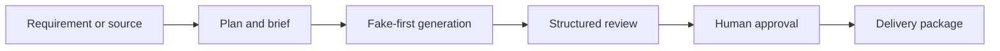

# Architecture

AI Content Delivery Studio is a Windows-first WPF application with one persisted project aggregate and two product workflows. The architecture favors concrete use cases over extension platforms.

## Dependency Direction

```text
App -> Application -> Core
App -> Infrastructure -> Application/Core
Tests -> all projects
```

- `ContentDeliveryStudio.Core` owns provider-neutral domain records and invariants.
- `ContentDeliveryStudio.Application` owns user-visible use cases and workflow sequencing.
- `ContentDeliveryStudio.Infrastructure` owns EF Core/SQLite, OpenAI and fake implementations, extraction, rendering, packaging, diagnostics, and filesystem safety.
- `ContentDeliveryStudio.App` owns WPF presentation state, commands, localization, operation gating, and host composition.

Core and Application do not depend on WPF, EF Core, OpenAI SDK types, or local filesystem implementations.

## Product Flow


```mermaid
flowchart LR
    A["Requirement or source"] --> B["Plan and brief"]
    B --> C["Fake-first generation"]
    C --> D["Structured review"]
    D --> E["Human approval"]
    E --> F["Delivery package"]
```

Document ingestion feeds the same plan and project model. Article, poster, courseware, report, and other scenario names are profiles or delivery categories, not separate engines.

## Core Model

The persisted project aggregate owns:

- source assets and extracted contents;
- creative briefs, design blueprints, and prompt directions;
- series, items, prompt versions, and generation settings;
- durable generation tasks and candidate images;
- structured review results and final human approval;
- delivery history and provider provenance;
- scientific workflow authority where applicable.

Large generated files stay on disk and are referenced by contained paths. Structured project state stays in SQLite. Sidecar metadata accompanies provider-generated images.

There is no current Pack, WorkflowPackage, ArtifactPlanning, OutputArtifact, ToolAdapter/Operator runtime, remote-workflow registry, or machine implementation queue. Reintroducing any of these requires two real product consumers and a migration decision.

## Provider Boundaries

Provider roles remain separate because their payloads, safety constraints, cost, and failure modes differ:

- text planning;
- image generation;
- image editing;
- vision review;
- scientific source understanding and review.

Fake providers are the default runtime and test path. Live provider construction is explicit and credential-backed. Preparation and local queue mutation never dispatch a provider; only explicit execution may do so.

Generated image bytes are decoded before persistence. Delivered format and dimensions must match the requested contract, and requested/original/delivered size metadata is written with the asset. Invalid bytes fail before the output directory is created.

## Controlled Image-Series Workflow

The image-series workspace is split by owned presentation state:

- planning;
- brief and blueprint selection;
- generation settings;
- durable queue execution;
- gallery and image edit;
- structured review and final approval;
- delivery.

`MainWindowViewModel` composes those workspaces and guards concurrent operations. `latest-wins` lanes protect replaceable reads; exclusive lanes serialize mutations. Workflow coordinators are retained only where they own a real projection or use-case transformation. Project creation and plan editing share one `ProjectWorkspaceCoordinator`.

Generation tasks survive reload. Queued and paused work is not dispatched automatically. Retry creates a linked task rather than rewriting terminal history. Real-provider replay remains forbidden without a new explicit execution decision.

## Scientific-Figure Workflow

The scientific path keeps a stronger authority chain:

```text
source extraction
  -> evidence-bound understanding
  -> approved figure specification (Gate 1)
  -> deterministic SVG render authority
  -> contract + semantic + visual review
  -> bounded repair
  -> human delivery approval (Gate 2)
  -> SVG/PNG/PDF package
```

Scientific meaning cannot be changed by automatic layout repair. Unsupported, contradictory, missing-evidence, OCR-heavy, or observation-like inputs fail closed. Provider review is advisory; accepted source claims and human gates remain authoritative.

Article illustration uses a domain-profile seam: planning selects an admitted profile from located source evidence, while each profile supplies its deterministic renderer expectations and scientific reviewer. The set runner depends only on that reviewer interface. `article-optics-v1`, `article-thermal-v1`, `article-gravity-v1`, `article-thermistor-v1`, and `article-archimedes-v1` therefore share extraction, export, visual review, bounded repair, evidence reporting, and Gate boundaries without treating one domain's invariants as universal. Each profile owns its candidate set, deterministic rendering facts, and fail-closed scientific checks.

Publication artwork contains only the title and labels needed to communicate the scientific content. Planning rationale, source/page identifiers, candidate disclaimers, and Gate status remain in SVG metadata or sidecar audit records rather than being printed into the artwork. Gate-review previews may display those notices, but the publication renderer and its visual contract reject them in final candidate SVGs. Source-evidence boards preserve the selected source pixels while keeping source identity and hashes in the audit record.

## Delivery And Diagnostics

Delivery exports only candidates that have both a passing structured decision and final human approval. Package paths are contained under the selected root, filenames are sanitized, hashes and provenance are recorded, and an exported package is treated as immutable.

Diagnostics describe actual provider calls, project state, and package results. They do not carry empty Operator or generic Artifact metadata from retired platform layers.

## Verification Architecture

- Focused tests prove the affected behavior or contract.
- Quick adds one solution build plus an explicit focused test filter.
- Full runs one build, non-release/non-live tests, mapped reference contract, and diff hygiene.
- Release invokes Full once, then adds release-only tests, changed-C# formatting, scans, and publish/package checks.

Source-token counts, private call ordering, duplicate wrappers, and per-change governance receipts are not architectural contracts. Native UI Automation or operator evidence is required for claims about packaged desktop behavior.

## Safety And Truth Boundary

- Secrets use local protected storage or ignored configuration and never enter Git.
- `workspace/`, `outputs/`, local databases, and generated assets are user state, not source truth.
- Repository verification proves code and deterministic contracts only.
- Paid-provider, human, hardware, accessibility, or field acceptance requires its own current authority and evidence.
