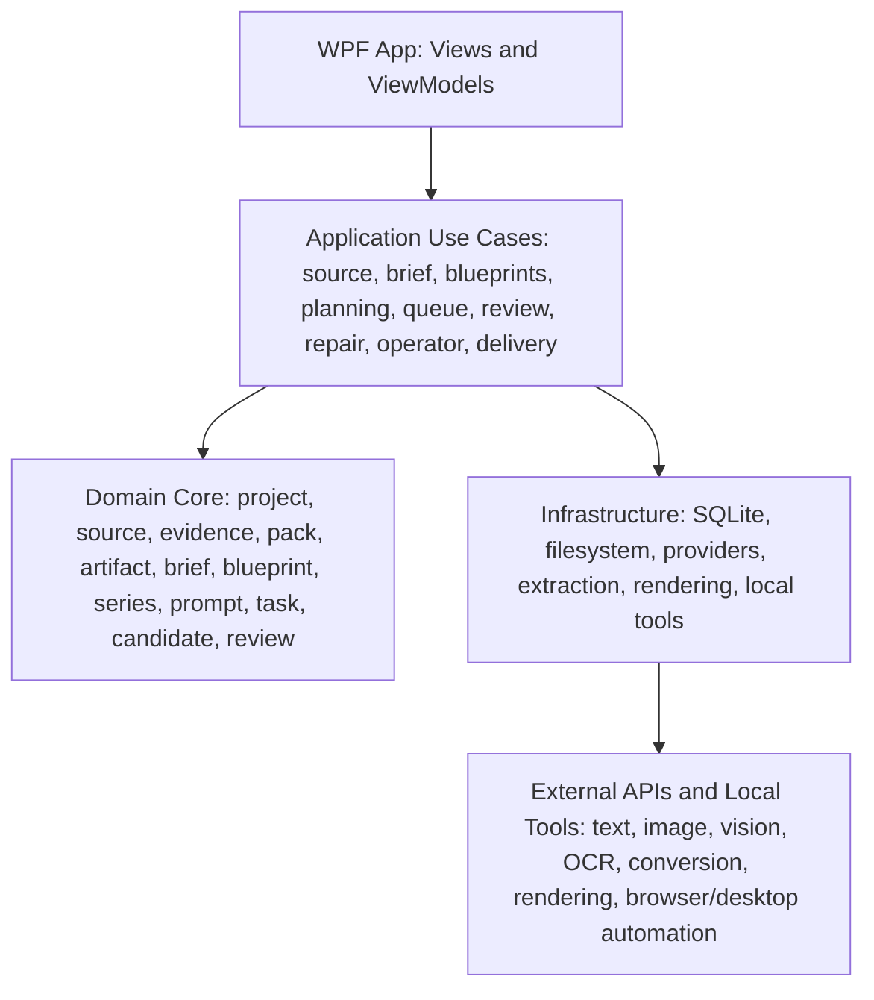
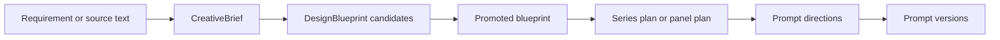
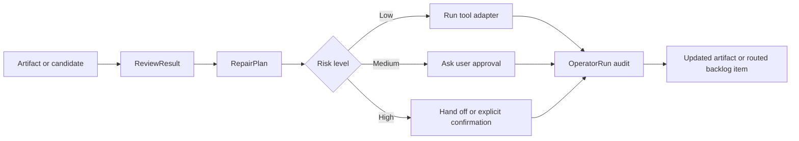

# Architecture

## Recommendation

Build an independent Windows-first desktop app using WPF on .NET 10 for the MVP, with strict separation between UI, application use cases, domain core, provider infrastructure, deterministic local tools, and local storage.

Microsoft recommends WinUI for new modern Windows apps. For this product, WPF is still the better MVP choice because it is mature, actively maintained, strong for local data-heavy workbenches, supports XAML/MVVM well, and can use .NET Generic Host for DI, logging, configuration, and background services. The architecture must keep UI-specific code outside the domain core so a later WinUI shell remains possible.

The target product is now AI Content Delivery Studio: a multimodal content delivery studio with image-series production as the core capability. AI providers, model families, workflow packs, and artifact types must be swappable. Core domain records and application use cases should not need a major rewrite for every provider release or new industry pack.

## Target Solution Layout

```text
ai-content-delivery-studio/              active checkout
  src/
    ContentDeliveryStudio.App/              WPF shell, views, view models
    ContentDeliveryStudio.Application/      use cases, localization, workflow orchestration
    ContentDeliveryStudio.Core/             domain model and provider-neutral contracts
    ContentDeliveryStudio.Infrastructure/   EF Core, filesystem, provider adapters
      Extraction/                       file ingestion, OCR, document conversion adapters
      Rendering/                        deterministic image, PDF, DOCX, slide, and report rendering
      Tools/                            CLI/SDK/browser/desktop automation adapters
  tests/
    ContentDeliveryStudio.Tests/            unit and integration tests with fake providers
  docs/
    adr/
    research/
    superpowers/
  workspace/                            ignored temporary candidates, edits, and review preparation
  outputs/                              ignored scripted evidence and ad hoc run outputs
```

`ContentDeliveryStudio` is now the active internal solution and namespace root. Historical `ImageSeriesStudio` text remains only in preserved evidence and compatibility notes described by ADR 0008.

## Local Output Layout

The desktop app keeps final delivery artifacts separate from temporary work. Temporary
data uses `%LOCALAPPDATA%\ContentDeliveryStudio` by default (or the explicit
`CONTENT_DELIVERY_STUDIO_DATA_ROOT` override). Final deliveries use
`CONTENT_DELIVERY_STUDIO_DELIVERY_ROOT` when configured, otherwise the data-root
`deliveries` fallback:

```text
workspace/<project-id>/generated/       candidate generation output
workspace/<project-id>/edited/          edited candidate output
workspace/<project-id>/review-prep/     crops, contact sheets, and review preparation
workspace/article-figure-runs/<run-id>/ article sample candidates and their review evidence
deliveries/<category>/<project-id>/<timestamp>/ immutable approved delivery package (fallback)
  images/                               final approved images only
  prompts/ metadata/ composition/       delivery evidence and provenance
```

The built-in final-image categories are `image-series`, `image-edits`,
`article-figure-sets`, `scientific-figures`, `document-illustrations`,
`courseware-visuals`, and `poster-report-visuals`. The application resolves these
through `FinalImageDeliveryCategory`; callers cannot inject a title or prompt as a
category path segment. A delivery export defaults to `image-series`, while a
specialized caller can select another category and/or pass an explicit custom root.
The generic WPF approval panel projects this contract directly: category selection
is finite and localized, the root defaults from configuration but remains editable
and browseable, and the resolved category destination is visible before export.
The ViewModel blocks export when the root resolves inside temporary `workspace`.

For the local classroom integration, configure the final root to
`D:\CODE\classroom-answer-toolkit\正式交付\科学配图`. The resulting package is
`<final-root>/<category>/<project-id>/<timestamp>/images/`; the generator
repository keeps temporary candidates and review material under its own
`workspace/` tree. The external root is an explicit deployment choice, not a
hard-coded repository dependency, so another consumer can provide its own delivery
root.

Resolution precedence is explicit custom root, then
`CONTENT_DELIVERY_STUDIO_DELIVERY_ROOT`, then the data-root `deliveries` fallback.
The data root itself is controlled by `CONTENT_DELIVERY_STUDIO_DATA_ROOT`; setting
both to D: locations keeps final assets off the default C: local-app-data tree.
Existing persisted asset paths are not migrated or deleted by this layout change.

Only a completed human-approved delivery creates `<delivery-root>/.../images/`
(or the fallback `deliveries/.../images/`).
Generation, edits, and review preparation must not write there. Repository-local
`outputs/` remains for ignored scripted evidence and sample runs, not end-user
delivery. The article sample scripts default to
`workspace/article-figure-runs/<run-id>/`; their `-OutputDirectory` parameter
remains an explicit override for reproducible evidence runs.

## Logical Layers


```mermaid
flowchart TB
    UI["WPF App: Views and ViewModels"]
    APP["Application Use Cases: source, brief, blueprints, planning, queue, review, repair, operator, delivery"]
    CORE["Domain Core: project, source, evidence, pack, artifact, brief, blueprint, series, prompt, task, candidate, review"]
    INFRA["Infrastructure: SQLite, filesystem, providers, extraction, rendering, local tools"]
    EXT["External APIs and Local Tools: text, image, vision, OCR, conversion, rendering, browser/desktop automation"]

    UI --> APP
    APP --> CORE
    APP --> INFRA
    INFRA --> EXT
```

## Localization

The app supports two first-class languages:

- Chinese: `zh-CN`
- English: `en-US`

Language preference is `System`, `Chinese`, or `English`. The application layer resolves the effective culture, exposes localized UI/report/prompt strings by stable keys, and keeps domain model identifiers, protocol fields, and provider error codes in English.

User-visible WPF labels, validation messages, review summaries, delivery reports, prompt templates, and export descriptions must not be hard-coded in view models or infrastructure. New strings should be added through the localization catalog and covered by tests for both supported languages.

## Scenario-Profile UI Composition

The UI shell is implemented around the two production lanes and must remain stable as scenario labels grow. Courseware, poster, article, report, and social are profiles of those lanes, not independent runtimes and not proof of production maturity.

The WPF shell and its state-owning workspace ViewModels own the actual tabs,
layout, navigation, and command surface. Application use cases own behavior;
provider and tool adapters remain outside the UI layer. The desktop does not
compose views or commands from pack metadata.

The trustworthy scientific-figure module follows this split through five
feature-owned workspaces: Source, Understanding, Figure Spec, Render & Review,
and Delivery. The WPF layer projects the authoritative workflow, review, hash,
repair, and approval records; it does not infer scientific eligibility. Gate 2
readiness and package construction remain in
`ScientificFigureDeliveryService`, while the Delivery view model only gathers
the explicit reviewer decision and projects the resulting immutable package.
The desktop host registers `IScientificDeliveryPackageSaveService` through the
Generic Host composition root. That service opens a system save dialog and
writes bytes only after the user invokes the enabled export command; approval
alone has no filesystem side effect.

UI complexity rules:

- Keep the canonical stage vocabulary small: `Source`, `Brief`, `Plan`, `Produce`, `Review`, `Repair`, `Deliver`.
- Hide irrelevant stages for the active workflow instead of showing disabled global tabs.
- Put advanced provider settings, manifest details, and operator logs behind inspector sections or advanced views.
- Prefer task-first commands such as `Generate directions`, `Run extraction`, `Approve repair`, or `Export package` over raw tool names.
- A new scenario profile must reuse a concrete production lane unless a separately approved product boundary proves a new workspace is necessary.
- New UI must be testable with fake application services and must not depend on a real provider.
- Scientific workspace visibility is enabled only after the complete fake-first
  five-workspace flow, both human gates, cross-format hash checks, WPF layout,
  screenshot, and UI Automation contract have passed. Corpus and live-provider
  acceptance remain separate later gates.
- The offline scientific corpus runner is an application-layer acceptance
  boundary. It loads only `human-approved` / `accepted` corpus authority,
  rebuilds domain extraction, understanding, Figure Spec, workflow, SVG,
  PNG/PDF, contract review, and provider-neutral review requests, then records
  deterministic per-item and per-mutation evidence. It depends on renderer,
  exporter, and cropper contracts; it neither imports infrastructure provider
  types nor treats fixed-corpus success as live or general acceptance.

## Provider Boundaries

The app must not let one AI API shape the whole architecture. Use separate contracts:

- `ITextPlanningProvider`: conversation, requirement clarification, plan/list/prompt generation, prompt revision.
- `IImageGenerationProvider`: text-to-image, image edit, reference images, batch settings, streaming partials.
- `IVisionReviewProvider`: candidate review, rubric scoring, visual issue detection, suggested fixes.
- `IDocumentAnalysisProvider`: source-file understanding, semantic extraction, summarization, translation, formula or citation suggestions.
- `IContentTransformProvider`: rewrite, polish, translate, de-AI-style editing, paper review, LaTeX conversion, and other text-heavy transformations.
- `IArtifactPlanningProvider`: plan output artifacts from source evidence and workflow packs.
- `IProviderCapabilities`: model sizes, quality levels, formats, streaming support, edit support, moderation modes, and cost hints.

OpenAI is the first implementation. Fake providers are required for tests and UI development.

The WPF host owns provider runtime selection through `AddContentDeliveryStudioProviderRuntime`. The default registration remains fake-first for text planning, image generation, image edit, vision review, and scientific understanding. Live provider registration is explicit: `PROVIDER_MODE=live` or an equivalent registration option reads the local `.env`, validates role-scoped provider profiles, delegates generic text/image/vision construction to the infrastructure-owned failover factory, and selects the OpenAI scientific-understanding adapter for bounded source chunks. Scientific understanding uses the text role profile, strict Responses Structured Outputs, `store: false`, stable source-block/location identifiers, and local semantic validation before any output can enter domain understanding. Image edit stays on the fake provider until a separate live edit slice proves that contract. This keeps Generic Host dependency injection as the composition boundary while provider transport, credential lookup, and failover behavior remain outside WPF.

The generalized design workflow should treat provider adapters as execution and planning engines, not as product-shaping objects. Topic-specific or provider-specific concepts should not leak into the core project model.

Provider contracts should return structured provenance: model, provider profile, capability warnings, request ID where available, input references, output references, token/cost hints, latency, and redacted errors.

For image generation, the current OpenAI boundary now supports both the default single-shot Images API path and an explicit opt-in Responses API path for stateful revision loops. That stateful path captures `previous_response_id`, `revised_prompt`, and image-generation tool call ids in local metadata while keeping local project persistence authoritative by default.

The detailed routing policy for choosing between the Images API and the Responses API, plus `store` and `previous_response_id` defaults, lives in [PROVIDER_ROUTING_POLICY.md](./PROVIDER_ROUTING_POLICY.md).

## Multimodal Source And Artifact Model

The core model needs stable records for user files and generated deliverables:

- `SourceAsset`: local file, folder, URL snapshot, screenshot, image reference, note, or generated intermediate.
- `ExtractedContent`: extracted text, images, tables, equations, OCR spans, page ranges, metadata, thumbnails, or layout hints.
- `EvidenceAnchor`: stable pointer from a brief, plan, review, or artifact back to a source asset and extracted range.
- `ContentTask`: a user-facing task such as article illustration, paper polishing, document translation, poster production, courseware visual pack, or PDF delivery report.
- `OutputArtifact`: generated image, PDF, DOCX, markdown, slide asset, manifest, review report, or archive.
- `ArtifactPackage`: delivery bundle with manifest, provenance, review, repair, approval, and source-evidence traceability.

These records should live in `Core` and be persisted through provider-neutral repositories. Extraction and rendering tools translate files into and out of this model; they do not define the model.

The launch-capable combinations of source inputs and output artifacts are intentionally narrower than the long-term model boundary and are tracked in [SOURCE_ARTIFACT_SUPPORT_MATRIX.md](./SOURCE_ARTIFACT_SUPPORT_MATRIX.md).

Within that bounded matrix, the current supported local source-ingestion path supports deterministic text extraction for local `pdf` and `docx` files through the same provider-neutral `SourceAsset -> ExtractedContent -> EvidenceAnchor` model. OCR-heavy, scanned, table-rich, and other high-fidelity binary extraction paths remain explicitly outside the current support boundary, and runtime/operator messaging should use that same boundary wording for both no-text and explicit OCR-request failures instead of older one-off slice language.

The current WPF shell exposes that bounded path through the existing document-illustration inspector surface: the user can now point the source-text entry to a local `pdf` or `docx` file, import the extracted text into the same planning textbox, and then continue through the existing fake-first document-illustration route without opening a second source-management surface.

## Legacy Pack Compatibility

`pack-package.v1` remains an import-only compatibility format. Its workflow,
blueprint, industry, renderer, rubric, UI-default, semantic-version, and
migration fields are retained so an existing local package can still be parsed
and validated. They do not drive the current WPF composition and are not an
active marketplace/plugin contract.

The built-in starter catalog and JSON export surface were retired in FOCUS-007
because no desktop, persistence, delivery, or user-visible consumer used them.
Scenario IDs read from an old package are descriptive profile labels only. New
public distribution, remote installation, or pack-driven UI work remains frozen
until a real consumer and migration plan are approved.

## Local Deterministic Toolchain

Use local deterministic tools for repeatable file and artifact work before asking AI to do the same job by prose:

- extraction and conversion: PDF/DOCX/PPTX/HTML/Markdown parsing, OCR, table extraction, formula extraction, metadata inspection
- rendering and composition: text overlays, labels, callouts, formula placement, PDF/DOCX/slide output, image conversion, compression
- validation: file dimensions, page counts, manifest shape, broken links, missing assets, naming, checksums
- browser and desktop automation: only through controlled harnesses with allow lists, dry-run where possible, screenshots, and audit logs

Tool preference order:

1. Stable SDK or library API.
2. Official CLI with structured output or machine-readable logs.
3. Local adapter around proven open-source tools.
4. Browser automation for web workflows.
5. Desktop or computer-use automation only when a better API/CLI path does not exist.

AI should understand, plan, choose, review, orchestrate, and repair. Deterministic tools should execute repeatable extraction, rendering, packaging, and validation.

## Blueprint-First Design Layer

The product should add a reusable design layer between requirement capture and prompt generation.

Recommended durable records:

- `CreativeBrief`
- `DesignBlueprint`
- `PromptDirection`
- `Series`
- `SeriesItem`
- `PromptVersion`

Recommended logical flow:


```mermaid
flowchart LR
    A["Requirement or source text"] --> B["CreativeBrief"]
    B --> C["DesignBlueprint candidates"]
    C --> D["Promoted blueprint"]
    D --> E["Series plan or panel plan"]
    E --> F["Prompt directions"]
    F --> G["Prompt versions"]
```

This allows posters, diagrams, article illustrations, storyboards, and comic-like panel sequences to share one architecture.

## Data Model

Core entities:

- `Workspace`
- `Project`
- `SourceAsset`
- `ExtractedContent`
- `EvidenceAnchor`
- `CreativeBrief`
- `DesignBlueprint`
- `WorkflowPack`
- `BlueprintPack`
- `ContentTask`
- `Series`
- `SeriesItem`
- `PromptVersion`
- `GenerationTask`
- `CandidateImage`
- `ReviewRubric`
- `ReviewResult`
- `RepairPlan`
- `OperatorAction`
- `OutputArtifact`
- `ArtifactPackage`
- `DeliveryPackage`
- `ProviderProfile`

Recommended extensions:

- `SeriesItemKind` such as `Standard`, `Panel`, `Diagram`, `Keyframe`, `Cover`
- review repair routing that distinguishes brief, blueprint, prompt, reference, settings, source extraction, renderer, and operator problems

State machines:

- Item: `Draft -> Ready -> Generating -> NeedsReview -> Approved -> Delivered`
- Candidate: `Generated -> ReviewPending -> Rejected | Alternate | Final`
- Task: `Queued <-> Paused`, `Queued -> Running | Cancelled`, and `Running -> Succeeded | Failed | Cancelled`

The current image-generation queue separates preparation from execution. Prepare
creates durable ordered `Queued` tasks without calling a provider. Operators can
pause, resume, or reorder active work, while retry creates a new `Queued` task
linked through `RetryOfTaskId` instead of reopening a terminal task. The
compatibility one-click fake flow still performs Prepare followed by Execute.
Only explicit Execute may dispatch a provider, and the current queue execution
boundary remains fake-only.

## Storage

- SQLite stores structured project state, prompt versions, queue state, review records, and manifest history.
- Filesystem stores large assets: images, masks, reference files, thumbnails, exports, and logs.
- Every generated image has a sidecar JSON metadata file.
- Delivery packages are immutable once exported unless explicitly rebuilt as a new delivery version.

## Background Work

Generation and review run through a bounded local queue:

- Per-provider concurrency.
- Per-model timeout.
- Retry with backoff.
- Cancellation.
- Cost and quota budget.
- Run log and request ID capture.
- Dry-run mode.
- Review-batch thresholds so one remote vision request does not silently grow into a large multi-item review session.

For the implemented image-generation path, execution is currently
single-process and sequential. `Queued` and `Paused` work survives project
reload without automatic dispatch; only an orphaned `Running` task is recovered
to `Failed`. There is no background worker, automatic resume, automatic retry,
or automatic replay after restart. The broader concurrency, backoff, budget,
and shared-queue bullets above remain target-state requirements for later
approved slices.

Extraction, rendering, repair, and operator tasks use the same queue discipline. Long-running local tools must support cancellation where possible and must write progress, command provenance, stdout/stderr summaries, output paths, and exit codes into structured audit records.

## Review And Text Composition

For image series with important text, especially educational posters and infographics, the preferred path is:

1. Generate visual scene or background.
2. Compose required text, formulas, legends, and labels deterministically in-app.
3. Review the combined image.

For image review at scale, the preferred path is similarly staged:

1. Prepare compact local review artifacts such as thumbnail grids, candidate manifests, prompt summaries, and selected evidence anchors.
2. Run remote vision review only on a bounded batch.
3. Persist structured findings locally and route repair from local project state rather than from remote chained conversation history.

This avoids over-reliance on image model text rendering.

For generalized series workflows, review should identify the right repair layer:

- return to brief when the goal is underspecified
- return to blueprint when the chosen visual route is wrong
- return to prompt when the route is correct but wording drifted
- return to settings or references when execution drifted
- return to source extraction when the evidence or document parse is wrong
- return to renderer/composer when text, formula, layout, or export quality is wrong

## Review, Repair, And Operator

Review must produce structured findings, not only comments. Repair turns findings into explicit actions. Operator executes safe repeatable steps.


```mermaid
flowchart LR
    A["Artifact or candidate"] --> B["ReviewResult"]
    B --> C["RepairPlan"]
    C --> D{"Risk level"}
    D -->|Low| E["Run tool adapter"]
    D -->|Medium| F["Ask user approval"]
    D -->|High| G["Hand off or explicit confirmation"]
    E --> H["OperatorRun audit"]
    F --> H
    G --> H
    H --> I["Updated artifact or routed backlog item"]
```

Operator surfaces must be small and auditable:

- `IToolAdapter` for SDK/CLI/local tool operations.
- `IBrowserAutomationAdapter` for web workflows.
- `IDesktopAutomationAdapter` for Windows UI automation.
- `IComputerUseProvider` for model-guided UI action planning.

Every operator action should declare risk level, dry-run support, input files, output files, side effects, required approvals, timeout, and rollback or cleanup path.

The execution boundary and first real low-risk operator slice are defined in [OPERATOR_RISK_POLICY.md](./OPERATOR_RISK_POLICY.md).
Remote workflow-engine execution is intentionally not a desktop runtime capability. The former fake-only adapter and repository module metadata were removed in FOCUS-006 after a source, persistence, package, DI, and user-visible consumer inventory found no live consumer. Reopening that capability requires a new approved PRD/ADR and a real end-to-end consumer.

## Physics Project Migration Limits

The physics poster importer is a sample migration path, not a second implementation root. It reads the source project as an external artifact and maps selected prompt metadata, finalized delivery manifest rows, final images, alternate images, and metadata sidecars into generic project, candidate, and review structures.

Migration limits:

- The importer is read-only against `D:\CODE\physicist_chinese_poster_batch_tool`.
- The importer blocks source-relative paths that escape the selected source root.
- It does not copy generated image binaries into this repository by default.
- It does not migrate API keys, workspace state, local SQLite databases, logs, or transient batch runtime state.
- It preserves the generic app model as the target contract; physics-specific naming remains import metadata, not domain vocabulary.
- Human final approval remains explicit in the generic workflow, even when imported final images are mapped as approved review records.

## Security

- Store API keys in Windows Credential Manager or DPAPI-backed local secrets.
- Keep `.env`, SQLite databases, workspaces, and outputs ignored by git.
- Redact secrets from logs and exported manifests.
- Record provider profile and model settings without exposing credentials.
- Treat provider credentials as role-scoped. `TEXT_PROVIDER_API_KEY` is the default text/vision secret and can also back image generation through the built-in single-key fallback when no `IMAGE_PROVIDER_API_KEY*` is configured; explicit `IMAGE_PROVIDER_API_KEY*` values still take precedence for image generation. See `docs/PROVIDER_CONFIGURATION.md`.

## Diagnostics Export

Diagnostics packages are local support artifacts for troubleshooting. They may include application version, OS and .NET runtime details, selected project counts, provider capability summaries, and whether required secrets are configured. They must not include secret values, local SQLite database contents, generated image binaries, raw workspace folders, or transient API request payloads.

Recent operational context comes from a separate app-local structured event journal, not from general `ILogger` capture. `IDiagnosticsEventJournal` accepts only strongly typed generation-queue lifecycle events and provider-call summaries. `JsonlDiagnosticsEventJournal` writes a versioned JSONL schema beneath the local studio data root, rotates each file at 1 MiB, and retains the active file plus two older files. The diagnostics exporter validates retained lines independently and includes at most the newest 500 valid events together with dropped/invalid counts.

The schema has no arbitrary message, exception, or property-bag field. Its fixed safe properties exclude prompts, responses, source material, output paths, endpoints, request/response IDs, API keys, Authorization data, `.env` content, and complete exception text. Queue events are emitted only after repository persistence checkpoints. Provider summaries mirror the existing Activity/Meter sink without changing the opt-in OTLP exporter path. Journal failures are best-effort diagnostics failures and cannot change queue or provider behavior.

## Backup And Restore

Local backup/restore is file-based and conservative by default. The safe default backup excludes `.env`, local appsettings overrides, SQLite databases, build outputs, `workspace/`, and `outputs/`. The Workbench inspector exposes only this safe mode and always restores into a user-selected separate folder without overwrite.

Each archive has one schema-v1 `backup-manifest.json` with normalized paths, byte lengths, and SHA-256 values. Creation writes a same-volume temporary ZIP and moves it into place only after success. Restore preflights the complete archive before creating or mutating the target: manifest support, unique case-insensitive paths, one-to-one membership, path containment, entry/total limits, existing conflicts, sizes, and streamed hashes must all pass. Directory/link-like entries, alternate data streams, traversal, missing/extra payloads, and tampering fail closed.

Full project-state backup that intentionally includes SQLite or generated assets must be an explicit user action with a separate manifest and size warning.

## Windows Package

`scripts/publish-app.ps1` publishes Release `win-x64`, records a portable schema-v1 manifest for every payload file, creates a sorted ZIP with normalized timestamps, writes an archive SHA-256 sidecar, and calls `scripts/verify-publish-package.ps1`. The verifier reads the archive without extraction and checks safe unique paths, manifest membership, lengths, hashes, required executable/runtime files, and the optional sidecar. `preflight-release.ps1 -NoRestore` performs an actual isolated framework-dependent publish/package/verify cycle and removes only its owned `publish/preflight` output.

This is a distributable packaged release, not an installer contract. MSI/MSIX registration, code signing, update delivery, and Store acceptance remain outside the current repository claim. The WPF project declares `win-x64` as its supported restore graph and embeds a PerMonitorV2 application manifest.

## Large Gallery And Accessibility

The gallery uses recycling virtualization, deferred logical scrolling, asynchronous thumbnail resolution, and a disk cache. The 1,000-row benchmark enforces broad regression budgets for projection, thumbnail warmup/revisit, streamed delivery export, bounded import, and peak managed memory, and requires cached revisit to be materially faster. Real frame timing and low-memory hardware remain manual/live acceptance.

Accessibility stays in the WPF presentation layer. Principal inspector inputs expose localized UIA names and stable IDs, interactive controls share a system-highlight focus visual, the gallery preserves native single-selection and keyboard containers, and the app declares PerMonitorV2. `run-packaged-accessibility-probe.ps1` verifies a ZIP before extraction, launches in fake mode with isolated data, and captures current-DPI layout/UIA facts. It is not Narrator, high-contrast-switching, touch/pen, or multi-DPI hardware acceptance.

## Modular Maintenance Period

The codebase should now enter a modular maintenance period:

- New features start in a module with a small use-case API, fake adapter, and focused tests.
- When a new module touches old centralized logic, move the directly related old logic into the module in the same slice.
- Split WPF views and view models by workflow tab or feature module instead of growing `MainWindowViewModel`.
- Treat the shell grid and column layout as stable scaffolding, and move heavy inspector workflow content into feature-owned user controls when `MainWindow.xaml` starts carrying more than placement and navigation composition.
- Inside already-extracted tab views, keep splitting repeated or dense stage regions into narrower user controls before introducing new shell-level tabs or layout branches. The brief workflow actions bar, blueprint panel, prompt-directions panel, plan header, plan rows list, prompts header, prompt rows list, queue header, queue rows list, gallery header, gallery rows list, workflow-graph header, workflow-graph rows list, review header, delivery header, inspector project setup panel, style-recipe panel, fake-planning panel, and document-illustration panel are the current reference patterns for this finer-grained split.
- The gallery rows list opts into WPF virtualization, recycling, deferred scrolling, keyboard focus/selection, and asynchronous disk-cached thumbnails; repository budgets are enforced, while subjective scroll responsiveness and low-memory hardware remain manual/live verification.
- As shell views split out, move the corresponding shell command orchestration into focused coordinators instead of leaving `MainWindowViewModel` to directly coordinate project creation, provider-center refresh, document-planning refresh, or image-edit inspector actions.
- Provider Center now follows that pattern through `ProviderCenterPresentationCoordinator`, which owns provider-row construction and health-summary composition while `ProviderCenterViewModel` keeps state and command entrypoints.
- Apply the same rule to shell localization: keep payload construction and localized selection restoration in dedicated coordinators instead of burying option-reset logic inside `MainWindowViewModel`.
- Apply the same rule to workbench reload paths: keep project-to-workbench state composition in a focused coordinator so `MainWindowViewModel` applies projected state and command enablement without rebuilding plan, prompt, gallery, review, delivery, and active-brief selections inline.
- `ImageSeriesWorkspaceViewModel` is the state owner for the queue slice: it owns queue rows, selected task, localized queue strings, pause/resume/retry/reorder/prepare/execute command state, and queue projection after reload. `MainWindowViewModel` remains the shell-level exclusive-operation and cross-workspace reload boundary because executing a queue can also update gallery and invalidate review/delivery projections. Its queue facade is temporary compatibility only; remove it after all direct non-XAML consumers bind through `ImageSeriesWorkspace` and the next image-series state-owner slice has migrated its public contract.
- `ImageSeriesWorkspaceViewModel.Gallery` owns candidate rows, selection, thumbnail-warmup requests, image-edit inputs/localization, and the fake edit command. The shell still owns the exclusive gate, global activity feed, and downstream review/delivery invalidation. Gallery and image-edit XAML bind through the single `ImageSeriesWorkspace` root; the direct `ImageSeriesGalleryWorkspace` property is a temporary compatibility facade with the same removal condition.
- `ImageSeriesWorkspaceViewModel.Review` owns review rows and selection, final-reviewer inputs, review localization, fake review, and approve/reject command state. The shell remains the exclusive operation/reload boundary and invalidates delivery after any review mutation. Human approval remains an explicit persisted gate; review XAML binds through the state owner, while the direct `ImageSeriesReviewWorkspace` and legacy review properties are temporary compatibility facades until all non-XAML consumers move to the workspace root and the remaining image-series state families are migrated.
- `ImageSeriesWorkspaceViewModel.Delivery` owns final-category/root selection, resolved destination preview, browse/export command state, delivery rows, and localization. MainWindow supplies the selected project plus gallery/review/blueprint snapshot to the existing export coordinator under the exclusive gate and rebuilds only the global workflow graph when delivery projection changes. Delivery views and the delivery portion of the approval inspector bind through the owner; direct MainWindow delivery aliases remain temporary compatibility facades under the same cutover condition.
- `ImageSeriesWorkspaceViewModel.Planning` owns series/item/prompt rows and selection, plan/prompt editor inputs and localization, plus create-series/add-item/create-prompt command state. MainWindow retains the exclusive project mutation/reload bridge and notifies the still-separate brief/blueprint state when series or item selection changes. Plan, prompt, and their inspector editors bind through the owner; legacy MainWindow aliases remain temporary until brief/generation-settings ownership and direct-consumer migration are complete.
- `ImageSeriesWorkspaceViewModel.Brief` owns fake-planning inputs, brief/blueprint/prompt-direction rows and selection, localized labels, and the create/generate/promote commands. MainWindow remains the persisted mutation/reload and cross-stage selection boundary. Brief, blueprint, and prompt-direction XAML bind through the owner.
- `ImageSeriesWorkspaceViewModel.GenerationSettings` owns image-type/style-guide/recipe option state, selection, localization, and the derived recipe summary. The root image-series workspace owns one-click fake generation and queue preparation because both operate on planning state and project the queue. Their XAML now binds through these owners; MainWindow no longer exposes workflow label/column facades. Remaining state/command aliases exist only for non-XAML compatibility and are removed when shell-internal and test consumers use the workspace root in a separately verified cutover.
- Split `ProjectApplicationService` into use-case services once a use case has independent state or tests.
- Split EF Core mapping into `IEntityTypeConfiguration<T>` as models grow.
- Keep provider configuration, secret storage, capability validation, and persistence configuration outside WPF.
- Avoid one central orchestrator that knows every provider, tool, UI tab, artifact type, and repair path.

The current repository baseline has now completed the first major shell decomposition pass: `MainWindowViewModel` delegates workflow-specific orchestration to focused coordinators, and the densest brief, plan, prompt, queue, gallery, workflow-graph, review, delivery, and inspector regions already live in feature-owned child views. Future slices should extend this pattern only when new touched logic would otherwise re-centralize responsibilities.

This is not a call for a large rewrite. The rule is: new feature, new module; while editing nearby old logic, move only the directly related piece.

## Quality Gates

Before real provider integration:

```powershell
dotnet build
dotnet test
dotnet format --verify-no-changes
```

Provider integration adds:

- Fake provider contract tests.
- OpenAI dry-run capability validation.
- Opt-in smoke tests with real API calls.
- Snapshot tests for delivery manifest format.
- Localization tests for `zh-CN`, `en-US`, and system fallback.

## Best Engineering End State

The best end state is a modular local desktop product:

- Application use cases can be tested without WPF, SQLite, or network access.
- WPF shell can be replaced without rewriting core logic.
- Provider adapters can be swapped or added.
- Scenario profiles reuse concrete production lanes; legacy v1 pack packages remain import-compatible without becoming a runtime composition system.
- Source assets, extracted content, output artifacts, and delivery packages are traceable through evidence anchors.
- Requirement capture, blueprint selection, and prompt generation stay distinct and traceable.
- Chinese and English are selectable across UI, prompts, review reports, and delivery output.
- Workflows are reproducible through stored prompt versions and metadata.
- Every generated output is traceable to prompt, model, settings, references, review, and delivery version.
- Review, repair, and operator actions are structured loops, not informal comments.
- The app can import the current physics poster project as a sample while staying domain-neutral.
