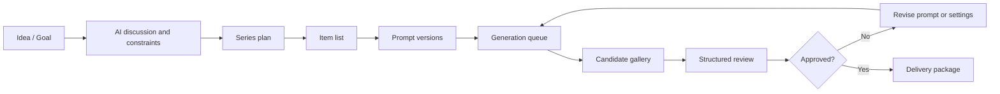

# Product Design

## Product Thesis

AI Image Series Studio is a Windows desktop workbench for producing coherent image series, not a single-image prompt toy. It helps users move from vague intent to planned series, generated candidates, reviewed iterations, and clean delivery.

The first target user is a power user creating educational posters, article illustrations, social image sets, courseware visuals, product concept boards, visual storyboards, themed image packs, or multi-frame narrative image sequences.

The product must stay domain-neutral. Science communication, comics, historical image series, courseware figures, and branded campaign packs are all important examples, but none of them should hard-code the core workflow. The core product should help users turn a requirement into a reusable visual strategy, then into a reproducible image series.

## Core Workflow

## Design-First Workflow

The product should prefer design-first generation over direct prompt dumping.

`Design blueprints` are reusable high-level creative routes such as:

- requirement-faithful poster series
- article illustration pack
- comparison chart set
- timeline story sequence
- concept explainer sequence
- storyboard or comic-like panel sequence

The user should not need to start from raw prompts. The normal entrypoint is a requirement, brief, article, source text, or series idea.

## Main Personas

- Solo creator: wants fast, controlled image sets with clear output folders.
- Teacher or content author: cares about factual correctness, readable text, and consistent style.
- Designer/operator: wants candidate comparison, batch controls, metadata, and repeatability.
- Developer/power user: wants provider configuration, workflow export, and auditability.
- Knowledge worker or analyst: wants diagrams, process visuals, comparison images, or multi-frame explainers from a structured source.

## First-Class Objects

- Workspace: local root folder containing projects and assets.
- Project: one user goal, such as a poster series or article image set.
- CreativeBrief: structured requirement record that explains the goal, audience, constraints, and delivery context.
- DesignBlueprint: a reusable visual strategy template that turns the brief into a coherent series route.
- Series: a coherent visual set within a project.
- Item: one planned image target in a series.
- PromptVersion: versioned prompt text and generation settings for one item.
- GenerationTask: queued execution attempt.
- CandidateImage: one generated output plus metadata.
- ReviewRubric: user and AI-readable quality standard.
- ReviewResult: structured scores, pass/fail flags, comments, and suggested fixes.
- DeliveryPackage: final folder with images, prompts, metadata, and manifest.

## MVP Scope

The MVP must support:

- Multi-turn planning chat.
- Requirement-first brief capture.
- Two to four prompt directions or blueprint routes before paid generation.
- Series plan and item list editing.
- Prompt generation and manual prompt editing.
- Queue-based batch generation using fake providers first, then OpenAI.
- Candidate gallery with side-by-side prompt, metadata, and review state.
- Structured AI-assisted review using a rubric.
- Prompt revision loop and regeneration history.
- Final delivery export with manifest.
- Import of the physics poster project as a sample migration.

The MVP excludes:

- Multi-user collaboration.
- Cloud sync.
- Marketplace plugins.
- Full node-graph editor.
- In-app pixel painting.
- Real API calls by default in tests.
- Full comic page editor or desktop publishing suite.

## UI Structure

The window uses a workbench layout:

- Left rail: Workspaces, Projects, Settings.
- Main tabs: Brief, Plan, Prompts, Queue, Gallery, Review, Delivery.
- Right inspector: selected item metadata, prompt version, review summary, and actions.
- Bottom activity panel: queue status, cost estimate, logs, warnings, and errors.

The `Brief` stage should be strong enough to support common generalized entrypoints:

- short requirement text
- article or note import
- structured educational topic
- design request with brand constraints
- narrative or multi-frame sequence goal

The `Plan` stage should support both standard image series and multi-frame panel sequences without creating a second isolated product mode.

## Review Model

Review is hybrid:

- AI review checks visible content against rubric.
- Programmatic checks validate files, dimensions, naming, metadata, and manifest.
- Human approval decides final status.

Review should also decide the right repair layer:

- return to brief when the goal was underspecified
- return to blueprint when the high-level visual route is wrong
- return to prompt when the plan is right but the image wording drifted
- return to parameters or references when the route is correct but execution drifted

Hard-fail examples:

- Missing required subject.
- Wrong count of final images per item.
- Unsafe or disallowed content.
- Text-heavy output with unreadable or hallucinated text.
- Factual or brand-critical mismatch.
- Image does not match the selected item.

## Delivery Model

Each delivery package contains:

- Final images.
- Optional alternates.
- Prompt snapshots.
- Candidate metadata.
- Review report.
- Project manifest in JSON and CSV.
- Provider settings summary with secrets redacted.

Delivery folders are content-oriented and stable. Temporary generation batches are not the final structure.

## Product Direction

AI 推荐: position the product as a generalized `series image workbench` instead of a topic-specific comic or poster generator.

That means:

- blueprints are examples, not hard-coded product silos
- science communication is an important safety-sensitive use case, not the only one
- comics and panel sequences are a supported narrative image pattern, not the whole product identity
- article illustration, concept diagrams, posters, and story sequences all flow through the same domain objects and review loop
