# Product Design

## Product Thesis

AI Content Delivery Studio is a Windows desktop multimodal content delivery workbench with coherent image series as its core production capability. The original working name was AI Image Series Studio; that remains a legacy code or repository identity until the planned migration is complete. The product is not a single-image prompt toy and not a one-purpose comic generator. It helps users move from vague intent and source files to structured understanding, planned visual or content deliverables, generated candidates, reviewed repairs, and clean delivery packages.

The first target user is a power user creating educational posters, article illustrations, social image sets, courseware visuals, product concept boards, visual storyboards, themed image packs, or multi-frame narrative image sequences.

The product must stay domain-neutral. Science communication, comics, historical image series, courseware figures, and branded campaign packs are all important examples, but none of them should hard-code the core workflow. The core product should help users turn a requirement into a reusable visual strategy, then into a reproducible image series.

The long-term product boundary is broader than image generation. Users often bring PDFs, DOCX files, slides, spreadsheets, screenshots, reference images, datasets, notes, or drafts. The workbench should eventually use those files as context and evidence, then produce the right artifact package: images, prompt packs, PDF reports, DOCX reviews, slide-ready visuals, delivery manifests, or other generated files. Image series remain the first-class path, but the workbench should be able to organize content and visual delivery around user-supplied files.

The launch boundary is intentionally narrower than the long-term vision. V1 should ship one primary workflow, one supporting validation workflow, and one proof path rather than trying to launch every multimodal route at once. The authoritative launch frame lives in [PRD_V1.md](./PRD_V1.md).

## V1 Release Boundary

AI 推荐: treat V1 as a launch-focused image-series product with two supporting validation routes.

- Primary launch route: short requirement -> `CreativeBrief` -> `DesignBlueprint` candidates -> promoted blueprint -> series plan -> prompts -> generation -> review -> approved `DeliveryPackage`.
- Supporting validation route: article or plain text -> evidence anchors -> illustration targets -> promoted plan -> same downstream review and delivery flow.
- Proof path: text-heavy educational poster -> generated background plate -> deterministic text, formula, and label composition -> approval evidence export.

These routes are not equal in release priority. The short requirement to image-series path is the product spine. The other two routes exist to prove that document-derived planning and high-trust text composition can feed the same spine without forcing a second product mode.

Locked V1 defaults:

- Primary audience: solo creator or teacher-like power user.
- Primary workflow: short requirement -> image-series.
- First real operator slice: additive local validation or diagnostics generation.
- Deterministic composition implementation choice: `SkiaSharp`.
- Packs remain internal reusable configuration in V1.

## Core Workflow

```mermaid
flowchart LR
    A["Goal / Files / References"] --> B["Source ingestion and extraction"]
    B --> C["Creative brief and evidence anchors"]
    C --> D["Workflow or blueprint pack"]
    D --> E["Artifact plan"]
    E --> F["Generation, rendering, or transformation queue"]
    F --> G["Candidate gallery and artifact preview"]
    G --> H["Review"]
    H --> I["Repair"]
    I --> J["Operator actions"]
    J --> K{"Approved?"}
    K -->|No| I
    K -->|Yes| L["Delivery package"]
```



## Design-First Workflow

The product should prefer design-first generation over direct prompt dumping.


`Design blueprints` are reusable high-level creative routes such as:

- requirement-faithful poster series
- article illustration pack
- comparison chart set
- timeline story sequence
- concept explainer sequence
- storyboard or comic-like panel sequence

The user should not need to start from raw prompts. The normal entrypoint is a requirement, brief, article, source text, or series idea.

The workbench should also support versioned packs that make this workflow reusable without hard-coding one industry into the core product:

- `WorkflowPack`: task flow, required stages, tool permissions, review gates, and delivery expectations.
- `BlueprintPack`: reusable creative strategies, artifact patterns, and source-to-output mappings.
- `IndustryPack`: domain vocabulary, common source types, output conventions, compliance hints, and rubric defaults.
- `RendererPack`: deterministic renderer or exporter recipes for PDF, DOCX, slide, image, or web-ready output.
- `ReviewRubricPack`: structured checks for visual quality, factual fit, safety, readability, brand, and delivery readiness.

Packs are product configuration and workflow knowledge. Core domain models and application use cases should not be rewritten every time a new AI model, provider, industry, or artifact type is added.

In V1, packs are internal reusable configuration and migration-friendly metadata. They are not yet a public marketplace, public sharing feature, or a reason to widen launch scope.

## Golden Scenarios

The next product slices should harden a small number of representative end-to-end routes before widening the pack catalog or automation surface.

- Primary launch route: short requirement -> `CreativeBrief` -> 2 to 4 `DesignBlueprint` candidates -> promoted blueprint -> series plan -> prompts -> generation -> review or repair -> approved `DeliveryPackage`.
- Supporting validation route: markdown, pasted article, or plain text -> evidence anchors -> illustration brief -> illustration targets -> promoted series workflow -> review report -> delivery package.
- Proof path: requirement or source material -> generated background plate -> deterministic text, formula, and label composition -> readability review -> approval evidence -> final export with provenance.

Until there is stronger production evidence, new workflow ideas should be explainable as variants or combinations of these routes instead of becoming separate product modes.

## Near-Term Focus

Near-term success means one reliable launch spine, not maximum feature breadth.

- Prioritize the requirement-first image-series route above every other user-visible workflow.
- Use the article or plain-text route to validate evidence-backed planning, not to create a second first-class launch mode.
- Prioritize deterministic text composition and approval evidence for text-heavy outputs.
- Keep the provider split explicit: use the direct Image API for single-shot generate or edit work, and use the Responses API for stateful multi-turn image workflows only when added state, revised prompts, or partial streaming provide clear product value.
- Prefer one audited low-risk operator path before broad browser or desktop automation.
- Treat already-landed foundation slices as reusable infrastructure, then prove them through user-visible end-to-end flows.

## Main Personas

- Solo creator: wants fast, controlled image sets with clear output folders.
- Teacher or content author: cares about factual correctness, readable text, and consistent style.
- Designer/operator: wants candidate comparison, batch controls, metadata, and repeatability.
- Developer/power user: wants provider configuration, workflow export, and auditability.
- Knowledge worker or analyst: wants diagrams, process visuals, comparison images, or multi-frame explainers from a structured source.
- Document-heavy worker: wants uploaded PDFs, DOCX files, screenshots, or notes converted into reviewed visual and document deliverables.

## First-Class Objects

- Workspace: local root folder containing projects and assets.
- Project: one user goal, such as a poster series or article image set.
- SourceAsset: a user-provided file, URL snapshot, image, folder, note, or generated intermediate that can be referenced by the project.
- ExtractedContent: text, images, tables, equations, layout hints, metadata, OCR output, or other structured content extracted from a source asset.
- EvidenceAnchor: a stable pointer from a brief, plan, review note, or generated artifact back to the source content that justified it.
- CreativeBrief: structured requirement record that explains the goal, audience, constraints, and delivery context.
- DesignBlueprint: a reusable visual strategy template that turns the brief into a coherent series route.
- WorkflowPack: a versioned task workflow package that defines stages, required inputs, review gates, repair routes, and delivery outputs.
- BlueprintPack: a versioned set of design blueprints and artifact patterns for reusable routes.
- Series: a coherent visual set within a project.
- Item: one planned image target in a series.
- PromptVersion: versioned prompt text and generation settings for one item.
- GenerationTask: queued execution attempt.
- CandidateImage: one generated output plus metadata.
- ReviewRubric: user and AI-readable quality standard.
- ReviewResult: structured scores, pass/fail flags, comments, and suggested fixes.
- RepairPlan: structured next action after review, including whether to revise brief, blueprint, prompt, settings, references, source extraction, layout, or deterministic renderer output.
- OperatorAction: a controlled local or UI automation action such as extracting a file, running a CLI tool, rendering a PDF, using a browser automation harness, or preparing an editable document.
- OutputArtifact: a generated or transformed file such as an image, PDF, DOCX, slide asset, markdown file, manifest, review report, or delivery archive.
- DeliveryPackage: final folder with images, prompts, metadata, and manifest.

## MVP Scope

The V1 release must support:

- Multi-turn planning chat for the primary requirement-first route.
- Requirement-first brief capture.
- Two to four blueprint or prompt-direction routes before paid generation.
- Series plan and item list editing.
- Prompt generation and manual prompt editing.
- Queue-based batch generation using fake providers first, then opt-in OpenAI.
- Candidate gallery with side-by-side prompt, metadata, and review state.
- Structured AI-assisted review using a rubric plus human final approval.
- Prompt revision loop and regeneration history.
- Final delivery export with manifest and approval evidence.
- Article or plain-text illustration planning that promotes approved targets into the same downstream workflow.
- Deterministic text composition for text-heavy educational or poster-style outputs.
- One real low-risk operator action with audit output.
- Import of the physics poster project as a sample migration.

The release remains image-series-first. Multimodal work should enter through stable source, evidence, artifact, and pack models before the app attempts to be a complete all-format automation suite.

The V1 release excludes:

- Multi-user collaboration.
- Cloud sync.
- Marketplace plugins.
- Public pack-sharing ecosystem.
- Full node-graph editor.
- In-app pixel painting.
- Broad high-fidelity binary extraction across office and PDF formats.
- PDF, DOCX, or slide publishing as first-class launch outputs.
- Broad browser or desktop automation with side effects.
- Real API calls by default in tests.
- Full comic page editor or desktop publishing suite.
- Fully autonomous operation on third-party accounts without explicit user approval.
- A required local GPU model runtime.
- Physical repository and namespace rename as a launch gate.

## Launch Metrics

V1 is not complete just because the relevant entities and tabs exist. The release is ready only when:

- The primary route passes three consecutive fake-first end-to-end runs.
- A 2-item sample series completes through the opt-in OpenAI path with provenance and redaction verified.
- The article or plain-text route can create and promote approved illustration targets without requiring paid APIs by default.
- The text-heavy educational proof path exports deterministic text-composition provenance and human approval evidence.
- The first real low-risk operator action writes an audit-friendly validation result without destructive side effects.

## UI Structure

The window uses a workbench layout:

- Left rail: Workspaces, Projects, Settings.
- Main tabs: Brief, Plan, Prompts, Queue, Gallery, Review, Delivery.
- Right inspector: selected item metadata, prompt version, review summary, and actions.
- Bottom activity panel: queue status, cost estimate, logs, warnings, and errors.

As task types grow, the window must not become a giant tab strip. The shell should stay stable while the active `WorkflowPack` decides which stages, panels, commands, and inspectors are visible.

Recommended stable shell:

- Left rail: workspace, project, source assets, active pack, and saved views.
- Center workspace: one active workflow stage at a time, with compact stage navigation.
- Right inspector: selected source, plan, prompt, artifact, review, repair, operator, or delivery metadata.
- Bottom activity panel: queue, operator runs, cost, warnings, approvals, and audit events.

The canonical stage vocabulary stays small:

```text
Source -> Brief -> Plan -> Produce -> Review -> Repair -> Deliver
```

Workflow packs may map these stages to different task surfaces:

- image series: plan, prompts, queue, gallery, review, delivery
- document polishing: source, extraction, transform, review, export
- paper review: source, evidence, issues, repair, DOCX/PDF report
- formula LaTeX conversion: source, extraction, formula review, export
- visual QA: source image, vision review, repair plan, delivery
- operator tasks: review, repair plan, operator action, approval, audit

The product should avoid exposing every provider option, tool setting, and pack detail in the main workflow. Advanced provider settings, tool logs, pack metadata, manifest details, and operator audit records belong in the inspector, activity panel, or explicit advanced views.

The `Brief` stage should be strong enough to support common generalized entrypoints:

- short requirement text
- article or note import
- structured educational topic
- design request with brand constraints
- narrative or multi-frame sequence goal

The `Plan` stage should support both standard image series and multi-frame panel sequences without creating a second isolated product mode.

## Review Model

Review becomes a three-part loop: Review, Repair, and Operator.

Review is hybrid:

- AI review checks visible content against rubric.
- Programmatic checks validate files, dimensions, naming, metadata, and manifest.
- Human approval decides final status.

Repair turns review findings into a structured plan:

- return to brief when the goal was underspecified
- return to blueprint when the high-level visual route is wrong
- return to prompt when the plan is right but the image wording drifted
- return to parameters or references when the route is correct but execution drifted
- return to source extraction when the input file was parsed incorrectly
- return to deterministic rendering when text, formula, layout, or export quality is the problem

Operator executes repeatable local steps when automation is safer or faster than manual work:

- run extraction, OCR, conversion, compression, layout, or export tools
- drive browser or desktop automation only through allow-listed harnesses
- keep dry-run, audit log, and human approval boundaries for risky actions
- treat uploaded files, screenshots, and external page text as untrusted content rather than user permission

Hard-fail examples:

- Missing required subject.
- Wrong count of final images per item.
- Unsafe or disallowed content.
- Text-heavy output with unreadable or hallucinated text.
- Factual or brand-critical mismatch.
- Image does not match the selected item.

## Delivery Model

Each delivery package contains:

- Final images.
- Optional alternates.
- Prompt snapshots.
- Candidate metadata.
- Review report.
- Project manifest in JSON and CSV.
- Provider settings summary with secrets redacted.

Delivery folders are content-oriented and stable. Temporary generation batches are not the final structure.

## Product Direction

AI 推荐: position the product as a multimodal content delivery workbench with image-series production as the core capability.

That means:

- blueprints are examples, not hard-coded product silos
- science communication is an important safety-sensitive use case, not the only one
- comics and panel sequences are a supported narrative image pattern, not the whole product identity
- article illustration, concept diagrams, posters, and story sequences all flow through the same domain objects and review loop
- source files and output artifacts are first-class project objects
- workflow and blueprint packs can be added, removed, versioned, and upgraded without reshaping the core domain every time
- AI belongs in understanding, planning, selection, review, repair, orchestration, and operator guidance; deterministic tools should do repeatable extraction, conversion, rendering, packaging, and validation
