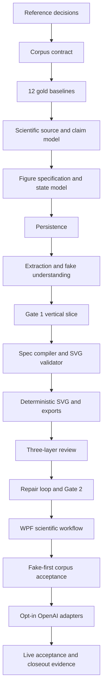

# Trustworthy Scientific Figure Workflow Implementation Plan

## Status

The design in `docs/superpowers/specs/2026-07-25-scientific-figure-trustworthy-workflow-design.md` is approved.

Task 1 supply-chain research and benchmark decisions and Task 2 corpus
contract are complete. Task 3 has four schema-valid mechanism/process
candidates awaiting human review; no corpus item is accepted. Runtime
implementation has not started, Tasks 3-30 remain open, and the recorded V1
launch baseline remains closed and unchanged. This is a new post-V1 flagship
slice.

## Objective

Deliver one complete, evidence-grounded physics and natural-science figure workflow:

```text
text-bearing PDF/Markdown/text
  -> trustworthy extraction
  -> claim-evidence understanding
  -> human-approved ScientificFigureSpec
  -> deterministic SVG and PNG/PDF exports
  -> contract, scientific, and visual review
  -> bounded repair
  -> final human approval and evidence-backed delivery
```

The first slice supports concept diagrams, mechanism/process diagrams, and graphical abstracts. It does not generate data plots or experimental evidence.

## Planning Rules

- Follow the authority chain from the approved design. Prompt text is never scientific truth.
- Use fake-first providers in repository gates.
- Keep real provider calls opt-in and require explicit user approval before paid execution.
- Keep tasks to one focused session and approximately two to five files.
- Use tests first for domain, contract, persistence, renderer, review, and workflow behavior.
- Commit each task independently after its focused verification passes.
- Run the full repository gate at every checkpoint.
- Do not widen the first slice to OCR, raw datasets, evidence imagery, broad ontologies, or external literature correction.

## Dependency Graph



## Standard Verification

Focused tasks use the exact narrow test filters recorded under each task. Run a focused build first whenever a task changes compiled code and the selected test command uses `--no-build`.

Checkpoints use the repository fixed order:

```powershell
dotnet build ContentDeliveryStudio.sln
dotnet test ContentDeliveryStudio.sln --no-build
pwsh -NoProfile -ExecutionPolicy Bypass -File scripts/verify-reference-evidence.ps1
dotnet format ContentDeliveryStudio.sln --verify-no-changes --no-restore
pwsh -NoProfile -ExecutionPolicy Bypass -File scripts/preflight-release.ps1 -NoRestore
```

## Milestone 0: Reference And Evaluation Foundation

### Task 1: Record extractor, SVG, formula, and export decisions

**Description:** Research primary sources and prove the local feasibility of the scholarly extractor adapter, deterministic SVG production, formula rendering, and SVG-to-PNG/PDF export before adding runtime dependencies.

**Acceptance criteria:**

- [x] The research note compares current PdfPig behavior, GROBID or an equivalent adapter, SVG generation, formula rendering, and export candidates.
- [x] Each selected dependency or standard-library approach records license, version, maintenance, security, deterministic-output behavior, and rollback.
- [x] `scripts/reference-basis.json` and generated reference documentation are in parity for every newly enforced area.

**Verification:**

- [x] `pwsh -NoProfile -ExecutionPolicy Bypass -File scripts/sync-reference-governance.ps1 -Check`
- [x] `pwsh -NoProfile -ExecutionPolicy Bypass -File scripts/verify-reference-evidence.ps1`
- [x] `git diff --check`

**Dependencies:** None

**Files likely touched:**

- `docs/research/SCIENTIFIC_FIGURE_WORKFLOW_RESEARCH.md`
- `scripts/reference-basis.json`
- `docs/REFERENCE_BASIS.md`
- `scripts/external-reference-shelf.snapshot.json`

**Estimated scope:** Medium

**Suggested commit:** `docs: 记录科研绘图供应链决策`

### Task 2: Add the scientific corpus contract and local-cache boundary

**Description:** Define the machine-readable 12-source corpus format, gold-baseline schema, source licensing fields, content hashes, local-cache convention, and contract tests without committing unlicensed paper binaries.

**Acceptance criteria:**

- [x] Corpus and gold-baseline schemas require source identity, stable hash, figure objective, claims, anchors, elements, relations, allowed variation, and mutations.
- [x] Repository tests reject missing licensing, source hash, evidence location, or required mutation coverage.
- [x] Paper binaries remain outside Git while redistribution-safe fixtures remain available to default tests.

**Verification:**

- [x] `dotnet test ContentDeliveryStudio.sln --filter ScientificFigureCorpusContractTests`
- [x] `git check-ignore eval/scientific-figures/.cache/probe.pdf`
- [x] `git diff --check`

**Dependencies:** Task 1

**Files likely touched:**

- `eval/scientific-figures/corpus.schema.json`
- `eval/scientific-figures/gold-baseline.schema.json`
- `eval/scientific-figures/corpus.json`
- `.gitignore`
- `tests/ContentDeliveryStudio.Tests/ScientificFigureCorpusContractTests.cs`

**Estimated scope:** Medium

**Suggested commit:** `test: 建立科研绘图评测集合同`

### Task 3: Admit four mechanism and process baselines

**Description:** Select four public, text-extractable mechanics, thermal-physics, optics, or electromagnetism sources and record human-reviewed mechanism/process gold baselines.

**Acceptance criteria:**

- [x] Four sources satisfy corpus admission, licensing, hash, and extraction-quality requirements.
- [x] Every required entity, relation, direction, condition, formula, value, and unit maps to an exact source anchor.
- [x] Each baseline includes at least one critical scientific mutation and one visual mutation.

**Verification:**

- [x] `dotnet test ContentDeliveryStudio.sln --filter ScientificFigureCorpusContractTests`
- [x] Human corpus review records all four items as accepted.

**Dependencies:** Task 2

**Files likely touched:**

- `eval/scientific-figures/mechanism-process-baselines.json`
- `eval/scientific-figures/corpus.json`
- `docs/change-evidence/20260725-scientific-figure-mechanism-corpus.md`

**Estimated scope:** Medium

**Suggested commit:** `test: 增加科研机制图基准`

### Task 4: Admit four concept and comparison baselines

**Description:** Add four public concept-relationship or comparison sources with element-level evidence and adversarial mutations.

**Acceptance criteria:**

- [x] Four sources cover at least two different physics subdomains.
- [x] Gold relations distinguish causal, directional, comparative, and non-causal associations.
- [x] Unsupported entities and reversed or overstated relations are represented as blocking mutations.

**Verification:**

- [x] `dotnet test ContentDeliveryStudio.sln --filter ScientificFigureCorpusContractTests`
- [x] Human corpus review records all four items as accepted.

Human review by `sciman` accepted all four records on 2026-07-26. The accepted
state is part of the Checkpoint 0 corpus authority.

**Dependencies:** Task 2

**Files likely touched:**

- `eval/scientific-figures/concept-comparison-baselines.json`
- `eval/scientific-figures/corpus.json`
- `docs/change-evidence/20260725-scientific-figure-concept-corpus.md`

**Estimated scope:** Medium

**Suggested commit:** `test: 增加科研概念图基准`

### Task 5: Admit four graphical-abstract baselines

**Description:** Add four public graphical-abstract objectives while separating authoritative scientific structure from allowed non-evidentiary visual assets.

**Acceptance criteria:**

- [x] Four sources identify the central message, approved abstraction level, and explicit non-evidentiary asset boundary.
- [x] Every scientific element remains evidence-linked even when visual variation is allowed.
- [x] Mutations cover omitted limitations, invented visual claims, and decorative assets that imply evidence.

**Verification:**

- [x] `dotnet test ContentDeliveryStudio.sln --filter ScientificFigureCorpusContractTests`
- [x] Human corpus review records all four items as accepted.

Human review by `sciman` accepted all four records on 2026-07-26. The accepted
state is part of the Checkpoint 0 corpus authority.

**Dependencies:** Task 2

**Files likely touched:**

- `eval/scientific-figures/graphical-abstract-baselines.json`
- `eval/scientific-figures/corpus.json`
- `docs/change-evidence/20260725-scientific-figure-graphical-abstract-corpus.md`

**Estimated scope:** Medium

**Suggested commit:** `test: 增加科研图形摘要基准`

### Checkpoint 0: Corpus authority

- [x] Tasks 1-5 pass their focused verification.
- [x] All 12 baselines pass schema validation.
- [x] A human approves the corpus as the scientific acceptance authority.
- [x] Full repository verification passes.
- [x] No renderer or provider implementation starts before this checkpoint.

## Milestone 1: Gate 1 Vertical Slice

### Task 6: Add scientific extraction and diagnostic records

**Description:** Add immutable source-block, location, extraction-quality, formula/table recovery, and blocked-result records while reusing `SourceAsset` identity.

**Acceptance criteria:**

- [x] Records preserve source hash, page, section, bounding region or offset, original text, extractor identity, and diagnostics.
- [x] Invalid ranges, missing hashes, or undefined recovery states fail fast.
- [x] Scanned, corrupted-order, and missing-required-content cases produce explicit blocked outcomes.

**Verification:**

- [x] `dotnet test ContentDeliveryStudio.sln --filter ScientificSourceModelTests`
- [x] `dotnet build ContentDeliveryStudio.sln`

**Dependencies:** Checkpoint 0

**Files likely touched:**

- `src/ContentDeliveryStudio.Core/ScientificFigures/ScientificSourceModel.cs`
- `tests/ContentDeliveryStudio.Tests/ScientificSourceModelTests.cs`
- `src/ContentDeliveryStudio.Application/Modules/ApplicationModuleCatalog.cs`
- `tests/ContentDeliveryStudio.Tests/ApplicationModuleCatalogTests.cs`

**Estimated scope:** Medium

**Suggested commit:** `feat: 建立科研来源诊断模型`

### Task 7: Add claims and element-level evidence authority

**Description:** Model scientific terminology, claims, limitations, uncertainty, evidence-link roles, conflicts, and coverage for one bounded figure objective.

**Acceptance criteria:**

- [x] Accepted claims require at least one valid evidence link.
- [x] Qualification and contradiction links cannot be normalized into unqualified support.
- [x] Missing evidence, unresolved conflicts, or incomplete required coverage blocks understanding approval.

**Verification:**

- [x] `dotnet test ContentDeliveryStudio.sln --filter ScientificUnderstandingTests`
- [x] `dotnet build ContentDeliveryStudio.sln`

**Dependencies:** Task 6

**Files likely touched:**

- `src/ContentDeliveryStudio.Core/ScientificFigures/ScientificUnderstanding.cs`
- `tests/ContentDeliveryStudio.Tests/ScientificUnderstandingTests.cs`

**Estimated scope:** Medium

**Suggested commit:** `feat: 建立科研主张证据模型`

### Task 8: Add figure specification and approval invalidation

**Description:** Model `ScientificFigureSpec`, element/relation contracts, render authority, workflow states, Gate 1 approval, and downstream invalidation.

**Acceptance criteria:**

- [x] Critical elements and relations require evidence or explicit `scientific_convention` provenance.
- [x] Gate 1 cannot approve a specification with conflicts, uncertainty, missing required coverage, or unsupported content.
- [x] A scientific-content change after Gate 1 increments the version and invalidates every downstream approval.

**Verification:**

- [x] `dotnet test ContentDeliveryStudio.sln --filter ScientificFigureSpecTests`
- [x] `dotnet test ContentDeliveryStudio.sln --filter ScientificFigureWorkflowStateTests`

**Dependencies:** Task 7

**Files likely touched:**

- `src/ContentDeliveryStudio.Core/ScientificFigures/ScientificFigureSpec.cs`
- `src/ContentDeliveryStudio.Core/ScientificFigures/ScientificFigureWorkflow.cs`
- `tests/ContentDeliveryStudio.Tests/ScientificFigureSpecTests.cs`
- `tests/ContentDeliveryStudio.Tests/ScientificFigureWorkflowStateTests.cs`

**Estimated scope:** Medium

**Suggested commit:** `feat: 建立科研绘图规格与门禁`

### Task 9: Persist the scientific workflow aggregate

**Description:** Persist versioned understanding, evidence, specification, approvals, and workflow state as a project-owned aggregate without breaking existing project loading.

**Acceptance criteria:**

- [x] Existing databases and projects without scientific records continue to load.
- [x] Save/reload preserves stable identifiers, versions, evidence links, Gate 1 state, and invalidation state.
- [x] Persistence migration and rollback evidence are recorded.

**Verification:**

- [x] `dotnet test ContentDeliveryStudio.sln --filter ScientificFigurePersistenceTests`
- [x] `dotnet test ContentDeliveryStudio.sln --filter PersistenceTests`

**Dependencies:** Task 8

**Files likely touched:**

- `src/ContentDeliveryStudio.Core/Projects/ProjectModel.cs`
- `src/ContentDeliveryStudio.Infrastructure/Persistence/AppDbContext.cs`
- `src/ContentDeliveryStudio.Infrastructure/Persistence/Configurations/ScientificFigureWorkflowConfiguration.cs`
- `tests/ContentDeliveryStudio.Tests/ScientificFigurePersistenceTests.cs`
- `docs/change-evidence/20260725-scientific-figure-persistence.md`

**Estimated scope:** Medium

**Suggested commit:** `feat: 持久化科研绘图工作流`

### Task 10: Add trustworthy text-bearing document extraction

**Description:** Adapt current PDF/Markdown/text ingestion into `ScientificDocumentExtraction`, including reading-order diagnostics and fail-closed recovery states.

**Acceptance criteria:**

- [x] Redistribution-safe fixtures preserve page and block provenance through extraction.
- [x] Unsupported OCR, missing required formulas/tables, and corrupted order return structured blocked results.
- [x] The adapter never converts low-confidence extraction into accepted evidence.

**Verification:**

- [x] `dotnet test ContentDeliveryStudio.sln --filter ScientificDocumentExtractionTests`
- [x] `dotnet test ContentDeliveryStudio.sln --filter DocumentExtractionProviderTests`

**Dependencies:** Task 6, Task 9

**Files likely touched:**

- `src/ContentDeliveryStudio.Application/ScientificFigures/ScientificDocumentExtraction.cs`
- `src/ContentDeliveryStudio.Infrastructure/ScientificFigures/PdfPigScientificDocumentExtractor.cs`
- `tests/ContentDeliveryStudio.Tests/ScientificDocumentExtractionTests.cs`
- `tests/ContentDeliveryStudio.Tests/BinaryDocumentTestFixtureBuilder.cs`

**Estimated scope:** Medium

**Suggested commit:** `feat: 接入可信科研文档提取`

### Task 11: Deliver fake-first understanding and Gate 1

**Description:** Add provider-neutral understanding contracts, a deterministic fake provider, bounded section merge, conflict reporting, application orchestration, and explicit Gate 1 approval.

**Acceptance criteria:**

- [x] Fake fixtures produce claims and exact evidence links without network calls.
- [x] Overlong sources are chunked within policy, while unresolved merge conflicts block Gate 1.
- [x] Gate 1 saves the approved understanding/spec version and never auto-approves.

**Verification:**

- [x] `dotnet test ContentDeliveryStudio.sln --filter ScientificUnderstandingProviderTests`
- [x] `dotnet test ContentDeliveryStudio.sln --filter ScientificGateOneWorkflowTests`

**Dependencies:** Task 7, Task 8, Task 10

**Files likely touched:**

- `src/ContentDeliveryStudio.Application/ScientificFigures/ScientificUnderstandingContracts.cs`
- `src/ContentDeliveryStudio.Infrastructure/ScientificFigures/FakeScientificUnderstandingProvider.cs`
- `src/ContentDeliveryStudio.Application/ScientificFigures/ScientificFigureApplicationService.cs`
- `tests/ContentDeliveryStudio.Tests/ScientificUnderstandingProviderTests.cs`
- `tests/ContentDeliveryStudio.Tests/ScientificGateOneWorkflowTests.cs`

**Estimated scope:** Medium

**Suggested commit:** `feat: 完成科研理解第一门禁`

### Checkpoint 1: Source-to-Gate-1

- [x] A redistribution-safe text-bearing PDF reaches a reviewable understanding/spec draft.
- [x] Unsupported extraction and unresolved science fail closed.
- [x] Gate 1 requires an explicit human decision.
- [x] Save/reload preserves the approved authority chain.
- [x] Full repository verification passes.

## Milestone 2: Deterministic SVG Vertical Slice

### Task 12: Compile approved specifications into render plans

**Description:** Add `SvgRenderPlan`, a deterministic compiler, and pre-render validation for elements, relations, labels, formulas, units, layers, and stable identifiers.

**Acceptance criteria:**

- [x] Only a Gate-1-approved specification can compile.
- [x] Every critical render-plan item maps back to one approved specification item.
- [x] Unsupported render strategies, missing relation endpoints, or unapproved content fail before rendering.

**Verification:**

- [x] `dotnet test ContentDeliveryStudio.sln --filter ScientificFigureSpecCompilerTests`
- [x] `dotnet test ContentDeliveryStudio.sln --filter SvgRenderPlanValidatorTests`

**Dependencies:** Checkpoint 1

**Files likely touched:**

- `src/ContentDeliveryStudio.Core/ScientificFigures/SvgRenderPlan.cs`
- `src/ContentDeliveryStudio.Application/ScientificFigures/ScientificFigureSpecCompiler.cs`
- `tests/ContentDeliveryStudio.Tests/ScientificFigureSpecCompilerTests.cs`
- `tests/ContentDeliveryStudio.Tests/SvgRenderPlanValidatorTests.cs`

**Estimated scope:** Medium

**Suggested commit:** `feat: 编译科研绘图 SVG 计划`

### Task 13: Render deterministic scientific SVG

**Description:** Render nodes, groups, arrows, labels, formulas, values, units, legends, accessibility metadata, and provenance IDs into editable SVG.

**Acceptance criteria:**

- [x] The same render plan produces semantically equivalent SVG across repeated runs.
- [x] Every scientific element and relation is addressable by stable SVG ID.
- [x] Generated assets cannot introduce labels, arrows, values, formulas, or authoritative scientific structure.

**Verification:**

- [x] `dotnet test ContentDeliveryStudio.sln --filter DeterministicSvgRendererTests`
- [x] `dotnet test ContentDeliveryStudio.sln --filter ScientificSvgGoldenTests`

**Dependencies:** Task 12, Task 1

**Files likely touched:**

- `src/ContentDeliveryStudio.Application/ScientificFigures/ScientificFigureRendering.cs`
- `src/ContentDeliveryStudio.Infrastructure/ScientificFigures/DeterministicSvgRenderer.cs`
- `tests/ContentDeliveryStudio.Tests/DeterministicSvgRendererTests.cs`
- `tests/ContentDeliveryStudio.Tests/ScientificSvgGoldenTests.cs`

**Estimated scope:** Medium

**Suggested commit:** `feat: 确定性渲染科研 SVG`

### Task 14: Export PNG and PDF from the SVG authority

**Description:** Implement the Task 1 export decision, preserve SVG provenance, and verify semantic and visual consistency across SVG, PNG, and PDF.

**Acceptance criteria:**

- [x] PNG and PDF are derived from the exact approved SVG hash.
- [x] Export metadata records source SVG, exporter identity, version, dimensions, and file hashes.
- [x] Formula, label, arrow, legend, and accessibility fixtures remain equivalent across exports.

**Verification:**

- [x] `dotnet test ContentDeliveryStudio.sln --filter ScientificFigureExporterTests`
- [x] `dotnet test ContentDeliveryStudio.sln --filter ScientificExportEquivalenceTests`

**Dependencies:** Task 13

**Files likely touched:**

- `src/ContentDeliveryStudio.Infrastructure/ContentDeliveryStudio.Infrastructure.csproj`
- `src/ContentDeliveryStudio.Infrastructure/ScientificFigures/ScientificFigureExporter.cs`
- `tests/ContentDeliveryStudio.Tests/ScientificFigureExporterTests.cs`
- `tests/ContentDeliveryStudio.Tests/ScientificExportEquivalenceTests.cs`

**Estimated scope:** Medium

**Suggested commit:** `feat: 导出科研 SVG PNG PDF`

### Task 15: Register the scientific workflow pack and module

**Description:** Add the internal `scientific-figure` workflow, blueprint, industry, renderer, and rubric packs plus the application module boundary, without making the incomplete workflow user-visible.

**Acceptance criteria:**

- [x] Pack compatibility, stages, renderer outputs, and rubric IDs match the approved design.
- [x] The module catalog names the scientific source, understanding, rendering, review, and delivery use cases.
- [x] Feature availability remains disabled until the WPF acceptance checkpoint.

**Verification:**

- [x] `dotnet test ContentDeliveryStudio.sln --filter BuiltInPackCatalogTests`
- [x] `dotnet test ContentDeliveryStudio.sln --filter ApplicationModuleCatalogTests`

**Dependencies:** Task 12, Task 14

**Files likely touched:**

- `src/ContentDeliveryStudio.Core/Packs/BuiltInPackCatalog.cs`
- `src/ContentDeliveryStudio.Application/Modules/ApplicationModuleCatalog.cs`
- `tests/ContentDeliveryStudio.Tests/BuiltInPackCatalogTests.cs`
- `tests/ContentDeliveryStudio.Tests/ApplicationModuleCatalogTests.cs`

**Estimated scope:** Medium

**Suggested commit:** `feat: 注册科研绘图工作流包`

### Checkpoint 2: Approved-spec-to-export

- [x] One approved fake specification renders to editable SVG.
- [x] PNG/PDF are traceable to the same SVG hash.
- [x] Critical structure is deterministic and generated assets remain non-authoritative.
- [x] Existing workflows remain unchanged and the new UI is still hidden.
- [x] Full repository verification passes.

## Milestone 3: Review, Repair, Gate 2, And Delivery

### Task 16: Add deterministic scientific contract review

**Description:** Compare specification, render plan, SVG, and exports and produce hard failures for missing, extra, reversed, or altered scientific content.

**Acceptance criteria:**

- [x] Missing required elements, extra scientific content, reversed arrows, formula/value/unit drift, and export drift are hard failures.
- [x] A score cannot override a hard failure.
- [x] Every finding identifies the failed invariant, responsible item, evidence, and repair layer.

**Verification:**

- [x] `dotnet test ContentDeliveryStudio.sln --filter ScientificContractReviewTests`
- [x] `dotnet test ContentDeliveryStudio.sln --filter ScientificMutationTests`

**Dependencies:** Checkpoint 2

**Files likely touched:**

- `src/ContentDeliveryStudio.Application/ScientificFigures/ScientificContractReviewer.cs`
- `src/ContentDeliveryStudio.Core/ScientificFigures/ScientificReviewReport.cs`
- `tests/ContentDeliveryStudio.Tests/ScientificContractReviewTests.cs`
- `tests/ContentDeliveryStudio.Tests/ScientificMutationTests.cs`

**Estimated scope:** Medium

**Suggested commit:** `feat: 增加科研合同审查`

### Task 17: Add semantic and visual review contracts with fakes

**Description:** Define bounded scientific semantic and full-resolution visual review requests, `pass/fail/uncertain` results, fake providers, and strict result mapping.

**Acceptance criteria:**

- [x] Scientific review receives only approved claims, minimum evidence, the specification, and render summary.
- [x] Visual review accepts full-resolution output and typed region crops.
- [x] `uncertain`, invalid output, missing element findings, or provider failure blocks Gate 2.

**Verification:**

- [x] `dotnet test ContentDeliveryStudio.sln --filter ScientificReviewProviderContractTests`
- [x] `dotnet test ContentDeliveryStudio.sln --filter FakeScientificReviewProviderTests`

**Dependencies:** Task 16

**Files likely touched:**

- `src/ContentDeliveryStudio.Application/ScientificFigures/ScientificReviewContracts.cs`
- `src/ContentDeliveryStudio.Infrastructure/ScientificFigures/FakeScientificReviewProviders.cs`
- `tests/ContentDeliveryStudio.Tests/ScientificReviewProviderContractTests.cs`
- `tests/ContentDeliveryStudio.Tests/FakeScientificReviewProviderTests.cs`

**Estimated scope:** Medium

**Suggested commit:** `feat: 建立科研语义视觉审查合同`

### Task 18: Build full-resolution review preparation

**Description:** Produce local review manifests, SVG structure summaries, full-resolution images, region crops, and typed evidence selections without reverting to the current 384px general-review path.

**Acceptance criteria:**

- [ ] Each critical element and relation has a reviewable structural row or crop.
- [ ] Review manifests contain only the minimum approved evidence and redact private paths in exportable records.
- [ ] Missing or oversized review artifacts fail before remote dispatch.

**Verification:**

- [ ] `dotnet test ContentDeliveryStudio.sln --filter ScientificReviewPrepTests`
- [ ] `dotnet test ContentDeliveryStudio.sln --filter VisionReviewExecutionPolicyTests`

**Dependencies:** Task 14, Task 17

**Files likely touched:**

- `src/ContentDeliveryStudio.Application/ScientificFigures/ScientificReviewPrepBuilder.cs`
- `src/ContentDeliveryStudio.Core/Providers/ScientificReviewExecutionPolicy.cs`
- `tests/ContentDeliveryStudio.Tests/ScientificReviewPrepTests.cs`
- `tests/ContentDeliveryStudio.Tests/VisionReviewExecutionPolicyTests.cs`

**Estimated scope:** Medium

**Suggested commit:** `feat: 构建全分辨率科研审查证据`

### Task 19: Route findings and bound automatic repair

**Description:** Route extraction, understanding, specification, renderer, layout, asset, and exporter findings to the responsible layer and enforce the three-round automatic limit.

**Acceptance criteria:**

- [ ] Only layout/style and non-evidentiary asset repairs run automatically.
- [ ] Scientific repair invalidates Gate 1 and all downstream artifacts.
- [ ] A fourth automatic attempt is rejected and requires human action.

**Verification:**

- [ ] `dotnet test ContentDeliveryStudio.sln --filter ScientificRepairRoutingTests`
- [ ] `dotnet test ContentDeliveryStudio.sln --filter ScientificRepairLoopTests`

**Dependencies:** Task 16, Task 17, Task 18

**Files likely touched:**

- `src/ContentDeliveryStudio.Core/ScientificFigures/ScientificRepairPlan.cs`
- `src/ContentDeliveryStudio.Application/ScientificFigures/ScientificRepairApplicationService.cs`
- `tests/ContentDeliveryStudio.Tests/ScientificRepairRoutingTests.cs`
- `tests/ContentDeliveryStudio.Tests/ScientificRepairLoopTests.cs`

**Estimated scope:** Medium

**Suggested commit:** `feat: 路由科研绘图修复责任层`

### Task 20: Add Gate 2 and evidence-backed delivery

**Description:** Require all machine-review layers to pass, record explicit final human approval, and export the figure plus scientific provenance and review history.

**Acceptance criteria:**

- [ ] Gate 2 is unavailable while any hard failure, uncertainty, invalidated version, or unresolved issue exists.
- [ ] Approved delivery includes SVG, PNG, PDF, specification, claim-evidence-element map, reviews, repairs, provider metadata, and both approvals.
- [ ] Rejected final review routes through the responsible repair layer and never silently approves.

**Verification:**

- [ ] `dotnet test ContentDeliveryStudio.sln --filter ScientificGateTwoWorkflowTests`
- [ ] `dotnet test ContentDeliveryStudio.sln --filter ScientificFigureDeliveryPackageTests`

**Dependencies:** Task 19

**Files likely touched:**

- `src/ContentDeliveryStudio.Application/ScientificFigures/ScientificFigureDeliveryService.cs`
- `src/ContentDeliveryStudio.Infrastructure/ScientificFigures/ScientificFigurePackageWriter.cs`
- `tests/ContentDeliveryStudio.Tests/ScientificGateTwoWorkflowTests.cs`
- `tests/ContentDeliveryStudio.Tests/ScientificFigureDeliveryPackageTests.cs`

**Estimated scope:** Medium

**Suggested commit:** `feat: 完成科研绘图第二门禁交付`

### Checkpoint 3: Machine trust loop

- [ ] Contract, semantic, and visual review remain separate.
- [ ] Every fixed mutation available at this stage is blocked.
- [ ] Presentation repairs preserve approved science.
- [ ] Scientific repairs return to Gate 1.
- [ ] An approved package requires both human decisions.
- [ ] Full repository verification passes.

## Milestone 4: WPF Scientific Figure Workflow

### Task 21: Add the hidden scientific workspace shell

**Description:** Add one scientific workflow tab with five stable internal workspaces, localized states, and a coordinator projection while keeping it disabled by default.

**Acceptance criteria:**

- [ ] Source, Understanding, Figure Spec, Render & Review, and Delivery workspace slots have stable dimensions and no placeholder content.
- [ ] The coordinator projects authoritative workflow state and exposes no direct prompt-editing requirement.
- [ ] Existing workbench tabs and bindings remain unchanged.

**Verification:**

- [ ] `dotnet test ContentDeliveryStudio.sln --filter ScientificFigureWorkspaceLayoutTests`
- [ ] `dotnet test ContentDeliveryStudio.sln --filter MainWindowLayoutTests`

**Dependencies:** Checkpoint 3

**Files likely touched:**

- `src/ContentDeliveryStudio.App/Views/ScientificFigureWorkspaceView.xaml`
- `src/ContentDeliveryStudio.App/Views/ScientificFigureWorkspaceView.xaml.cs`
- `src/ContentDeliveryStudio.App/ViewModels/ScientificFigureWorkflowCoordinator.cs`
- `src/ContentDeliveryStudio.App/Views/WorkbenchTabHostView.xaml`
- `tests/ContentDeliveryStudio.Tests/ScientificFigureWorkspaceLayoutTests.cs`

**Estimated scope:** Medium

**Suggested commit:** `feat: 建立科研绘图工作区外壳`

### Task 22: Deliver Source and Understanding workspaces

**Description:** Provide extraction diagnostics, source/claim evidence navigation, conflict visibility, blocked states, and claim approval or correction audit.

**Acceptance criteria:**

- [ ] Selecting a claim locates its exact source evidence.
- [ ] Missing evidence, conflicts, and extraction blocks are visible and prevent progression.
- [ ] Claim edits create audited drafts rather than mutating approved records.

**Verification:**

- [ ] `dotnet test ContentDeliveryStudio.sln --filter ScientificSourceUnderstandingViewModelTests`
- [ ] `dotnet test ContentDeliveryStudio.sln --filter ScientificFigureWorkspaceLayoutTests`

**Dependencies:** Task 21

**Files likely touched:**

- `src/ContentDeliveryStudio.App/Views/ScientificSourceWorkspaceView.xaml`
- `src/ContentDeliveryStudio.App/Views/ScientificSourceWorkspaceView.xaml.cs`
- `src/ContentDeliveryStudio.App/Views/ScientificUnderstandingWorkspaceView.xaml`
- `src/ContentDeliveryStudio.App/Views/ScientificUnderstandingWorkspaceView.xaml.cs`
- `tests/ContentDeliveryStudio.Tests/ScientificSourceUnderstandingViewModelTests.cs`

**Estimated scope:** Medium

**Suggested commit:** `feat: 呈现科研来源与理解证据`

### Task 23: Deliver Figure Spec and Gate 1 workspace

**Description:** Provide structured element/relation editing, provenance navigation, proposal diffs, risk display, and explicit Gate 1 approval without raw JSON.

**Acceptance criteria:**

- [ ] Users can inspect every critical element and relation with evidence.
- [ ] AI proposals are accepted or rejected as explicit diffs.
- [ ] Gate 1 controls reflect domain eligibility and show which version is frozen.

**Verification:**

- [ ] `dotnet test ContentDeliveryStudio.sln --filter ScientificFigureSpecViewModelTests`
- [ ] `dotnet test ContentDeliveryStudio.sln --filter ScientificGateOneWorkflowTests`

**Dependencies:** Task 22

**Files likely touched:**

- `src/ContentDeliveryStudio.App/Views/ScientificFigureSpecWorkspaceView.xaml`
- `src/ContentDeliveryStudio.App/Views/ScientificFigureSpecWorkspaceView.xaml.cs`
- `src/ContentDeliveryStudio.App/ViewModels/ScientificFigureWorkflowCoordinator.cs`
- `tests/ContentDeliveryStudio.Tests/ScientificFigureSpecViewModelTests.cs`

**Estimated scope:** Medium

**Suggested commit:** `feat: 增加科研绘图规格审批界面`

### Task 24: Deliver Render and Review workspace

**Description:** Show zoomable SVG, element selection, provenance, three-layer findings, repair history, and layer-specific repair actions.

**Acceptance criteria:**

- [ ] Selecting an SVG element traces to specification, claim, and source evidence.
- [ ] Scientific and visual findings are separated and hard failures remain prominent.
- [ ] UI only enables automatic actions for presentation-authorized repairs.

**Verification:**

- [ ] `dotnet test ContentDeliveryStudio.sln --filter ScientificRenderReviewViewModelTests`
- [ ] `dotnet test ContentDeliveryStudio.sln --filter ScientificFigureWorkspaceLayoutTests`

**Dependencies:** Task 23

**Files likely touched:**

- `src/ContentDeliveryStudio.App/Views/ScientificRenderReviewWorkspaceView.xaml`
- `src/ContentDeliveryStudio.App/Views/ScientificRenderReviewWorkspaceView.xaml.cs`
- `src/ContentDeliveryStudio.App/ViewModels/ScientificFigureWorkflowCoordinator.cs`
- `tests/ContentDeliveryStudio.Tests/ScientificRenderReviewViewModelTests.cs`

**Estimated scope:** Medium

**Suggested commit:** `feat: 增加科研绘图渲染审查界面`

### Task 25: Deliver Gate 2 and Delivery workspace

**Description:** Show cross-format previews, review status, unresolved issues, repair count, provenance, and explicit final approval/export.

**Acceptance criteria:**

- [ ] Gate 2 and export commands remain disabled until domain eligibility is true.
- [ ] Users can compare SVG, PNG, and PDF and inspect the complete evidence chain.
- [ ] The workflow pack becomes visible only after fake-first WPF acceptance passes.

**Verification:**

- [ ] `dotnet test ContentDeliveryStudio.sln --filter ScientificDeliveryViewModelTests`
- [ ] `dotnet test ContentDeliveryStudio.sln --filter ScientificFigureWorkspaceLayoutTests`
- [ ] `dotnet test ContentDeliveryStudio.sln --filter MainWindowViewModelTests`

**Dependencies:** Task 24

**Files likely touched:**

- `src/ContentDeliveryStudio.App/Views/ScientificDeliveryWorkspaceView.xaml`
- `src/ContentDeliveryStudio.App/Views/ScientificDeliveryWorkspaceView.xaml.cs`
- `src/ContentDeliveryStudio.App/ViewModels/ScientificFigureWorkflowCoordinator.cs`
- `tests/ContentDeliveryStudio.Tests/ScientificDeliveryViewModelTests.cs`
- `src/ContentDeliveryStudio.Core/Packs/BuiltInPackCatalog.cs`

**Estimated scope:** Medium

**Suggested commit:** `feat: 完成科研绘图终审交付界面`

### Checkpoint 4: User-visible fake-first workflow

- [ ] A user can complete all five workspaces with fake providers.
- [ ] Both approval gates are explicit and persisted.
- [ ] Text fits and controls remain usable at supported desktop sizes.
- [ ] Existing primary launch routes remain green.
- [ ] Full repository verification passes.

## Milestone 5: Corpus And Live Provider Acceptance

### Task 26: Run fake-first acceptance against all 12 baselines

**Description:** Add an offline acceptance runner that replays all corpus baselines and mutations through the scientific workflow without paid calls.

**Acceptance criteria:**

- [ ] All 12 valid baselines reach the expected pre-human state.
- [ ] Every critical scientific mutation and first-slice visual mutation is blocked.
- [ ] The runner writes a deterministic report with per-item coverage, finding, and workflow-state evidence.

**Verification:**

- [ ] `dotnet test ContentDeliveryStudio.sln --filter ScientificFigureCorpusAcceptanceTests`
- [ ] Run the repo-owned corpus acceptance command recorded by this task.

**Dependencies:** Checkpoint 4

**Files likely touched:**

- `src/ContentDeliveryStudio.Application/ScientificFigures/ScientificFigureCorpusRunner.cs`
- `tests/ContentDeliveryStudio.Tests/ScientificFigureCorpusAcceptanceTests.cs`
- `scripts/run-scientific-figure-corpus.ps1`
- `docs/change-evidence/20260725-scientific-figure-fake-corpus.md`

**Estimated scope:** Medium

**Suggested commit:** `test: 验收科研绘图固定评测集`

### Task 27: Add opt-in OpenAI scientific understanding

**Description:** Implement bounded structured-output planning for terms, claims, limitations, evidence links, conflicts, and figure specification proposals while preserving local authority and explicit opt-in.

**Acceptance criteria:**

- [ ] Requests use bounded chunks, structured schemas, `store: false`, and source-location identifiers.
- [ ] Invalid, unsupported, unanchored, or conflicting output becomes a blocked draft.
- [ ] Default repository tests use captured contract payloads and make no network calls.

**Verification:**

- [ ] `dotnet test ContentDeliveryStudio.sln --filter OpenAiScientificUnderstandingContractTests`
- [ ] `dotnet test ContentDeliveryStudio.sln --filter OpenAiProviderConfigurationTests`

**Dependencies:** Task 11, Task 26

**Files likely touched:**

- `src/ContentDeliveryStudio.Infrastructure/OpenAI/OpenAiScientificUnderstandingProvider.cs`
- `src/ContentDeliveryStudio.Infrastructure/OpenAI/OpenAiScientificUnderstandingMapper.cs`
- `src/ContentDeliveryStudio.Infrastructure/OpenAI/OpenAiServiceCollectionExtensions.cs`
- `tests/ContentDeliveryStudio.Tests/OpenAiScientificUnderstandingContractTests.cs`

**Estimated scope:** Medium

**Suggested commit:** `feat: 接入 OpenAI 科研论文理解`

### Task 28: Add opt-in OpenAI scientific and visual review

**Description:** Implement fresh bounded scientific semantic review and full-resolution crop-based visual review without using the generic 384px review rubric.

**Acceptance criteria:**

- [ ] Scientific review receives approved evidence and reports per-element and per-relation findings.
- [ ] Visual review receives full-resolution artifacts and typed crops.
- [ ] Provider errors, malformed output, `uncertain`, and missing findings fail closed.

**Verification:**

- [ ] `dotnet test ContentDeliveryStudio.sln --filter OpenAiScientificReviewContractTests`
- [ ] `dotnet test ContentDeliveryStudio.sln --filter OpenAiProviderSmokeTests`

**Dependencies:** Task 17, Task 18, Task 27

**Files likely touched:**

- `src/ContentDeliveryStudio.Infrastructure/OpenAI/OpenAiScientificReviewProvider.cs`
- `src/ContentDeliveryStudio.Infrastructure/OpenAI/OpenAiScientificReviewMapper.cs`
- `src/ContentDeliveryStudio.Infrastructure/OpenAI/OpenAiServiceCollectionExtensions.cs`
- `tests/ContentDeliveryStudio.Tests/OpenAiScientificReviewContractTests.cs`

**Estimated scope:** Medium

**Suggested commit:** `feat: 接入 OpenAI 科研图双重审查`

### Task 29: Record opt-in live-provider acceptance

**Description:** After explicit user approval for paid calls, run three representative sources through understanding, rendering, review, both human gates, and evidence export.

**Acceptance criteria:**

- [ ] One mechanism, one concept, and one graphical-abstract source complete the intended live path.
- [ ] Scientific experts or the designated human reviewer approve element-level correctness and record all corrections.
- [ ] Cost, provider, prompt, redaction, hashes, reviews, repairs, and both approvals are preserved.

**Verification:**

- [ ] Run the explicit opt-in live acceptance command recorded by this task.
- [ ] `pwsh -NoProfile -ExecutionPolicy Bypass -File scripts/verify-reference-evidence.ps1`
- [ ] Human review signs the live acceptance evidence.

**Dependencies:** Task 27, Task 28

**Files likely touched:**

- `tests/ContentDeliveryStudio.Tests/OpenAiScientificFigureLiveAcceptanceTests.cs`
- `docs/change-evidence/20260725-scientific-figure-live-acceptance.md`
- `artifacts/scientific-figure-live-acceptance/`

**Estimated scope:** Medium

**Approval boundary:** Do not execute real paid calls without explicit current-task approval.

**Suggested commit:** `test: 记录科研绘图真实 provider 验收`

### Task 30: Close documentation, evidence, and release truth

**Description:** Update user guidance, task status, roadmap status, launch evidence, and rollback notes using fresh test, corpus, live-provider, and human-approval evidence.

**Acceptance criteria:**

- [ ] Documentation distinguishes implemented, fake-first verified, live verified, and human accepted states.
- [ ] No V1 or scientific-workflow completion claim exceeds available evidence.
- [ ] Rollback, migration, dependency, and operator guidance are complete.

**Verification:**

- [ ] Full repository fixed-order gate passes.
- [ ] Documentation placeholder and conflict scans pass.
- [ ] `git diff --check`

**Dependencies:** Task 29

**Files likely touched:**

- `docs/USER_GUIDE.md`
- `docs/TASKS.md`
- `docs/ROADMAP.md`
- `docs/V1_LAUNCH_EVIDENCE.md`
- `docs/change-evidence/20260725-scientific-figure-closeout.md`

**Estimated scope:** Medium

**Suggested commit:** `docs: 收口可信科研绘图交付证据`

### Checkpoint 5: Scientific workflow acceptance

- [ ] All 12 corpus baselines and mutations pass the recorded acceptance contract.
- [ ] Three representative live samples have fresh provider and human evidence.
- [ ] Both human gates are proven in the workbench.
- [ ] No excluded capability is presented as supported.
- [ ] Full repository and release preflight gates pass.
- [ ] Only then may the flagship slice be reported `accepted`.

## Parallelism And Ownership

Default execution remains one agent per bounded task.

Potential parallel work is intentionally narrow:

- Tasks 3, 4, and 5 are independent after Task 2, but they share corpus truth and require coordinated human review.
- Renderer implementation and unrelated WPF mock/layout work may only overlap after their shared contracts are frozen.
- OpenAI understanding and review adapters may only overlap after the application contracts and fake acceptance are stable.

Persistence, authority models, workflow state, pack registration, and task/roadmap truth updates remain single-writer work.

## Risks

| Risk | Early control |
| --- | --- |
| Corpus is weak or legally unusable | Tasks 2-5 precede implementation and require human admission |
| Extraction appears successful while reading order is wrong | Task 10 fails closed on extraction diagnostics |
| Domain model becomes a second generic document model | Tasks 6-8 stay scoped to scientific authority and reuse `SourceAsset` |
| SVG/export dependency is unsuitable | Task 1 decides before runtime adoption |
| AI reviewer agrees with planner | Task 17 uses fresh bounded evidence and Task 16 remains deterministic |
| UI work starts before trust logic exists | Milestone 4 depends on Checkpoint 3 |
| Automatic repair changes science | Task 19 enforces layer authority and Gate 1 invalidation |
| Live evidence is mistaken for general acceptance | Task 30 preserves corpus, live, human, and completion boundaries |

## Plan Verification Checklist

- [x] The approved spec is the authority for scope and invariants.
- [x] Dependencies are explicit and ordered risk-first.
- [x] Every task has acceptance criteria and a verification command.
- [x] Every task names a bounded likely write-set.
- [x] Tasks are small or medium; no task is intentionally XL.
- [x] Checkpoints occur before downstream investment.
- [x] Fake-first and paid-call boundaries are explicit.
- [x] Persistence, supply-chain, migration, rollback, and human approvals are represented.
- [x] The plan does not claim implementation has started.
