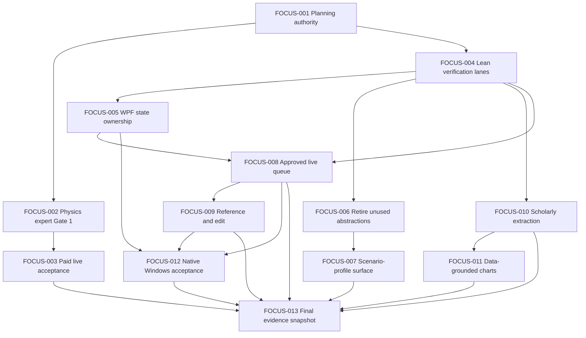

# Product Focus And Simplification Implementation Plan

**Status:** Active post-V1 execution authority
**Date:** 2026-08-02
**PRD:** [PRD_POST_V1_PRODUCT_FOCUS.md](../../PRD_POST_V1_PRODUCT_FOCUS.md)
**Design:** [2026-08-02-product-focus-and-simplification-design.md](../specs/2026-08-02-product-focus-and-simplification-design.md)
**Mutable queue:** [product-focus-execution.json](../../product-focus-execution.json)

## 1. Objective And Truth Boundary

This plan converts the product-focus review into bounded AI-executable work. It does not rewrite the locked V1 promise or any accepted historical evidence. The program concentrates implementation on two production lanes:

1. `image-series-production`
2. `trustworthy-scientific-figures`

Document illustration remains an input adapter. Courseware, poster, article, report, and social outputs remain scenario profiles. Remote workflows, a public pack ecosystem, a general operator platform, additional provider abstractions, a graph editor, and partial-image streaming remain frozen.

Mutable status, dependency, authority, and next-task truth live only in `docs/product-focus-execution.json`. This narrative plan defines how to execute each task; it must not be used to infer that a task is complete.

## 2. AI Task Selection Protocol

Before changing code, the executor must:

1. Parse `docs/product-focus-execution.json` and run `scripts/verify-product-focus-plan.ps1`.
2. Select the lowest-order task whose state is `ready`; a blocked external task does not block an independent repo-only task.
3. Confirm every dependency is `completed` and the task authority is available.
4. Record the starting commit, `git status --short --branch`, owned write-set, and pre-existing dirty paths.
5. Search runtime, persistence, package, test, and documentation consumers before deleting or changing a compatibility surface.
6. Update a task from `ready` to `in_progress` before implementation. At most one task may be `in_progress`.
7. Stay inside the declared write-set. If a discovered dependency requires another path, add it to the queue and evidence before editing it.
8. Use fake or captured transports by default. Human, paid/live, and named-hardware authority cannot be inferred from repository access.
9. Run focused verification before full verification. A failing focused check keeps the task open.
10. Mark a task `completed` only after its acceptance, evidence, compatibility, and rollback fields are satisfied. Then promote every newly unblocked lowest-order repo task from `proposed` to `ready`.

## 3. Standard Verification And Stop Rules

Repository tasks use this order:

```powershell
dotnet build ContentDeliveryStudio.sln
dotnet test ContentDeliveryStudio.sln --no-build
pwsh -NoProfile -ExecutionPolicy Bypass -File scripts/verify-reference-evidence.ps1
pwsh -NoProfile -ExecutionPolicy Bypass -File scripts/verify-product-focus-plan.ps1
dotnet format ContentDeliveryStudio.sln --verify-no-changes --no-restore
pwsh -NoProfile -ExecutionPolicy Bypass -File scripts/preflight-release.ps1 -NoRestore
```

The executor stops without broadening scope when:

- required authority is absent;
- a paid provider, external system mutation, or named human/hardware action would be needed;
- a second failed repair attempt leaves the same root cause unresolved;
- a persisted consumer or compatibility contract contradicts a planned deletion;
- source, provider, or scientific evidence cannot be recovered without guessing;
- the worktree changes outside the declared write-set during execution;
- acceptance would require relabeling repo-only evidence as manual, live, or hardware proof.

## 4. Dependency Graph



## 5. Task Execution Cards

### FOCUS-001 — Establish The Product-Focus Authority

**Queue contract:** `P0`, `completed`, `shared-foundation`, `repo-only`, risk `low`, no dependency.

**Owned write-set:**

- `docs/PRD_POST_V1_PRODUCT_FOCUS.md`
- `docs/product-focus-execution.json`
- `docs/ROADMAP.md`
- `docs/TASKS.md`
- `docs/DOCUMENTATION_GOVERNANCE.md`
- `docs/superpowers/specs/2026-08-02-product-focus-and-simplification-design.md`
- `docs/superpowers/plans/2026-08-02-product-focus-and-simplification.md`
- `scripts/verify-product-focus-plan.ps1`
- `scripts/verify-repo.ps1`
- `docs/change-evidence/20260802-product-focus-and-simplification-plan.md`

**Preconditions:** Preserve `docs/PRD_V1.md`, V1 launch evidence, scientific acceptance evidence, and all historical plans. Confirm the working tree before edits and record whether unrelated user changes exist.

**Execution:**

1. Record two production lanes, five maturity states, and the frozen capability set in the post-V1 PRD and machine queue.
2. Record the design decisions for WPF state ownership, lean verification, live queue authority, reference/edit behavior, scientific extraction, and deterministic charts.
3. Define all `FOCUS-001` through `FOCUS-013` tasks with dependency, authority, write-set, verification, acceptance, evidence, and rollback.
4. Add this implementation plan and synchronize the roadmap, task checklist, and documentation authority map.
5. Add the plan verifier and invoke it from the canonical full repository gate.
6. Record fresh evidence and verify that no paid call, human approval, or hardware claim occurred.

**Focused verification:** Parse the JSON with `ConvertFrom-Json`; run `scripts/verify-product-focus-plan.ps1`; run `git diff --check`.

**Acceptance and evidence:** All authority surfaces agree, the verifier reports `FOCUS-004` as the next repo-only ready task, and the evidence file records commands, outputs, compatibility, dirty-worktree boundary, and rollback.

**Stop/rollback:** Stop if the locked V1 PRD or historical evidence changes. Roll back only the owned planning and verifier files.

### FOCUS-002 — Obtain Physics-Expert Gate 1 For The Six-Figure Set

**Queue contract:** `P0`, `blocked_external`, `trustworthy-scientific-figures`, `human-expert`, risk `high`, depends on `FOCUS-001`.

**Owned write-set:** the exact ignored review run selected by the reviewer, `docs/change-evidence/20260801-article-figure-set-reconstruction.md`, `docs/superpowers/plans/2026-08-01-article-figure-set-reconstruction.md`, and `docs/product-focus-execution.json`.

**Preconditions:** A named physics expert is available; all six items have immutable source identity, evidence anchors, specification version, artifact hashes, and current machine-review reports. The exact review run must be recorded before review begins.

**Execution:**

1. Present each source claim, evidence anchor, Figure Spec element/relation, formula/value/unit, and full-resolution figure to the expert.
2. Record an explicit accept or reject decision for every item and every blocking correction.
3. Apply corrections only through a new scientific authority version; invalidate stale Gate 1, render, review, and Gate 2 state.
4. Re-run the existing article-set verifier against the exact reviewed identity.
5. Mark the task complete only when all six items have a named expert decision and no stale approval survives.

**Focused verification:** Existing article-set verifier plus exact equality checks for source hash, claim/evidence rows, specification version, figure hash, reviewer identity, and correction history.

**Acceptance and evidence:** Six explicit decisions, no implicit approval, no paid provider call, and durable human-expert evidence in the existing reconstruction record.

**Stop/rollback:** Stop immediately if reviewer identity or exact run identity is absent. Never delete reviewer evidence; reject the affected version and create a corrected version.

### FOCUS-003 — Run One Bounded Paid Scientific Acceptance

**Queue contract:** `P0`, `blocked_external`, `trustworthy-scientific-figures`, `paid-live-approval`, risk `high`, depends on `FOCUS-002`.

**Owned write-set:** one ignored live-acceptance artifact directory, one execution-time-selected evidence file, and `docs/product-focus-execution.json`.

**Preconditions:** Current explicit paid-call authority exists; `FOCUS-002` is complete; the request checkpoint exactly matches the Gate-1-approved source, specification, prompts, provider profile, model, and settings.

**Execution:**

1. Freeze and hash the approved request identity before dispatch.
2. Produce a cost and operation summary and obtain current approval for that exact request.
3. Dispatch only the bounded approved operations; persist checkpoint and receipt state before and after each call.
4. On interruption, resume only when checkpoint identity proves that no new request will be created silently.
5. Run contract, semantic, full-resolution visual, Gate 2, package, and hash verification.
6. Record provider metadata, cost, machine reviews, human Gate 2 decision, and immutable delivery hashes.

**Focused verification:** Exact request/checkpoint equality, no-replay checks, scientific contract review, semantic review, original-resolution visual review, Gate 2, package verification, and hash replay.

**Acceptance and evidence:** A current authorized live run reaches accepted Gate 2 with complete cost and provenance evidence. Partial or rejected runs remain preserved but are not accepted.

**Stop/rollback:** Stop dispatch on authority loss, identity drift, unexpected cost, or failed checkpoint persistence. Return to fake mode and preserve partial receipts.

### FOCUS-004 — Simplify Verification Without Losing Risk Coverage

**Queue contract:** `P0`, `ready`, `shared-foundation`, `repo-only`, risk `medium`, depends on `FOCUS-001`.

**Owned write-set:** `scripts/verify-repo.ps1`, `scripts/preflight-release.ps1`, `scripts/verify-reference-evidence.ps1`, the source-structure subset under `tests/ContentDeliveryStudio.Tests`, `docs/AI_CODING_WORKFLOW.md`, `docs/REFERENCE_EVIDENCE_POLICY.md`, one bounded evidence record, and `docs/product-focus-execution.json`.

**Preconditions:** Capture current quick/full/release commands, durations, duplicated steps, reference-gate behavior, and all source-text/XAML structure tests. Classify every candidate removal by the risk it currently guards.

**Execution:**

1. Define `quick` as touched-project build plus focused tests and one task-specific invariant; it must not publish or package.
2. Define `full` as reference decision check when triggered, solution build, complete tests, product-focus contract, and format.
3. Define `release` as full verification plus release-only scans, actual publish/package verification, and diff hygiene.
4. Remove duplicate invocation paths so reference parity/evidence and build/test/format run once per release preflight.
5. Replace path-correlation-only reference acceptance with structured decision fields for genuinely high-drift changes.
6. Inventory XAML/source token assertions. Retain security and externally observable contract checks; replace high-value UI behavior with ViewModel, parser, delivery, or native UIA coverage; delete redundant source-shape assertions.
7. Record before/after command composition, duration, removed assertions, replacement coverage, and preserved hard guards.

**Focused verification:** Run each lane independently. Run focused tests for verifier scripts and every replacement behavior/UIA contract. Use `-ForcePowerShellTextScan` once to retain no-`rg` release-scanner coverage.

**Acceptance and evidence:** Quick has no packaging; full covers build/test/contracts/format; release covers package and diff hygiene without duplicate expensive work. Scientific, secret, package-integrity, persistence, paid-call, and no-replay guards remain fail-closed.

**Stop/rollback:** Stop if a removed test has no equivalent risk coverage or if a release path becomes weaker. Restore the prior scripts/tests rather than introducing a new gate framework.

### FOCUS-005 — Move Workflow State Out Of The Main Window

**Queue contract:** `P1`, `proposed`, `shared-foundation`, `repo-only`, risk `high`, depends on `FOCUS-004`.

**Owned write-set:** `src/ContentDeliveryStudio.App/ViewModels/MainWindowViewModel*.cs`, new image-series and scientific workspace ViewModels, workflow host views, focused ViewModel/UIA tests, `docs/ARCHITECTURE.md`, and `docs/product-focus-execution.json`.

**Preconditions:** Count and classify current main-window workflow properties, commands, event subscriptions, coordinator construction, localization, busy state, and persistence reload paths. Capture packaged fake-first UIA probes for both workflow modes.

**Execution:**

1. Introduce `ImageSeriesWorkspaceViewModel` as owner of brief, blueprint, prompt, queue, gallery, review, generic delivery, approval receipt, and reference/edit state.
2. Migrate one complete vertical state family at a time: fields, commands, validation, selection, busy/failure state, and reload together.
3. Introduce `ScientificFigureWorkspaceViewModel` as owner of source, understanding, specification, render/review, Gate 1/Gate 2, repair, checkpoint, and scientific delivery state.
4. Change XAML bindings and workflow hosts to bind to the owning workspace ViewModel.
5. Keep `MainWindowViewModel` limited to project lifecycle, route selection, language, shared provider/diagnostic/backup entrypoints, and genuinely global operation summary.
6. Use a temporary compatibility facade only when a binding migration cannot be atomic; record owner and removal condition and remove it in the same bounded sub-slice when feasible.
7. Remove forwarding coordinators that own neither state nor an external boundary.

**Focused verification:** Navigation, command enablement, concurrent busy-state, latest-wins/exclusive operation gate, localization switch, project reload, selection persistence, and packaged native UIA for both workspaces.

**Acceptance and evidence:** Workflow fields/commands have one owner, scientific and generic series state do not leak, touched main-window surface decreases measurably, and no stateless indirection is added as a success metric.

**Stop/rollback:** Stop a sub-slice if public binding compatibility, project reload, or operation-gate behavior cannot be preserved. Revert only that vertical state family and retain a bounded facade when necessary.

### FOCUS-006 — Retire Unconsumed Module And Remote-Workflow Abstractions

**Queue contract:** `P1`, `proposed`, `shared-foundation`, `repo-only`, risk `medium`, depends on `FOCUS-004`.

**Owned write-set:** application module and remote-workflow directories, infrastructure fake remote-workflow directory, desktop host registration, corresponding tests, `docs/ARCHITECTURE.md`, `docs/ROADMAP.md`, and `docs/product-focus-execution.json`.

**Preconditions:** Search source, DI, persisted JSON/SQLite, package formats, pack files, diagnostics, delivery manifests, tests, docs, and user-visible commands for every type and field. Record each real consumer or prove none exists.

**Execution:**

1. Move repository-folder inspection out of production runtime code when it is only a repository test concern.
2. Remove the fake remote-workflow registration and its contracts if no user-visible or persisted consumer exists.
3. Preserve serialized names or fields only through the minimum compatibility adapter when old fixtures prove they are required.
4. Delete tests that only protect repository layout and add reload or DI tests for any retained compatibility boundary.
5. Update architecture and roadmap wording so frozen remote workflow work is not presented as an active runtime capability.

**Focused verification:** Consumer inventory searches; DI resolution; old-fixture reload; fake-first WPF launch; build, tests, format, publish, and package verification.

**Acceptance and evidence:** Repository paths are absent from product-domain runtime records, no fake remote adapter is registered, persisted compatibility is explicit, and no replacement abstraction appears without a real consumer.

**Stop/rollback:** Stop deletion when a persisted or user-visible consumer is found. Restore only the proven contract/registration and document why it remains.

### FOCUS-007 — Reduce Packs To A Consumed Scenario-Profile Surface

**Queue contract:** `P1`, `proposed`, `shared-foundation`, `repo-only`, risk `high`, depends on `FOCUS-006`.

**Owned write-set:** core/application/infrastructure pack surfaces, core styles, desktop scenario selection, pack/preset tests, `docs/ARCHITECTURE.md`, `docs/ROADMAP.md`, and `docs/product-focus-execution.json`.

**Preconditions:** Inventory every pack type, importer/exporter, compatibility range, view-slot field, persisted fixture, built-in scenario, and WPF consumer. Confirm whether the current hard-coded views consume each metadata field.

**Execution:**

1. Define the minimum scenario profile: stable ID, display/localization identity, target lane, planning defaults, style/policy defaults, and delivery defaults actually consumed at runtime.
2. Map courseware, poster, article, document, report, and social labels to profiles without assigning unproven production maturity.
3. Remove or freeze view-slot composition metadata that the hard-coded WPF shell does not consume.
4. Keep the smallest old-pack loader/adapter required by fixtures; document migration and expiry conditions.
5. Hide or remove public marketplace, remote distribution, broad import/export, and speculative compatibility UX.
6. Verify planning, generation, review, and delivery behavior for every retained built-in profile.

**Focused verification:** Old workspace and pack fixture reload, profile selection/localization, planning defaults, policy enforcement, delivery categorization, and compatibility migration tests.

**Acceptance and evidence:** Profiles affect real behavior; labels do not imply maturity; the UI does not claim pack-driven composition; frozen ecosystem features remain unavailable.

**Stop/rollback:** Stop when a field has a persisted consumer whose migration is not proven. Restore the minimal adapter without reopening ecosystem scope.

### FOCUS-008 — Add Approval Receipts And Cost-Gated Live Queue Execution

**Queue contract:** `P1`, `proposed`, `image-series-production`, `repo-only-until-live-probe`, risk `high`, depends on `FOCUS-004` and `FOCUS-005`.

**Owned write-set:** generation domain/project records, `GenerationWorkflowApplicationService`, persistence, image-series queue ViewModel/views, queue/provider/persistence/WPF tests, provider/operator policy docs, and `docs/product-focus-execution.json`.

**Preconditions:** The queue is owned by the image-series workspace. Capture current task identity, prompt versioning, provider routing, cost settings, pause/retry/reload semantics, and legacy SQLite fixtures. No live call is authorized by selecting this task.

**Execution:**

1. Add immutable `GenerationApprovalReceipt` fields from the design, including canonical request-set hash and bounded cost estimate.
2. Add additive persistence and old-workspace behavior where absence means unapproved, never implicitly approved.
3. Compute and display ordered operations, provider/model/settings, retry ceiling, and estimated total before approval.
4. Invalidate approval on every material request, provider, setting, reference, edit, retry, or expiry change.
5. Validate the current receipt immediately before every new dispatch.
6. Keep Prepare, pause, resume, reorder, cancel-pending, and local retry construction provider-call-free.
7. Prevent automatic replay of interrupted `Running` work and require receipt coverage for failover or new retry identities.
8. Add capability- and authority-aware WPF controls; live Execute remains disabled without explicit current paid authority.

**Focused verification:** Zero-call mutation tests; receipt canonicalization and invalidation matrix; additive migration/reload; cost ceiling; dispatch order; pause; in-flight completion; failure; failover; restart no-replay; captured provider transport; WPF command-state and UIA.

**Acceptance and evidence:** Exact request and cost bind to approval, material drift blocks before dispatch, pause only stops later calls, restart never replays, and repo tests do not consume paid services.

**Stop/rollback:** Stop before a live probe unless separately authorized. Disable live Execute on rollback, preserve fake compatibility, and retain additive receipt fields.

### FOCUS-009 — Implement Capability-Aware Reference And Edit Production

**Queue contract:** `P1`, `proposed`, `image-series-production`, `repo-only-until-live-probe`, risk `high`, depends on `FOCUS-008`.

**Owned write-set:** provider/reference domain surfaces, OpenAI infrastructure, generation/edit application services, image-series reference/edit UI, provider/edit/reference/persistence/delivery tests, provider docs, and `docs/product-focus-execution.json`.

**Preconditions:** Record current official provider operations and limits from current SDK/API evidence; determine one concrete operation to support. Approval receipt and non-destructive candidate history are available.

**Execution:**

1. Extend capability contracts with supported reference roles, edit/mask operations, count/size/format limits, and endpoint/model requirements.
2. Add hashed local reference records with explicit roles and no secret or full-path leakage.
3. Implement one concrete provider request through captured transport before adding another abstraction.
4. Make unsupported combinations fail before dispatch; never silently fall back to plain generation.
5. Create every edit as a new candidate linked to source candidate, ordered references, optional mask, instruction version, provider operation, result, reviews, and approval.
6. Generate WPF options from actual capabilities and explain disabled operations.
7. Include edit lineage and reference provenance in delivery manifests without copying private source paths.
8. Run one bounded live probe only after separate current paid authority.

**Focused verification:** Capability matrix, captured request/response, unsupported pre-dispatch rejection, hash/provenance, mask/reference validation, non-overwrite, persistence/reload, receipt invalidation, delivery manifest, and WPF UIA.

**Acceptance and evidence:** At least one concrete real-provider operation is implemented, unsupported roles are not advertised, source assets are immutable, and fake editing is not cited as live proof.

**Stop/rollback:** Stop when official provider evidence is ambiguous or a paid call would be required. Disable routing/UI capability while preserving neutral records and candidate history.

### FOCUS-010 — Harden Scholarly Source Extraction

**Queue contract:** `P1`, `proposed`, `trustworthy-scientific-figures`, `repo-only`, risk `high`, depends on `FOCUS-004`.

**Owned write-set:** scientific source model, extractor adapters, understanding boundary, scientific source workspace, legally reusable extraction fixtures/baselines, focused tests, research note, and `docs/product-focus-execution.json`.

**Preconditions:** Establish a fixed corpus with license, source hash, expected reading order, captions, formulas, tables, citations, and known OCR-heavy/unsupported cases. Evaluate candidates before runtime adoption.

**Execution:**

1. Add explicit structure types and stable source locations for text blocks, reading order, captions, formulas, tables, citations, footnotes, and embedded figures.
2. Represent recovery as exact, partial, missing, corrupted, unsupported, or OCR-required with confidence and diagnostics.
3. Mark objective-critical missing or ambiguous structures and block Gate 1.
4. Adapt one selected parser only after license, integrity, maintenance, Windows packaging, offline, performance, and rollback evidence passes.
5. Preserve current text-bearing extraction as fallback only when it returns truthful structured status.
6. Surface recovery quality and blocking diagnostics in the scientific source workspace.

**Focused verification:** Fixed-corpus evaluation; reading-order, caption, formula, table, citation, missing-content, corrupted-order, and OCR-required fail-closed cases; old accepted fixture compatibility; package and offline checks.

**Acceptance and evidence:** Every recovered structure has a stable location and quality state, critical gaps block Gate 1, and no dependency is adopted from a single favorable sample.

**Stop/rollback:** Stop if licensing, packaging, determinism, or corpus accuracy is inadequate. Remove the adapter and return explicit unsupported/blocked results through the prior extractor.

### FOCUS-011 — Add Deterministic Data-Grounded Scientific Charts

**Queue contract:** `P2`, `proposed`, `trustworthy-scientific-figures`, `repo-only`, risk `high`, depends on `FOCUS-010`.

**Owned write-set:** one bounded scientific data/chart domain module, deterministic SVG chart renderer, scientific spec/review integration, WPF data and chart-spec surface, fixed chart corpus/mutations, delivery provenance, and `docs/product-focus-execution.json`.

**Preconditions:** Approve the first supported chart types and a redistribution-safe structured-data corpus. Define schema, units, missing-value policy, transformations, aggregation, uncertainty, axes, scale, labels, legend, renderer, and font identity.

**Execution:**

1. Import immutable structured data with SHA-256, column types, units, provenance, and bounded row/column limits.
2. Add a versioned `ScientificChartSpec` under Gate 1 authority.
3. Validate filters, transformations, aggregation, uncertainty, axis mapping, scale, labels, and legend before render.
4. Reject non-finite values, unit mismatch, ambiguous columns, implicit transformation, and requests for absent values.
5. Render deterministic SVG without invoking an image model and feed it into existing export/review/Gate 2 flow.
6. Preserve input hash, chart spec, renderer/font version, reviews, repairs, and both human gates in delivery provenance.

**Focused verification:** Fixed dataset replay plus adversarial values, axes, units, transforms, filters, aggregation, uncertainty, and legend mutations; deterministic hash replay; Gate 1 invalidation; export equivalence.

**Acceptance and evidence:** Every plotted value is traceable to a source row or approved transform, no missing curve/value is invented, and all visual semantics are reviewable before Gate 1.

**Stop/rollback:** Stop when data provenance or unit semantics are ambiguous. Disable chart creation and retain imported data without converting it to an image.

### FOCUS-012 — Complete Native Windows And Packaging Acceptance

**Queue contract:** `P2`, `proposed`, `shared-foundation`, `manual-hardware`, risk `medium`, depends on `FOCUS-005`, `FOCUS-008`, and `FOCUS-009`.

**Owned write-set:** packaged UIA/hardware probe scripts, the WPF structural-test subset, approved packaging configuration, English/Chinese user guides, `docs/ROADMAP.md`, and `docs/product-focus-execution.json`.

**Preconditions:** Both production workspaces and critical queue/reference/edit paths are stable. An ADR or explicit decision selects verified ZIP only or a bounded installer/signing route. Named Windows hardware and authorized operator are available for manual claims.

**Execution:**

1. Identify critical native flows and map each to AutomationId, accessible name, keyboard path, command state, expected artifact, and recovery behavior.
2. Replace high-value XAML token assertions with packaged native UIA or public behavior tests; retain static checks only for properties that cannot be observed reliably otherwise.
3. Probe Chinese/spaced paths, locked files, removable-media failure, restart/recovery, and no-secret package contents.
4. Record Narrator, actual high-contrast switching, non-default or mixed-monitor DPI, touch/pen where exposed, and low-memory behavior on named hardware.
5. Build and independently verify the selected distribution artifact. Do not claim installer/signing when only ZIP exists.
6. Synchronize user guidance and leave every untested hardware condition explicitly open.

**Focused verification:** Packaged native UIA for both workspaces; package hash/membership verification; manual transcript and screenshots for named hardware conditions; focused behavior tests replacing removed source assertions.

**Acceptance and evidence:** Critical flows have native evidence, package claims match artifacts, secret/workspace/output/database files are absent, and no static test is used as hardware acceptance.

**Stop/rollback:** Stop if starting/replacing the user's live app would interrupt work or named hardware is unavailable. Retain the verified ZIP and remove only unaccepted packaging/probe changes.

### FOCUS-013 — Publish A Truthful Post-V1 Evidence Snapshot

**Queue contract:** `P2`, `proposed`, `shared-foundation`, `mixed-explicit`, risk `medium`, depends on `FOCUS-003`, `FOCUS-007`, `FOCUS-008`, `FOCUS-009`, `FOCUS-010`, `FOCUS-011`, and `FOCUS-012`.

**Owned write-set:** `docs/product-focus-execution.json`, `docs/ROADMAP.md`, `docs/TASKS.md`, affected user guidance, one new post-V1 evidence snapshot, and one final closeout record.

**Preconditions:** Every dependency is `completed`; each has an existing bounded evidence file; the working tree is stable; exact commit, provider run, human reviewer, hardware, package, and delivery identities are available where applicable.

**Execution:**

1. Audit every task and acceptance statement against repository, manual, live, paid, and hardware evidence separately.
2. Run the full release lane from the exact recorded commit and verify final packages/artifacts independently.
3. Create a new dated post-V1 snapshot without editing historical V1 or scientific acceptance snapshots.
4. State each capability maturity using the five canonical states and cite exact evidence.
5. Confirm frozen capabilities remain frozen or link a separate approved reopening decision.
6. Mark the program complete only when all dependencies and final claims verify; otherwise retain explicit open tasks and boundaries.

**Focused verification:** Product-focus verifier, full release preflight, artifact hashes, evidence-link audit, current provider receipt audit, human/hardware identity audit, and `git diff --check`.

**Acceptance and evidence:** Every completion claim maps to current evidence, history remains immutable, and the next queue is empty or explicitly identifies newly approved work.

**Stop/rollback:** Withdraw only the new snapshot if any claim lacks evidence. Never rewrite accepted historical evidence to make the new snapshot pass.

## 6. Program Completion Semantics

- `FOCUS-001` completion means the planning authority and verifier exist and pass; it does not complete later product work.
- Repo-only completion proves code, automated contracts, migration, rollback, docs, and repository gates.
- Human, live, paid, and hardware completion each require their named authority and evidence.
- A frozen capability stays out of the queue until a new approved PRD or ADR reopens it.
- The program is complete only when `FOCUS-013` is complete. A passing repository gate alone cannot satisfy that condition.
