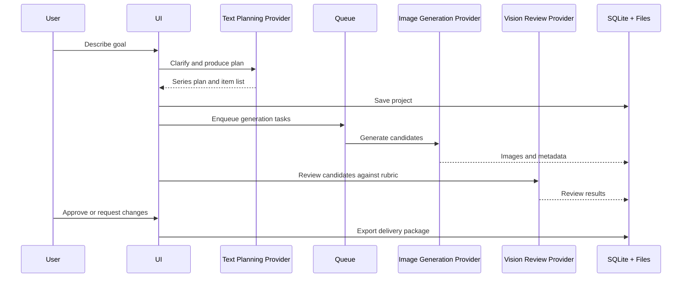

# AI Image Series Studio Design

## Goal

Create a Windows-first desktop workbench for AI-assisted image series production, from user idea to final delivery package.

## Scope

The first version focuses on a single-user local desktop workflow:

- AI-assisted discussion and planning.
- Series plan and item list.
- Prompt generation and prompt versioning.
- Batch generation queue.
- Candidate gallery.
- Structured review.
- Prompt repair and regeneration.
- Final delivery export.

Cloud sync, multi-user collaboration, marketplace plugins, and full graph editing are later phases.

## Architecture

The product uses an independent repository and a layered architecture:

- WPF app for Windows UI.
- Domain core for project, series, item, prompt, generation, review, and delivery concepts.
- Infrastructure for SQLite, filesystem assets, OpenAI providers, and fake providers.
- Provider contracts split text planning, image generation, and vision review.

## Data Flow

## User Interface

Use a workbench layout:

- Left rail for projects and settings.
- Main tabs for Brief, Plan, Prompts, Queue, Gallery, Review, and Delivery.
- Right inspector for selected item details.
- Bottom activity panel for queue, logs, and cost estimates.

## Review Rules

AI review must produce structured results:

- Status: pass, warning, fail.
- Scores by rubric dimension.
- Hard-fail flags.
- Evidence comments.
- Suggested prompt repair.

Human approval is still required before delivery.

## Engineering Constraints

- No real paid API calls in default tests.
- Secrets never enter git.
- Generated outputs are ignored by git.
- Every final image has prompt snapshot, metadata, review record, and manifest entry.
- Text-heavy final output should support deterministic text composition.

## Acceptance Criteria

- A fake-provider MVP can complete the entire workflow without network access.
- The OpenAI provider can be added behind the same contracts.
- The current physics poster project can be imported as a sample without domain-specific code in the core model.
