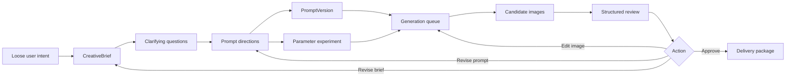

# Brief-First Image Generation Design

## Current Landing And Target

- Current landing: `D:\CODE\ai-image-series-studio`
- Target: add a provider-neutral design workflow that clarifies image-generation needs, explores prompt options, and reduces expensive regeneration before the existing queue, gallery, review, and delivery stages.
- Source evidence: current architecture already separates text planning, image generation, and vision review providers; current style governance already separates image type presets, style guides, generation recipes, reference image sets, parameter experiments, and review rubrics.

## Problem

Image generation fails expensively when vague intent is sent directly to the image model. Users often discover missing requirements only after paid generation and visual review: wrong audience, wrong image type, weak series consistency, unreadable text, unsupported provider settings, or a style that looked good in words but fails as a series.

The product needs a first-class design stage before generation. This stage must help the user turn loose intent into a structured creative brief, several prompt directions, a low-cost trial strategy, and explicit review criteria.

## Goals

- Support common generation modes through one workflow: text-to-image, reference-image generation, image editing, mask-based local edit, variation/remix, and later workflow import/export.
- Keep the domain model provider-neutral. Provider adapters map the neutral workflow to OpenAI or future providers and report unsupported capabilities instead of dropping settings silently.
- Make prompt optimization cheaper than repeated image generation by doing several text-only refinement passes before paid or slow image calls.
- Let users compare two to four prompt directions before committing to a generation route.
- Preserve reproducibility: every generated candidate must remain traceable to the brief, prompt direction, prompt version, recipe, references, settings, review result, and final delivery decision.
- Keep human approval as the final delivery gate.

## Non-Goals

- Do not add real API calls by default.
- Do not require a full node graph editor for the first version of this workflow.
- Do not make image-model text rendering the preferred path for text-heavy posters.
- Do not expose every provider parameter as a flat form in the main UI.

## Recommended Approach

AI 推荐: add a `Brief Studio` stage before `Plan` and `Prompts`.

The workflow should be layered:

1. User intent becomes a structured `CreativeBrief`.
2. The text planning provider asks clarifying questions and generates prompt directions.
3. The user selects one primary direction and optional alternates.
4. The app runs low-cost draft experiments first.
5. Only promoted directions enter normal generation, review, and delivery.

This approach fits the existing architecture because it strengthens the `ITextPlanningProvider` side of the workflow without forcing image-generation providers to know about product strategy, user intent, or brainstorming state.

## CreativeBrief

`CreativeBrief` is the durable output of the design stage.

Recommended fields:

- `id`
- `project_id`
- `series_id`
- `goal`
- `audience`
- `image_type_preset_id`
- `delivery_context`
- `subject_requirements`
- `must_include`
- `must_avoid`
- `style_intent`
- `reference_image_set_ids`
- `text_policy`
- `layout_constraints`
- `series_consistency_rules`
- `factual_or_brand_constraints`
- `cost_strategy`
- `review_rubric_id`
- `created_at`
- `updated_at`

`CreativeBrief` should not replace `SeriesItem`, `PromptVersion`, `StyleGuide`, or `GenerationRecipe`. It sits above them and explains why those lower-level records exist.

## Supported Generation Modes

The product should expose generation mode as a capability-aware choice:

- Text-to-image: prompt only, no image input.
- Reference-image generation: one or more input images guide subject, style, composition, or palette.
- Image-to-image edit: existing image plus prompt produces a revised image.
- Mask edit: existing image plus mask plus prompt edits a specific area.
- Variation/remix: existing candidate becomes the starting point for style, mood, or composition alternatives.
- Background plate: generate visual background first, then compose text deterministically in app.
- Final-render composition: combine generated visual, deterministic text, metadata, and export settings.

The current OpenAI provider implementation only enables text-to-image. Editing, reference images, and streaming should remain hidden or disabled until the adapter capability flags and tests support them.

## Common Image Types

The preset catalog should grow from the current foundation toward these common categories:

- Educational poster
- Article cover
- Article inline illustration
- Courseware slide visual
- Social media square
- Storyboard frame
- Product concept board
- Icon or sticker
- Background plate
- Infographic
- Character sheet
- Scene keyframe
- Brand campaign visual
- Reference-based edit

Each image type should define defaults for aspect ratio, output format, text policy, review rubric, and delivery naming.

## Common Style Dimensions

Style should be captured as structured guidance, not only prose inside the prompt.

Recommended dimensions:

- visual genre: photorealistic, editorial illustration, vector, line art, 3D render, watercolor, comic, isometric, technical diagram
- mood: calm, dramatic, playful, premium, academic, futuristic, documentary
- composition: centered subject, rule of thirds, layered infographic, cinematic wide, close-up, grid, timeline
- lighting: soft studio, rim light, natural light, low key, high key
- palette: warm, cool, high contrast, muted, brand palette, monochrome plus accent
- texture: clean flat, paper grain, brush stroke, glossy product render, chalkboard, blueprint
- typography policy: no model-rendered text, minimal model-rendered text, deterministic post-render text
- negative constraints: forbidden style, forbidden elements, wrong audience signals, unsafe or misleading content

## Parameter Governance

Use a compact simple mode and a controlled advanced mode.

Simple mode fields:

- image type
- aspect ratio
- quality band
- output format
- style guide
- reference set
- draft count
- final count

Advanced mode fields:

- exact size
- compression
- background mode
- moderation mode
- seed
- mask path
- input image role
- image detail or fidelity
- parameter experiment axes
- provider-specific warnings

Unsupported fields must produce visible warnings before queue execution.

## Prompt Direction Workflow

The text planning provider should generate two to four prompt directions for the same brief.

Recommended direction types:

- Conservative faithful version: safest match to requirements.
- Visual-impact version: stronger composition, mood, and contrast.
- Minimal/clean version: lower visual noise and easier review.
- Experimental alternate: useful when the user is still exploring style.

Each direction should contain:

- short name
- intended use
- full prompt draft
- negative constraints
- recommended recipe
- expected strengths
- expected risks
- review rubric emphasis

The UI should let the user promote one direction to the primary prompt version and keep alternates as saved prompt versions or experiment variants.

## User Guidance And Brainstorming

The design stage should guide the user with focused questions instead of asking for a perfect prompt.

Question sequence:

1. What is the image for?
2. Who will read or view it?
3. What must be visually present?
4. What must not appear?
5. Is text required inside the final image?
6. Should the image belong to a series with a shared style?
7. Are there reference images or brand constraints?
8. What counts as failure?
9. Is this a draft exploration or final delivery?

The app should accept short answers and turn them into structured fields. It should also allow the user to skip a question and continue with a clearly marked assumption.

## Cost And Token Strategy

Text refinement is the preferred first loop because it is cheaper and faster than repeated image output and image-input review.

Recommended cost strategy:

- Run multiple text-only prompt refinements first.
- Generate draft images at low quality or smaller scope.
- Review only selected candidates with vision.
- Use image editing for localized fixes when the composition is already strong.
- Use full regeneration when the subject, style, or layout is fundamentally wrong.
- Use high quality only for promoted candidates.

The app should show a cost preview before generation: text planning calls, image generation count, image input count, vision review count, and expected quality band.

## Review Strategy

Vision review should be structured and advisory.

Recommended review outputs:

- requirement match score
- series consistency score
- style guide score
- subject accuracy score
- text readability score
- layout/composition score
- hard failures
- suggested fix
- recommended action: approve, edit, regenerate, or revise brief

The review loop should decide where to send the problem:

- brief problem: return to `Brief Studio`
- prompt problem: create new `PromptVersion`
- parameter problem: adjust `GenerationRecipe`
- local visual problem: use mask/edit workflow when available
- final readiness problem: keep candidate out of delivery

## UI Placement

Add `Brief` as a first-class workbench tab before `Plan`.

Recommended sections:

- brief summary
- guided questions
- assumptions
- image type and text policy
- style guide selection
- reference image set
- prompt directions
- cost strategy
- review criteria

The right inspector should show the selected direction, recipe warnings, and promotion actions.

## Data Flow



## Implementation Phases

1. Documentation and task plan: record this workflow and map it to existing objects.
2. Domain model: add `CreativeBrief` and `PromptDirection` records.
3. Provider contract: extend planning result to return directions, assumptions, and clarifying questions.
4. Application service: create, update, and promote brief directions into prompt versions.
5. UI: add Brief tab and direction promotion controls.
6. Cost guard: estimate planning, generation, and review calls before queue execution.
7. Future provider work: add reference-image and mask/edit workflow after capability tests exist.

## Acceptance Criteria

- A user can create a structured brief without writing a full prompt by hand.
- The app can produce multiple prompt directions from one brief.
- The user can promote a direction into an existing `PromptVersion`.
- Unsupported generation modes are visible but disabled when the provider does not support them.
- Draft generation can be planned separately from final generation.
- Review results can send a candidate back to brief, prompt, recipe, edit, or approval.
- No real API call is required for tests.

## Verification Policy

Documentation-only changes must pass:

```powershell
rg -n "(TB[D]|TO[D]O|PLACE''HOL[D]ER)" .
git status --short
```

Code implementation later must pass:

```powershell
dotnet build
dotnet test
dotnet format --verify-no-changes
```

Real image API calls remain opt-in only.
