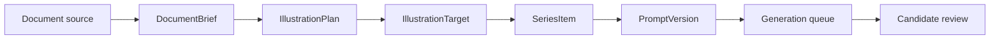

# Document Illustration Workflow Design

## Goal

Add a document-driven illustration planning workflow for authors who need covers, inline illustrations, diagrams, graphical abstracts, and reviewable visual briefs for articles, educational writing, and scholarly drafts.

The first version should turn an imported `docx`, `pdf`, `md`, or `txt` file into a structured illustration plan. It should not attempt full automatic paper production, data-chart generation, layout export back into the source document, or default real paid API calls.

## Scope

The first version focuses on a local, auditable planning loop:

- Import or paste a document source.
- Extract a document brief with title, document type, audience, sections, key claims, concepts, and constraints.
- Classify the document into an illustration strictness level.
- Produce an illustration plan with one or more image targets.
- Convert approved targets into existing `SeriesItem` and `PromptVersion` records.
- Attach image type presets, style guidance, and review rubrics to each target.
- Preserve source evidence so the user can see why an image was suggested.

The first version supports three primary document families:

- Editorial and popular articles.
- Educational or courseware-adjacent articles.
- Scholarly draft articles or papers that need concept-level visuals.

## Non-Goals

The first version excludes:

- Automatic generation of scientific data charts from raw datasets.
- Fabricated microscopy, archaeology, medical, legal, satellite, or experimental evidence imagery.
- Citation verification across external literature databases.
- Full document re-layout or automatic export back into Word, LaTeX, or PDF.
- Multi-author collaboration.
- Real image API calls in default tests.

## Existing Architecture Fit

This workflow should sit above the current image-series model. A document import creates planning evidence; it does not replace the existing project model.

Recommended flow:

The workflow should reuse these existing objects:

- `ImageProject`: project container for the document illustration job.
- `ImageSeries`: one visual set for a document, section, or delivery channel.
- `SeriesItem`: one planned image target.
- `PromptVersion`: generated or manually revised prompt.
- `ImageTypePreset`: output intent such as article cover or background plate.
- `StyleGuide`: consistent visual language for the document.
- `GenerationRecipe`: provider-neutral output settings.
- `ReviewRubric`: structured quality and safety review.

## New Domain Concepts

### DocumentBrief

`DocumentBrief` captures source-document evidence and planning context.

Fields:

- `id`
- `project_id`
- `source_kind`: `docx`, `pdf`, `markdown`, `text`, or `paste`
- `source_display_name`
- `title`
- `document_family`: `editorial`, `educational`, or `scholarly_draft`
- `audience`
- `sections`
- `key_claims`
- `visual_opportunities`
- `known_constraints`
- `strictness_level`
- `created_at`

Source content should be stored or referenced using the existing workspace storage rules. Secrets, private documents, and local source paths must not leak into delivery manifests unless explicitly exported by the user.

### IllustrationPlan

`IllustrationPlan` is the proposed set of images for a document.

Fields:

- `id`
- `document_brief_id`
- `summary`
- `targets`
- `coverage_notes`
- `risk_notes`
- `created_at`

### IllustrationTarget

`IllustrationTarget` is a pre-generation image brief. Once approved, it becomes a `SeriesItem`.

Fields:

- `id`
- `plan_id`
- `title`
- `document_location`
- `purpose`: `cover`, `inline_illustration`, `concept_diagram`, `mechanism_diagram`, `timeline`, `comparison`, `graphical_abstract`, or `background_plate`
- `must_show`
- `must_not_show`
- `source_evidence`
- `suggested_image_type_preset_id`
- `suggested_review_rubric_template_id`
- `text_policy`
- `strictness_notes`
- `approval_state`: `draft`, `approved`, or `rejected`

## Strictness Levels

Strictness levels control what the planner and reviewer may allow.

### Editorial

Use for public essays, newsletters, and lightweight popular articles.

Allowed:

- Metaphor and symbolic composition.
- Strong visual style.
- Cover-oriented abstraction.

Hard failures:

- Misrepresenting the article's central claim.
- Misleading real-world identity, person, brand, or historical event.

### Educational

Use for teaching, courseware, science communication, and explainer writing.

Allowed:

- Clear conceptual diagrams.
- Simplified but accurate scenes.
- Deterministic labels, formulas, and legends after image generation.

Hard failures:

- Wrong concept relationship.
- Unreadable required labels.
- Diagram layout that hides the intended explanation.

### ScholarlyDraft

Use for paper drafts and research-adjacent documents before final publication work.

Allowed:

- Graphical abstract drafts.
- Conceptual mechanism diagrams.
- Neutral background plates for later manual figure composition.
- Illustrations explicitly marked as schematic.

Hard failures:

- Fabricated data plots.
- Images that imply real experimental evidence.
- Fake microscopy, telescope, fieldwork, clinical, archival, or archaeological evidence.
- Unverifiable historical or scientific specificity presented as fact.

## Planning Rules

The planner should create fewer, better targets by default. A short article might need one cover and two inline images. A long educational article might need one cover, several section illustrations, and one summary diagram. A scholarly draft should prefer a small number of schematic visuals.

Each target must include:

- Why the image exists.
- Which part of the document supports it.
- What the image must communicate.
- What it must avoid.
- Whether visible text should be generated by the image model or composed deterministically afterward.

When the source document contains unsupported needs, the planner should produce a risk note instead of creating an unsafe target.

## Preset And Rubric Extensions

The first implementation plan should add these image type presets:

- `article-inline-illustration`
- `concept-diagram`
- `graphical-abstract`
- `scholarly-schematic`

The first implementation plan should add these rubric templates:

- `editorial-illustration`
- `educational-accuracy`
- `scholarly-schematic`

Rubrics should include dimensions for requirement match, source evidence fit, visual clarity, strictness compliance, text policy compliance, and delivery readiness.

## User Interface

Add a document illustration entry inside the existing workbench rather than a separate app.

Recommended UI path:

1. User creates or opens a project.
2. User opens the Brief tab and selects document illustration mode.
3. User imports or pastes a document.
4. The app shows the document brief and detected strictness level.
5. The app proposes illustration targets with source evidence snippets.
6. User approves, rejects, or edits each target.
7. Approved targets are added to the Plan and Prompts workflow.

The target list should show purpose, document location, strictness level, evidence, and risk flags. It should not hide scientific or factual risk behind a generic quality score.

## Provider Boundaries

Document analysis uses `ITextPlanningProvider`. Image generation and vision review remain separate provider contracts.

Fake providers are required for tests. Real document analysis and image generation with paid APIs remain opt-in.

The provider prompt should ask for structured output rather than freeform prose. Invalid or incomplete provider output should fail into a repairable draft state.

## Error Handling

The workflow should handle:

- Unsupported file type.
- Failed extraction.
- Empty or too-short document.
- Overlong document requiring chunking.
- Provider output that misses required fields.
- Targets that violate strictness rules.
- User rejection of all proposed targets.

Failures should leave the project editable. They should not enqueue image-generation tasks automatically.

## Testing

Default tests should use fake providers and sample text fixtures.

Recommended test coverage:

- `DocumentBrief` validates required source and title fields.
- `IllustrationPlan` rejects empty target sets after approval.
- `IllustrationTarget` records source evidence and strictness notes.
- Planner fake maps editorial, educational, and scholarly draft examples to different target sets.
- Scholarly draft strictness blocks fabricated evidence targets.
- Approved targets can be converted into `SeriesItem` records.
- Delivery metadata redacts source paths unless explicitly exported.

## Acceptance Criteria

- A markdown or text article can produce a document brief and an illustration plan without network access.
- The user can approve targets before they become `SeriesItem` records.
- Scholarly draft mode prevents fake evidence imagery by default.
- Educational mode prefers deterministic post-render text for labels, formulas, and legends.
- Generated prompts preserve source evidence and strictness notes.
- No real paid API call is required by default gates.

## Rollback

This feature can be rolled back by removing the document illustration domain objects, planner use case, UI entry point, and tests. Existing project, series, prompt, queue, review, and delivery objects should remain compatible because the new workflow only feeds approved targets into the existing model.
