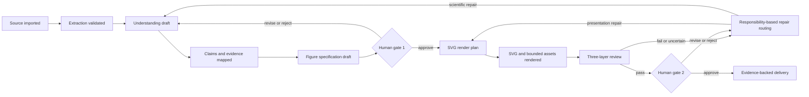

# Trustworthy Scientific Figure Workflow Design

## Status

Design and written specification approved by the user on 2026-07-25. The implementation plan is recorded in `docs/superpowers/plans/2026-07-25-scientific-figure-trustworthy-workflow.md`; runtime implementation has not started.

## Goal

Add a first-class, high-trust scientific figure workflow to AI Content Delivery Studio without changing the product into a single-purpose scientific application.

The first slice turns a text-bearing physics or natural-science paper into an editable, evidence-grounded concept diagram, mechanism diagram, or graphical abstract. It must understand the source material relevant to the requested figure before rendering, preserve element-level provenance, fail closed on unresolved scientific uncertainty, and require two human approval gates.

The resulting workflow is:

```text
text-bearing paper
  -> structured extraction
  -> scientific understanding and claim-evidence mapping
  -> approved ScientificFigureSpec
  -> deterministic SVG plus bounded non-evidentiary assets
  -> scientific and visual review
  -> approved SVG/PNG/PDF delivery with evidence
```

## Product Position

The repository remains a general multimodal content-delivery workbench. Scientific figure production becomes its first high-trust flagship workflow and reuses the existing source, provider, review, repair, approval, persistence, and delivery foundations.

The primary value is not a more elaborate prompt. The primary value is a controlled transformation from source evidence to a verifiable figure.

## First-Slice Scope

The first slice covers:

- physics and general natural-science papers or high-quality scholarly articles
- text-bearing PDF input plus Markdown and plain-text input
- one bounded figure objective per source
- concept relationship diagrams
- mechanism and process diagrams
- graphical abstracts
- editable SVG as the delivery source of truth
- PNG and PDF exports generated from the approved SVG
- deterministic text, formulas, units, arrows, legends, and critical scientific structure
- bounded generated assets only when they are explicitly non-evidentiary
- element-level source provenance
- deterministic contract review, scientific semantic review, and visual-quality review
- two explicit human approval gates

## Non-Goals

The first slice does not include:

- scanned or image-only PDF OCR
- broad high-fidelity recovery of every PDF formula, table, or embedded figure
- automatic scientific charts from raw datasets
- generated microscopy, clinical, telescope, field, archival, or experimental evidence
- replacement or fabrication of source evidence images
- automatic correction of a paper using external literature
- broad cross-disciplinary ontology coverage
- autonomous approval or delivery without a human decision
- prompt-only scientific correctness
- online self-modification of production prompts, rubrics, or scientific rules

If a requested figure requires an excluded capability, the workflow returns a structured blocked result instead of producing a plausible-looking image.

## Authority Chain

The scientific authority order is fixed:

```text
source paper content
  > located evidence anchors
  > human-approved scientific claims
  > human-approved ScientificFigureSpec
  > prompts and provider requests
  > rendered output
```

Lower layers cannot silently redefine higher layers.

Prompts, generated assets, reviewer comments, and layout suggestions are derived artifacts. They are never scientific sources of truth.

After the first human gate, approved scientific content is frozen for the current specification version. An automated repair may change presentation, but any change to an entity, relation, direction, formula, value, unit, condition, or conclusion invalidates the approval and returns the workflow to the first gate.

## Domain Model

### ScientificDocumentExtraction

Represents deterministic or tool-assisted source extraction.

Required information:

- source asset and content hash
- title, authors, abstract, keywords, and page count when recoverable
- pages, text blocks, paragraphs, and section headings with stable identifiers
- captions, footnotes, references, and supplemental statements when recoverable
- formula and table locations with recovery status
- page number, bounding region, character offsets, and original text for each block
- extraction diagnostics for reading order, missing content, encoding, columns, and layout
- extractor identity and version

### ScientificDocumentUnderstanding

Represents the structured interpretation relevant to a requested figure.

Required information:

- scope and requested figure objective
- normalized terminology and entity definitions
- methods, mechanisms, results, conditions, limitations, and uncertainty statements
- scientific claims
- unresolved conflicts and unanswered questions
- coverage status for the requested objective
- understanding version and approval state

### ScientificClaim

Represents one reviewable scientific statement.

Claim categories include:

- definition
- mechanism
- causal relation
- process step
- comparison
- quantitative result
- constraint or boundary condition
- limitation
- uncertainty

Each claim records its normalized statement, source wording, confidence, status, and evidence links.

### ClaimEvidenceLink

Connects a claim to a precise source location.

It records:

- source block identifier
- page and section
- quoted text
- formula, table, or figure-caption reference when applicable
- extraction coordinates or offsets
- link role, such as support, qualification, contradiction, or definition
- confidence and validation state

### ScientificFigureSpec

The approved scientific drawing contract and the only authority allowed to create a render plan.

It records:

- figure purpose, central message, audience, and schematic status
- required and forbidden content
- figure elements and relations
- labels, symbols, formulas, values, units, legends, and annotations
- layout and grouping constraints
- visual conventions and accessibility requirements
- render strategy for every element
- evidence links for every critical element and relation
- unresolved issues, risk level, and approval history
- stable specification version

### FigureElementSpec

Represents one entity or visual element.

Critical elements require:

- stable identifier
- scientific meaning
- element type
- exact label or formula where applicable
- evidence or explicit `scientific_convention` provenance
- render strategy
- required, optional, or forbidden status

### FigureRelationSpec

Represents one relationship between elements.

It records:

- stable identifier
- source and target element identifiers
- relation type
- directionality
- label and scientific meaning
- evidence or explicit scientific-convention provenance
- visual representation constraints

### SvgRenderPlan

The deterministic compilation target for an approved specification.

It contains the canvas, layers, elements, connections, labels, formulas, legends, layout constraints, style tokens, accessibility metadata, and export settings required to produce SVG.

### ScientificReviewReport

Stores per-element and per-relation results from all review layers.

It separates:

- deterministic contract failures
- scientific semantic failures or uncertainty
- visual-quality failures
- responsible repair layer
- evidence used for the finding
- repair history and final disposition

### ScientificFigureDeliveryEvidence

Connects the approved outputs to:

- source hashes
- extraction and understanding versions
- claim and evidence versions
- specification and render-plan versions
- SVG, PNG, and PDF hashes
- provider and model metadata
- prompt snapshots
- review reports
- repair rounds
- both human approval decisions

## Workflow And State Model

The primary state path is:



User-visible states are:

- `extraction_blocked`
- `understanding_draft`
- `understanding_blocked`
- `figure_spec_draft`
- `gate_1_approved`
- `rendering`
- `review_failed`
- `review_passed`
- `final_approval_pending`
- `delivery_approved`

A source, understanding, claim, or specification change invalidates every downstream approval and artifact derived from the changed version.

## Paper Extraction And Understanding

### Extraction Boundary

The first slice accepts only documents that pass a text-extractability check.

`IScientificDocumentExtractor` provides a provider-neutral boundary. The current PdfPig-based extractor may continue supplying page text and coordinates. Scientific structure recovery is a separate adapter so that a later validated GROBID or equivalent implementation does not become a hard-coded dependency.

The workflow must preserve raw source locations before any AI normalization.

### Bounded Understanding

The planning provider does not receive an entire long paper as one unstructured prompt.

The workflow:

1. extracts bounded sections and source blocks
2. identifies terminology, entities, variables, methods, results, limitations, and uncertainty locally per section
3. requires evidence anchors for every local conclusion
4. merges and deduplicates claims across sections
5. detects contradictions and inconsistent terminology
6. selects only the claims relevant to the requested figure
7. produces an understanding draft and unresolved-issues list

"Sufficient understanding" means complete, traceable, conflict-free coverage of the scientific content relevant to the requested figure. It does not mean that a model claims to understand every aspect of the paper.

### External Knowledge Boundary

The first slice does not automatically browse for supporting facts.

A generally accepted visual or scientific convention must be labeled `scientific_convention` and remain distinct from a paper claim. If external literature support is added in a later slice, its source, version, quotation, and relationship to the paper must be recorded separately.

An external source that conflicts with the submitted paper creates a blocked decision for the user. It does not silently rewrite the paper.

### Extraction And Understanding Blocks

The workflow fails closed when:

- the PDF has no usable text
- reading order or encoding cannot be recovered reliably
- a required formula, caption, table, or passage cannot be extracted
- a critical claim lacks a precise evidence anchor
- relevant claims conflict without resolution
- the model must guess a fact not present in the paper
- the objective requires raw data plotting or evidence-image generation
- the document is scanned, OCR-heavy, or outside the supported scientific scope

Blocked results identify the failed stage, affected claims, source locations, recovery options, and whether the user can provide corrected structured text.

## SVG-First Rendering

### Rendering Routes

| Figure content | First-slice route | Generative-model authority |
| --- | --- | --- |
| Concept relationships | Deterministic SVG | May suggest layout or style only |
| Mechanisms and processes | Deterministic SVG nodes, links, arrows, and labels | May create non-critical decorative assets |
| Graphical abstracts | SVG scientific structure plus bounded raster assets | May create explicitly non-evidentiary scene or texture assets |
| Data charts | Outside the first slice; future real-data renderer | Cannot invent data, curves, or axes |
| Experimental evidence | Reference-only and outside generation | Cannot generate or replace evidence |

### Components

- `ScientificFigureSpecCompiler` compiles an approved specification into `SvgRenderPlan`.
- `IScientificFigureRenderer` defines the provider-neutral render boundary.
- `DeterministicSvgRenderer` owns critical structure, text, formulas, values, units, arrows, legends, and annotations.
- `IGenerativeVisualAssetProvider` may create only assets classified as `decorative` or `non_evidentiary`.
- `SvgConstraintValidator` validates the plan and rendered SVG.
- `ScientificFigureExporter` creates PNG and PDF from the approved SVG source.

### Rendering Invariants

- Every critical SVG element has a stable identifier tied to a specification item.
- Every arrow comes from an approved relation.
- Labels, formulas, symbols, values, units, axes, and legends are deterministic.
- Generated assets cannot contain authoritative labels or scientific structure.
- Model suggestions become structured proposals and cannot mutate the render plan directly.
- SVG is the only editable delivery source of truth.
- PNG and PDF are exports from the same validated SVG version.

## Review Model

Review uses three independent layers. A score average cannot override a hard failure.

### Deterministic Contract Review

Checks:

- required and forbidden element coverage
- relation endpoints, direction, and type
- exact labels, formulas, values, and units
- stable identifiers and evidence links
- absence of unapproved scientific content
- SVG, PNG, and PDF semantic consistency

### Scientific Semantic Review

Uses a fresh, bounded request containing only:

- approved relevant claims and limitations
- the minimum evidence-anchor set
- the approved specification
- an SVG structure summary
- necessary full-resolution image crops

It returns per-element and per-relation `pass`, `fail`, or `uncertain` findings with evidence and repair recommendations. `fail` and `uncertain` both block delivery.

The planning provider's prior conclusion is not evidence.

### Visual-Quality Review

Uses full-resolution output plus region crops. It checks:

- label, formula, legend, and arrow readability
- overlap, clipping, ambiguous links, and incorrect visual grouping
- contrast, color differentiation, grayscale output, and color-vision accessibility
- hierarchy, spacing, balance, and target-size suitability
- SVG, PNG, and PDF appearance consistency

## Repair And Adaptive Iteration

Findings route to the responsible layer:

| Finding | Repair layer |
| --- | --- |
| Extraction or formula recovery error | `source-extraction` |
| Misunderstood claim or omitted condition | `scientific-understanding` |
| Wrong entity, relation, direction, value, or formula | `figure-spec` |
| Missing element or deterministic render error | `svg-renderer` |
| Overlap, spacing, color, or readability | `layout-style` |
| Unsuitable non-evidentiary generated asset | `generative-asset` |
| SVG/export drift | `exporter` |

Automatic iteration is limited to three rounds.

Layout, style, and non-evidentiary assets may be repaired automatically. Scientific understanding or specification changes require a new draft and first-gate approval.

Every round records:

- specification diff
- render-plan and SVG diff
- review findings
- provider and model identity
- prompt version
- latency and cost
- applied repair layer

Prompt adaptation selects versioned templates and parameters based on known failure classes. Production prompts, rubrics, and scientific rules cannot modify themselves online.

An optimization candidate can be promoted only after a fixed evaluation suite shows no scientific regression and a human approves the new version.

## Human Approval Gates

### Gate 1: Understanding And Specification

The user reviews:

- relevant claims and limitations
- evidence anchors in source context
- conflicts and low-confidence items
- required and forbidden figure content
- every critical element and relation
- formulas, values, units, and scientific conventions

Approval freezes the scientific-content version used for rendering.

### Gate 2: Final Scientific Delivery

Gate 2 becomes available only after all three machine-review layers pass.

The user reviews:

- full-resolution SVG, PNG, and PDF
- per-element scientific provenance
- review findings and repair history
- unresolved issues
- provider, model, prompt, cost, and export evidence

Only explicit approval creates an approved delivery package.

## WPF Workbench Design

The workflow is an internal `scientific-figure` Workflow Pack inside the existing workbench.

### Source Workspace

- import PDF, Markdown, or text
- show extraction coverage and diagnostics
- block continuation when extraction is not trustworthy

### Understanding Workspace

- source text and structured understanding shown side by side
- selecting a claim highlights its source evidence
- users approve, reject, or edit claims with an audit record
- conflicts, missing evidence, and low confidence remain visible

### Figure Spec Workspace

- edit purpose, central message, entities, relations, arrows, labels, formulas, units, and constraints
- show provenance for each critical item
- show AI proposals as accept/reject diffs
- approve and freeze a specification without editing raw JSON

### Render And Review Workspace

- zoomable SVG as the primary surface
- layer, element, provenance, review, and repair inspection
- selecting an element traces back to the specification and paper
- presentation repairs can run automatically
- scientific repairs return to Gate 1

### Delivery Workspace

- show all machine-review states
- compare SVG, PNG, and PDF
- show unresolved issues and repair rounds
- record Gate 2 approval
- export the figure and its evidence package

The UI always displays the current state and the layer affected by a generate, repair, or approve action. Users do not need to edit prompts as part of the normal workflow.

## Evaluation Corpus

The first fixed corpus contains 12 public, text-extractable physics or natural-science papers or high-quality scholarly articles:

- four mechanism or process examples
- four concept relationship or comparison examples
- four graphical-abstract examples
- representation across mechanics, thermal physics, and optics or electromagnetism
- one bounded figure objective per source

Corpus admission requires stable access or a legally reusable repository fixture, deterministic source hashing, sufficient extraction quality, and a clear first-slice figure objective.

Each corpus item includes a human-reviewed gold baseline:

- relevant claims and limitations
- exact evidence anchors
- required and forbidden elements
- required relations and directions
- formulas, values, and units when applicable
- an acceptable specification
- allowed visual variation
- scientific and visual fault mutations

Mutations include reversed relations, wrong units, omitted conditions, fabricated entities, formula errors, ambiguous arrows, clipping, overlap, and unreadable labels.

## Acceptance Criteria

### Source And Understanding

- Every accepted scientific claim has a valid source quote and location.
- Every required gold claim relevant to the figure is represented or explicitly blocked.
- Extraction uncertainty that affects the figure blocks Gate 1.
- Unresolved scientific conflict blocks Gate 1.

### Specification And Rendering

- Every critical element and relation maps to evidence or an explicit scientific convention.
- Every gold-required element and relation is represented.
- No unapproved scientific element, relation, value, or formula appears.
- Repeated rendering of the same specification produces semantically equivalent SVG.
- PNG and PDF exports preserve the approved SVG content.

### Review And Repair

- Every injected critical scientific mutation in the fixed corpus is blocked.
- Every injected first-slice visual mutation is detected.
- No hard failure or uncertain scientific finding can reach Gate 2.
- Presentation-only repair does not mutate approved scientific content.
- A scientific repair invalidates downstream approval and returns to Gate 1.
- Automatic repair stops after three unsuccessful rounds.

### Approval And Delivery

- No approved package exists without both human decisions.
- Every delivered critical element traces to specification, claim, and source evidence.
- Delivery preserves provider, prompt, review, repair, approval, and file-hash provenance.
- Fake-first repository gates require no paid provider calls.
- Opt-in live-provider acceptance uses explicit configuration, cost evidence, and secret redaction.

## Test Strategy

- domain tests for claims, evidence, elements, relations, versions, and state transitions
- schema and contract tests for extraction, understanding, specification, render plan, and review reports
- extraction fixtures for stable text-bearing PDF cases
- SVG golden and semantic-equivalence tests
- formula, label, arrow, unit, and export invariant tests
- scientific and visual mutation tests
- workflow integration tests for both gates and repair routing
- persistence migration and backward-compatibility tests
- WPF workflow tests for state, evidence navigation, diffs, approvals, and blocked actions
- opt-in live-provider contract and acceptance tests
- human review of every fixed-corpus final artifact

Repository closeout keeps the fixed order:

```text
build -> test -> contract/invariant -> hotspot
```

The canonical repository gate and release preflight remain required.

## Delivery Phases

1. Establish the scientific terminology, reference basis, fixed corpus, and gold baselines without generating images.
2. Deliver extraction, understanding, claim-evidence mapping, and Gate 1 as a working vertical slice.
3. Deliver specification compilation, deterministic SVG, and PNG/PDF export.
4. Deliver three-layer review, repair routing, and bounded automatic iteration.
5. Deliver the five WPF workspaces, Gate 2, and evidence-backed package export.
6. Run opt-in real-provider acceptance and record launch evidence.

A phase may be reported `repo-side closed` only with fresh phase evidence. The scientific workflow is `accepted` only after the fixed corpus, opt-in real-provider sample, and both human-gate evidence are complete.

## Risks And Mitigations

| Risk | Mitigation |
| --- | --- |
| PDF text looks extractable but has corrupted reading order | Extraction diagnostics and fail-closed corpus admission |
| AI creates unsupported but plausible claims | Mandatory evidence links and Gate 1 |
| Reviewer agrees with planner instead of checking evidence | Fresh bounded review input and independent source anchors |
| Attractive generated assets imply scientific evidence | Explicit non-evidentiary classification and render restrictions |
| Automatic repair changes scientific meaning | Layer-specific repair authority and approval invalidation |
| SVG and exported formats drift | Single SVG truth source and export equivalence checks |
| Evaluation overfits a few papers | Versioned 12-item corpus with multiple figure and physics structures |
| Paid provider behavior drifts | Fake-first gates plus bounded opt-in live acceptance evidence |

## Reference And Supply-Chain Requirements

Before implementation changes the extraction, SVG, formula, PDF export, or provider boundaries, the repository reference basis must be refreshed with primary-source evidence for the selected components.

GROBID or any equivalent scholarly parser remains an evaluated adapter candidate, not a mandatory runtime dependency, until local deployment, licensing, maintenance, output quality, and failure behavior are verified.

Any new rendering or formula dependency requires provenance, license, version, maintenance, security, and deterministic-output review.

## Compatibility And Migration

The new workflow extends the repository rather than replacing `DocumentBrief`, `IllustrationPlan`, `SeriesItem`, `PromptVersion`, or existing delivery flows.

Scientific records use new versioned persistence boundaries. Existing projects remain loadable without scientific records. Schema changes require forward migration, backward-compatible loading where practical, and rollback evidence.

Existing generic document illustration and fake-first launch routes remain unchanged until a later explicitly approved migration promotes shared scientific capabilities.

## Rollback

The scientific workflow is isolated behind its Workflow Pack, module registrations, persistence records, and UI entry.

Rollback removes or disables only:

- the `scientific-figure` pack and workspaces
- scientific extraction and understanding adapters
- scientific specification and render services
- scientific review and delivery evidence records introduced by this slice

Existing source ingestion, generic document illustration, image-series generation, review, approval, and delivery behavior must remain compatible.
