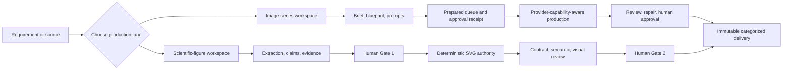

# Product Focus And Simplification Design

**Status:** Approved for staged repository implementation
**Date:** 2026-08-02
**PRD:** [Post-V1 Product Focus PRD](../../PRD_POST_V1_PRODUCT_FOCUS.md)
**Execution truth:** [product-focus-execution.json](../../product-focus-execution.json)
**Implementation plan:** [2026-08-02-product-focus-and-simplification.md](../plans/2026-08-02-product-focus-and-simplification.md)

## 1. Problem Statement

The repository has a strong traceable image-series spine and a deliberately rigorous trustworthy-scientific-figure workflow. It also carries substantial future-facing infrastructure:

- provider-neutral pack families, compatibility ranges, package import/export, and workflow view-slot metadata;
- a runtime application-module catalog containing repository folder paths;
- a remote-workflow contract whose only implementation is a no-network fake;
- a general operator/tool-adapter model broader than its user-visible execution surface;
- many WPF UserControls and coordinators while central workflow state remains in `MainWindowViewModel`;
- many source-text tests and evidence documents alongside fewer native user-flow probes.

At the same time, ordinary production gaps remain:

- the operator queue Execute path is fake-only;
- real image reference and edit capabilities are not advertised by the current OpenAI image provider;
- courseware, poster, article, document, and social labels have uneven maturity;
- scholarly extraction remains bounded to text-bearing sources and does not broadly recover reading order, formulas, tables, or captions;
- signed installation and several Windows hardware/accessibility conditions remain unaccepted.

The design goal is not a broad rewrite. It is a staged transfer of effort from speculative extensibility and ceremonial governance into two user-visible production lanes.

## 2. Evidence Baseline

The design is based on the repository state observed on 2026-08-02:

- approximately 44,000 source lines, 29,000 test lines, and 19,000 documentation lines;
- 782 discovered tests in the current working snapshot;
- release-style preflight completing in approximately one minute on the observed host;
- hard-coded WPF workflow views despite pack/view-slot metadata;
- no desktop consumer for pack import/export;
- no real remote-workflow adapter;
- provider capabilities explicitly reporting no image editing and no reference images;
- current scientific article-set follow-up still requiring physics-expert Gate 1 and separate paid/live authorization.

These values are audit context, not permanent thresholds. The verifier must not encode mutable line or test counts.

## 3. Design Principles

1. **Two production lanes:** image series and trustworthy scientific figures.
2. **Concrete before generic:** one concrete implementation is preferred until a second real consumer proves an abstraction.
3. **Fake is a test mode, not a maturity claim:** fake completion proves contracts and local flow only.
4. **Authority travels with side effects:** paid, scientific, manual, and hardware authority remain explicit and separate.
5. **State ownership defines modularity:** extracting files or forwarding coordinators does not count unless state and commands move.
6. **Behavior over source shape:** tests should observe public behavior, persisted state, provider requests, native UIA, or delivery artifacts.
7. **One current queue:** mutable execution state lives in `docs/product-focus-execution.json`; narrative documents explain decisions and link to it.
8. **One evidence note per bounded slice:** microtask evidence is folded into the owning slice unless an external acceptance event needs a separate immutable record.
9. **Compatibility before deletion:** speculative code may be removed only after runtime, persistence, package, and documentation consumers are inventoried.
10. **No hidden broadening:** a frozen capability requires a new approved PRD or ADR before implementation resumes.

## 4. Target Product Topology

Document illustration feeds the route decision. Courseware, poster, report, article, and social selections provide defaults within the image-series lane. They do not create parallel domain aggregates or permanent global tabs.

## 5. Capability Disposition

| Capability | Current disposition | Target decision |
| --- | --- | --- |
| Image-series workflow | Keep and productize | Add real queue authority, reference/edit, native flow evidence. |
| Scientific figures | Keep high-trust boundary | Improve source extraction and add only data-grounded charts. |
| Document illustration | Keep as adapter | Promote approved targets into one production lane. |
| Courseware/poster/article/social presets | Keep as profiles | Do not create separate platforms or maturity claims. |
| Pack metadata/import/export | Freeze, review consumers | Reduce to consumed scenario-profile and compatibility surface. |
| Application module catalog | Removal candidate | Move repository-shape checks out of production code. |
| Remote workflow engine | Removal candidate | Remove fake registration and contracts if no persisted consumer exists. |
| General operator platform | Freeze | Keep only adapters used by current local validation and composition. |
| Workflow graph | Freeze or hide | Retain only if user evidence shows navigation value. |
| Additional provider abstraction | Freeze | Complete one real provider path before adding another layer. |
| Partial-image streaming | Excluded from current program | Reopen only with a measurable preview use case. |

## 6. WPF State Ownership Design

### 6.1 Current issue

The main window constructs many coordinators and continues to expose most workflow fields, commands, selections, localization strings, and computed state. This creates a large binding surface and makes unrelated workflows change together.

### 6.2 Target ownership

`MainWindowViewModel` owns:

- application title and global language;
- project selection and project-open lifecycle;
- active workspace route;
- shared provider/diagnostics/backup entrypoints;
- global busy/failure summary where a cross-workspace operation requires it.

`ImageSeriesWorkspaceViewModel` owns:

- brief, blueprint, plan, prompts, queue, gallery, review, and generic delivery state;
- real execution approval receipt and cost summary;
- reference and editing inputs;
- ordinary repair routing and approval.

`ScientificFigureWorkspaceViewModel` owns:

- source, understanding, figure specification, render/review, and scientific delivery state;
- Gate 1 and Gate 2 authority;
- scientific repair and checkpoint/resume status.

### 6.3 Migration rule

Migration is vertical and behavior-preserving:

1. select one workflow state family;
2. add focused behavior tests through the intended new owner;
3. move fields, commands, validation, and selection together;
4. keep a temporary binding facade only when XAML migration cannot be atomic;
5. remove the facade in the same bounded slice or record an expiry condition;
6. run reload, localization, busy-state, and UIA checks.

Creating another stateless forwarding coordinator is not an accepted outcome.

## 7. Lean Verification Design

### 7.1 Verification lanes

| Lane | Use | Required content |
| --- | --- | --- |
| `quick` | Inner loop for one bounded change | Build touched project or solution, focused tests, task-specific invariant. |
| `full` | Repository closeout before commit | Reference decision check when triggered, solution build, all tests, product-focus verifier, format. |
| `release` | Packaging or release-claim change | Full lane plus placeholder/conflict release scans, actual publish/package verification, diff hygiene. |

The release lane may take about one minute on the observed host. That is acceptable for closeout, not necessary after every edit.

### 7.2 Test disposition

Retain:

- domain state-transition and invariant tests;
- SQLite additive migration and reload tests;
- provider request/response/capability/cost/secret contracts;
- deterministic rendering, hash, package, and scientific mutation tests;
- backup/restore path and integrity attacks;
- queue interruption and no-replay tests;
- native UIA and manual acceptance evidence.

Reduce or replace:

- exact XAML token counts;
- tests that only assert a source file contains a method, type, or literal;
- tests whose only function is to preserve repository folder layout inside production code;
- duplicate assertions repeated at facade, coordinator, and service layers without distinct risk coverage.

### 7.3 Reference evidence

The current path-correlation gate is retained until FOCUS-004. Its target replacement records structured decisions for high-drift changes:

- area;
- trigger;
- consulted source path and revision or official documentation version;
- observed behavior;
- adopt, adapt, or reject decision;
- affected repository contract;
- focused verification;
- expiry or recovery condition when evidence is unavailable.

The replacement must not require an evidence file for pure renames, localization-only edits, or behavior-preserving internal movement when no high-drift contract is touched.

## 8. Live Queue Execution Design

### 8.1 Approval receipt

A `GenerationApprovalReceipt` is immutable and includes:

- receipt ID and schema version;
- project and series IDs;
- ordered task identities;
- prompt-version hashes;
- provider profile, endpoint class, model, size, quality, format, and background mode;
- planned operation count and retry ceiling;
- configured per-operation or token cost estimate and total estimate;
- approval actor, timestamp, optional expiry, and authority reference;
- canonical request-set hash.

### 8.2 Invalidation

Approval is invalidated by:

- task addition, removal, reorder that changes dispatch identity, or replacement;
- prompt version or source candidate change;
- provider, model, endpoint class, key-pool selection, or routing change;
- size, quality, format, background, mask, reference, edit, or retry-policy change;
- expiration or an explicit revoke action.

Local pause and resume without changing request identity does not create a new cost approval. A retry creates a new task identity and therefore requires receipt coverage.

### 8.3 Dispatch

- Prepare and local queue mutations make zero provider calls.
- Execute validates the receipt immediately before each new dispatch.
- Pause prevents later dispatch but does not claim to cancel an in-flight HTTP request.
- An interrupted `Running` task becomes failed and is never replayed automatically.
- Provider failover that can create a new charge requires receipt coverage for the destination profile.
- Diagnostics record bounded metadata, not prompts, response bodies, secrets, endpoints, or user paths.

## 9. Reference And Edit Design

Reference assets use explicit roles:

- `subject-identity`;
- `style`;
- `layout`;
- `palette`;
- `content`;
- `mask`.

The provider capability contract must declare supported operations and limits. The WPF UI is generated from capabilities, not optimistic domain possibilities. Unsupported combinations fail before a provider call.

An edit always creates a new candidate with:

- source candidate ID and hash;
- ordered reference IDs and roles;
- optional mask ID and hash;
- edit instruction version;
- provider operation and result metadata;
- review and approval history.

No edit path overwrites source files or silently falls back to plain generation.

## 10. Scientific Extraction Design

The extraction model distinguishes:

- recovered text and stable location;
- inferred reading order with confidence and diagnostics;
- caption, formula, table, citation, footnote, and embedded-figure locations;
- exact, partial, missing, corrupted, and unsupported recovery;
- OCR-required status without pretending OCR ran;
- objective-critical structures that block Gate 1 when unavailable.

Candidate libraries or services are evaluated against a fixed legally reusable corpus before adoption. Evaluation covers Windows packaging, offline behavior, licenses, maintenance, deterministic identity, performance bounds, and rollback. A component is not adopted solely because it extracts more text on one sample.

## 11. Data-Grounded Chart Design

Charts are deterministic scientific artifacts, not image-model generations.

Required inputs:

- immutable source data artifact and SHA-256;
- schema with column names, types, units, missing-value policy, and provenance;
- approved chart specification;
- explicit filters, transformations, aggregation, uncertainty representation, axes, scale, labels, and legend;
- renderer and font version.

Blocking conditions include:

- non-finite or type-invalid values;
- incompatible or missing units;
- implicit filtering or aggregation;
- ambiguous axis mapping;
- requested values absent from the source;
- transformations without a reviewable definition;
- any attempt to generate or interpolate evidence without an approved deterministic rule.

The chart specification enters Gate 1 authority, and exports use the same contract, semantic, visual, and Gate 2 chain as other scientific figures.

## 12. Persistence And Migration

- New queue receipt, reference/edit, extraction, or chart fields use additive schema changes.
- Old workspaces load with capability unavailable or receipt absent rather than fabricating approval.
- Removed speculative runtime types are checked for serialized type names, JSON fields, EF mappings, pack files, diagnostics, and delivery manifests before deletion.
- Compatibility adapters must have an owner, expiry condition, and focused old-fixture reload test.
- Migration does not move or delete user workspace, output, or delivery assets automatically.

## 13. Security And Privacy

- Paid authority never contains secret values.
- Receipt hashes may identify request structure but do not include raw secrets.
- Reference images, masks, source data, and scientific documents remain local user assets.
- Diagnostic records continue to exclude prompts, response bodies, source bodies, generated content, request IDs, endpoints, full exceptions, credentials, and full user paths.
- External extraction, chart, or provider tools require license, package integrity, execution-boundary, and data-egress review.

## 14. Accessibility And Windows Acceptance

Repository checks establish stable AutomationIds, names, focus, keyboard navigation, command state, and packaged launch behavior. Manual or named-hardware evidence establishes:

- Narrator behavior;
- real high-contrast switching;
- non-default DPI and mixed-monitor scaling;
- touch and pen where the workflow exposes those interactions;
- Chinese and spaced paths;
- locked file and removable-media failure;
- low-memory behavior and subjective scrolling responsiveness.

Source-text XAML assertions cannot close these conditions.

## 15. Execution And Authority Boundaries

- FOCUS-001 and repo-only tasks may execute autonomously.
- FOCUS-002 requires a named physics expert.
- FOCUS-003 requires explicit current paid/live authorization after FOCUS-002.
- FOCUS-008 and FOCUS-009 may implement with fake/captured transports, but paid probes require separate authorization.
- FOCUS-012 requires named hardware/manual evidence for hardware acceptance.
- A blocked external task does not prevent an independent repo-only ready task from proceeding.

## 16. Acceptance Criteria

- Product documents agree on two production lanes and frozen capability boundaries.
- The machine-readable queue validates task IDs, dependencies, state, authority, write sets, verification, acceptance, evidence, and rollback.
- The locked V1 PRD and historical live evidence remain unchanged.
- AI can select the next repo-only task without interpreting every historical phase document.
- Speculative abstractions are not deleted without consumer and compatibility evidence.
- Real-provider, human, and hardware boundaries remain explicit.
- Repository verification passes without a paid-provider call.

## 17. Rollback

Revert this planning slice independently. Later implementation rollback is task-local. When a task adds persistence, retain additive fields if removing them would endanger old workspace loading. Never delete local user data or accepted evidence as part of Git rollback.
