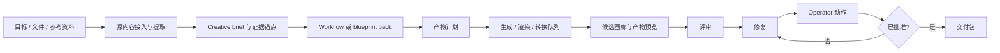

# 产品设计

> 英文原文: [../PRODUCT_DESIGN.md](../PRODUCT_DESIGN.md)
> 中文文档中心: [./README.md](./README.md)
> 说明: 本文件是中文说明版。若与英文原文、代码、测试、ADR 或证据文件冲突，以仓库事实和英文正式文档为准。

## 产品主张

AI Content Delivery Studio 是一个以 Windows 为先的多模态内容交付工作台，当前最核心的生产能力是“连贯图像序列”。它最初的工作名是 AI Image Series Studio；该名称现在只应作为旧代码或历史仓库身份的遗留痕迹存在，而不是当前产品定义。

这不是一个“单图 prompt 小玩具”，也不是一个“单用途漫画生成器”。它的目标是帮助用户从模糊意图、源文件或草稿出发，逐步走到结构化理解、可规划的视觉或内容交付物、候选结果、评审后的修复，以及清晰的最终交付包。

第一类目标用户，是那些需要制作教学海报、文章配图、社交媒体图片组、课件视觉素材、产品概念板、视觉分镜、主题图包或多帧叙事序列的重度用户。

产品必须保持领域中立。科学传播、漫画、历史图像系列、课件配图和品牌活动视觉包都只是重要示例，不能反过来把核心工作流硬编码成某一个行业专用工具。

长期边界比“图像生成”更广。用户会带来 PDF、DOCX、幻灯片、表格、截图、参考图、数据集、笔记和草稿；工作台最终应该能够把这些内容当作上下文与证据，并生成合适的交付包，例如图像、prompt 包、PDF 报告、DOCX 评审、可进幻灯片的视觉素材、delivery manifest 等。

## V1 发布边界

V1 明确小于长期多模态愿景。它只应发布：

- 一条主发布工作流
- 一条支撑验证工作流
- 一条证明路径

而不是同时发布所有多模态路线。

AI 推荐: 将 V1 视为一个以图像序列为主干、但有两条辅助验证能力的发布版本。

- 主发布路径: 短需求 -> `CreativeBrief` -> `DesignBlueprint` 候选 -> 提升后的 blueprint -> series plan -> prompts -> generation -> review -> 已批准的 `DeliveryPackage`
- 支撑验证路径: 文章或纯文本 -> evidence anchors -> illustration targets -> promoted plan -> 同一条下游 review 与 delivery 流
- 证明路径: 文本密集型教学海报 -> 生成背景底板 -> 确定性文本、公式与标签合成 -> 审批证据导出

这三条路径的重要性并不相等。短需求到图像序列是产品主干；另外两条路径存在，是为了证明同一个产品骨架也能承接“文档导出的规划”和“高信任文本合成”。

已锁定的 V1 默认值：

- 主要受众: 独立创作者或类似教师的重度用户
- 主要工作流: 短需求 -> 图像序列
- 第一条真实 operator 切片: 叠加式的本地验证或诊断导出
- 确定性合成实现: `SkiaSharp`
- Packs 在 V1 中仅是内部可复用配置

## 核心工作流



## 设计优先工作流

产品更应偏向“设计优先生成”，而不是让用户直接堆原始 prompt。

```mermaid
flowchart LR
    A["目标 / 源文件"] --> B["Source assets"]
    B --> C["Extracted content"]
    C --> D["Creative brief"]
    D --> E["Design blueprints"]
    E --> F["Artifact 或 series plan"]
    F --> G["Prompt direction 与工具步骤"]
    G --> H["Prompt version 或 render recipe"]
    H --> I["Queue"]
    I --> J["Review / Repair / Operator"]
    J --> K["Delivery package"]
```



这里的 `DesignBlueprint` 是可复用的高层创意路线，例如：

- 忠实于需求的海报系列
- 文章插图包
- 对比图组
- 时间线叙事序列
- 概念讲解序列
- 分镜或类漫画 panel 序列

用户不应被迫从原始 prompt 开始。正常入口应该是需求、brief、文章、源文本或系列创意。

## Packs 的角色

工作台应支持版本化 packs，让流程可以复用，而不是把某个行业写死在核心产品里：

- `WorkflowPack`: 定义阶段、必需输入、review gate、repair route 和交付期望
- `BlueprintPack`: 承载可复用的创意策略与产物模式
- `IndustryPack`: 承载领域词汇、常见源类型、输出惯例、合规提示与 rubric 默认值
- `RendererPack`: 承载 PDF、DOCX、slide、image 或 web-ready 输出的确定性渲染/导出配方
- `ReviewRubricPack`: 承载视觉质量、事实贴合、安全、可读性、品牌和交付 readiness 的结构化检查

Packs 是产品配置与工作流知识，而不是要求每次接入新模型、新 provider、新行业或新产物类型时都重写核心领域模型。

在 V1 中，packs 只作为内部可复用配置和迁移友好元数据存在，不是 public marketplace，也不是扩大发布范围的理由。

## 代表场景

下一批产品切片应先强化少量代表性的端到端路线，再扩展 pack 目录或自动化表面：

- 主发布路径: 短需求 -> `CreativeBrief` -> 2 到 4 条 `DesignBlueprint` 候选 -> 提升后的 blueprint -> series plan -> prompts -> generation -> review 或 repair -> 已批准的 `DeliveryPackage`
- 支撑验证路径: markdown、粘贴文章或纯文本 -> evidence anchors -> illustration brief -> illustration targets -> 提升到图像序列工作流 -> review report -> delivery package
- 证明路径: 需求或源材料 -> 生成背景底板 -> 确定性文本、公式与标签合成 -> 可读性评审 -> approval evidence -> 最终导出

在获得更强生产证据之前，新的工作流想法都应该先解释成这些路线的变体或组合，而不是另起一个产品模式。

## 近期重点

近期成功意味着“一条可靠的发布主干”，而不是“功能越多越好”。

- 需求优先的图像序列路线，优先级高于其他用户可见工作流。
- 文章/纯文本路线的作用是验证“有证据支撑的规划”，不是创建第二条同等重要的主模式。
- 对文本密集型输出，要优先保证确定性文本合成和 approval evidence。
- 保持 provider 分工显式化: 直接单次生成或编辑走 Image API；只有在状态、多轮修订或部分流式预览确实有产品价值时，才考虑 Responses API。
- 在扩大 browser 或 desktop automation 之前，先证明一条受审计的低风险 operator 路径。
- 对已经落地的基础设施，应优先通过用户可见的端到端路线来证明其价值。

## 主要角色

- 独立创作者: 需要快速、可控、目录清晰的图像序列工作流
- 教师或内容作者: 在意事实贴合、文本可读性和交付可追溯性
- 设计师 / operator: 在意候选对比、批量控制、metadata 与可重复性
- 开发者 / 重度用户: 在意 provider 配置、工作流导出和可审计性
- 知识工作者或分析人员: 希望从结构化源材料生成图示、流程图、对比图或多帧解释图
- 文档密集型用户: 希望把 PDF、DOCX、截图或笔记转成经过评审的视觉或文档交付物

## 一等对象

- `Workspace`: 包含项目与资产的本地根目录
- `Project`: 一个用户目标，例如一组海报序列或一套文章配图
- `SourceAsset`: 用户提供的文件、URL 快照、图像、文件夹、笔记或生成中间物
- `ExtractedContent`: 从源资产中提取的文本、图像、表格、公式、版式线索、metadata 或 OCR 结果
- `EvidenceAnchor`: 从 brief、plan、review note 或生成产物回指源证据的稳定指针
- `CreativeBrief`: 对目标、受众、约束和交付背景的结构化需求记录
- `DesignBlueprint`: 将 brief 转成连贯视觉路线的可复用模板
- `WorkflowPack`: 定义阶段、输入、review gate、repair 路径与交付输出的版本化工作流包
- `BlueprintPack`: 定义可复用设计蓝图与产物模式的版本化包
- `Series`: 项目中的一组连贯视觉结果
- `Item`: 序列中的一个计划图像目标
- `PromptVersion`: 某个 item 对应的 prompt 与生成设置版本
- `GenerationTask`: 一次排队执行尝试
- `CandidateImage`: 一个生成结果及其 metadata
- `ReviewRubric`: 人类与 AI 都可读的质量标准
- `ReviewResult`: 结构化评分、通过/失败标记、评论与建议修复
- `RepairPlan`: 评审后的结构化下一步动作，指向 brief、blueprint、prompt、参数、参考、源提取、布局或确定性渲染输出中的正确层
- `OperatorAction`: 一次受控的本地或 UI 自动化动作，例如提取文件、运行 CLI、渲染 PDF、调用浏览器自动化 harness 或准备可编辑文档
- `OutputArtifact`: 图像、PDF、DOCX、slide asset、markdown、manifest、review report 或 delivery archive 等生成/转换结果
- `DeliveryPackage`: 包含图像、prompt、metadata 与 manifest 的最终文件夹

## MVP / V1 范围

V1 必须支持：

- 面向主路径的多轮规划对话
- 需求优先的 brief 捕获
- 在付费生成前先比较 2 到 4 条 blueprint 或 prompt-direction 路线
- Series plan 与 item list 编辑
- Prompt 生成与手工编辑
- 以 fake provider 为先、以 opt-in OpenAI 为后的队列式批量生成
- 带 prompt、metadata 和 review 状态的 candidate gallery
- 结构化 AI 辅助 review + 人工最终审批
- Prompt 修订与重新生成历史
- 带 manifest 与 approval evidence 的最终交付导出
- 文章或纯文本插图规划，并能将已批准目标提升到同一条下游工作流
- 对文本密集型教学或海报输出提供确定性文本合成
- 一条真实的低风险 operator 动作，并带审计输出
- 物理学海报项目作为 sample migration 来源

V1 仍然以图像序列为中心。多模态能力应该先通过稳定的 source、evidence、artifact 和 pack 模型进入，而不是让应用在 V1 就变成“全格式自动化套件”。

## 发布指标

只有当下列条件都成立时，V1 才算 ready：

- 主路径连续三次 fake-first 端到端运行成功
- 一组 `2-item` 样本序列能通过 opt-in OpenAI 路径跑通，并验证 provenance 与 redaction
- 文章或纯文本路径默认不依赖付费 API，也能创建并提升已批准的插图目标
- 教学海报证明路径能导出确定性文本合成 provenance 和人工 approval evidence
- 第一条真实低风险 operator 动作能够写出适合审计的验证结果，且不带破坏性副作用

## UI 结构

窗口采用工作台布局：

- 左侧栏: Workspace、Project、Settings
- 主标签: Brief、Plan、Prompts、Queue、Gallery、Review、Delivery
- 右侧检查器: 当前选中项的 metadata、prompt version、review summary 与可执行动作
- 底部活动面板: queue 状态、成本估算、日志、warning 和 error

随着任务类型增长，窗口不能退化成一个巨大 tab strip。外壳本身应保持稳定，而由当前 `WorkflowPack` 决定哪些阶段、面板、命令和检查器应该出现。

推荐的稳定外壳：

- 左侧栏: workspace、project、source assets、active pack、saved views
- 中央工作区: 一次只聚焦一个 active workflow stage，并配以紧凑阶段导航
- 右侧检查器: selected source、plan、prompt、artifact、review、repair、operator 或 delivery metadata
- 底部活动面板: queue、operator runs、cost、warnings、approvals 和 audit events

规范的阶段词汇应保持克制：

```text
Source -> Brief -> Plan -> Produce -> Review -> Repair -> Deliver
```

## 评审、修复与交付方向

产品不应把“生成完图片”当作终点。真正的价值在于：

- review 有结构化标准，而不是零散主观评论
- repair 能指向正确层级，而不是只会让用户“再改 prompt 试试”
- delivery package 能保留 prompt snapshot、metadata、manifest、review report 和 approval evidence
- 需要精确文本时，系统能把场景图生成与文本合成拆开处理，而不是把所有责任都压在图像模型上

长期方向上，工作台可以扩展到更多 artifact 类型、更多 pack 和更多行业语汇；但这些扩展都不应破坏当前已经被验证过的 V1 主干。
